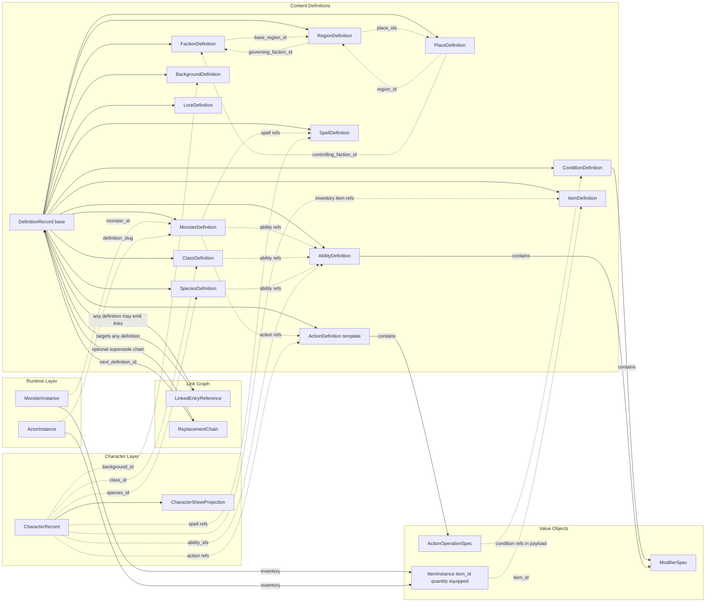

# Compendium And Gameplay Entity Dependency Tree

Status: In Progress
Scope: Frontend Compendium UI Master Blueprint

## Purpose

Define dependency order for compendium authoring UI and adjacent gameplay entities (Character + Runtime Instances), with explicit treatment of action templates vs operation primitives.

## Deep Dependency Analysis

### 1. ActionDefinition vs ActionOperationSpec

Decision for blueprinting:

1. `ActionOperationSpec` is a value object primitive (no lifecycle, no independent publish/supersede semantics).
2. `ActionDefinition` is the business entity template (has identity, lifecycle, versioning, pack ownership).
3. Template cloning must operate on `ActionDefinition`.

Result:

1. Keep both in the model.
2. Treat `ActionDefinition` as the reusable container/coupler for one or more `ActionOperationSpec` nodes.

### 2. Content-Level Cross References

Business references required by planning scope:

1. Monster can reference spells.
2. Monster, class, and species can reference abilities.
3. World entities are cyclic by design (`Faction <-> Region <-> Place`).
4. Condition can be targeted by action payload fields.

These links should be represented via `LinkedEntryReference` edges for integrity policy coverage.

### 3. Character-Level Dependencies

Character build and sheet dependencies:

1. Character depends on class, species, background, and ability references.
2. Character sheet projection depends on Character as source aggregate and reference resolution outcomes.
3. Character inventory/spells/actions create additional template dependencies (item/spell/action).

### 4. Instancing Viability

Instancing supports per-instance inventory and quantities:

1. `MonsterInstance` owns `ItemInstance[]`.
2. `ItemInstance` carries `item_id` plus `quantity`, enabling "2 daggers" style inventory.
3. Runtime `ActorInstance` likewise supports `inventory` for live encounter state.

Conclusion: yes, monster inventory instancing is structurally supported.

## Mermaid Dependency Diagram

## Dependency Interpretation

1. Solid arrows represent structural composition or required aggregate ownership.
2. Dotted arrows represent ID/link dependencies resolved through query or link graph policies.
3. `ActionDefinition -> ActionOperationSpec` is the primary template-to-executable shape.
4. Character and Runtime layers are downstream consumers of content definitions.

## Leaf-First Build Order

1. LoreDefinition
2. ConditionDefinition
3. SpeciesDefinition
4. BackgroundDefinition
5. ClassDefinition
6. FactionDefinition, RegionDefinition, PlaceDefinition (bounded cyclic cluster)
7. ActionDefinition (template editor)
8. AbilityDefinition (links to action and condition concerns)
9. SpellDefinition (links to action templates and conditions)
10. ItemDefinition (links to action templates)
11. MonsterDefinition (links to action templates, spells, abilities)
12. CharacterRecord and CharacterSheetProjection editors/viewers
13. Runtime instance tools (MonsterInstance and ActorInstance inventory surfaces)

## Implementation Notes

1. Current codebase has replacement-link creation wired; generalized automatic link extraction for all payload refs is not fully wired yet.
2. UI should still model references explicitly now so API/link extraction can be turned on without UI redesign.

## Source Models

1. backend/src/systems/dnd5e/content/domain/definition_models.py
2. backend/src/systems/dnd5e/content/domain/primitives.py
3. backend/src/systems/dnd5e/content/domain/link_models.py
4. backend/src/schemas/character.py
5. backend/src/schemas/monster.py
6. backend/src/schemas/monster_instance.py
7. backend/src/schemas/item_instance.py
8. backend/src/systems/dnd5e/application/character_service.py
