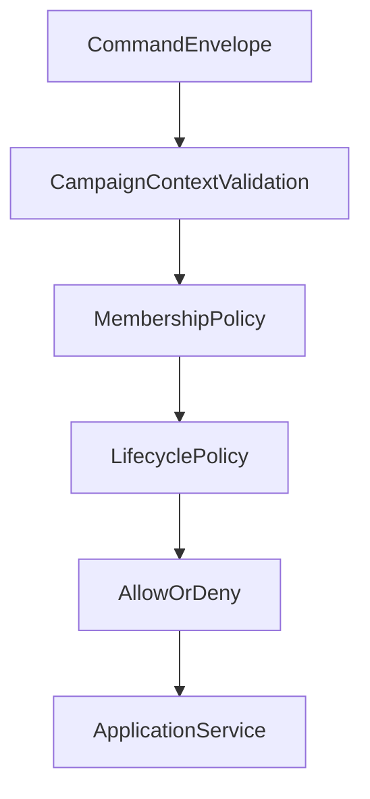

# ISSUE [CONTRACT] [CAM-01]: Campaign Management Context Contract

## Why This Exists

Campaign-level orchestration requires a stable contract for membership, permissions, and context boundaries used by content and character systems.

## Scope

1. Campaign identity and lifecycle fields.
2. Campaign membership and role context.
3. Contract boundaries between campaign context and DND5E content/character modules.

## Initial Contract Surface

1. `CampaignRecord` (`id`, `title`, `owner_user_id`, `lifecycle_state`, `created_at`, `updated_at`).
2. `CampaignMemberRecord` (`campaign_id`, `user_id`, `role`, `status`).
3. `CampaignScopeContext` fields included in command envelopes for campaign-bound operations.

## Contract Invariants (Initial)

1. Every character and campaign-scoped content mutation must include campaign context.
2. Role and membership status must be validated before campaign-bound mutation.
3. Campaign lifecycle state gates write permissions for campaign-bound resources.
4. Cross-campaign data mutation is denied.

## Validation Directives (Initial)

1. Deny campaign-bound commands missing campaign context.
2. Deny mutation commands from non-member or inactive member identities.
3. Deny writes in campaign states that disallow mutation.
4. Deny cross-campaign ownership violations explicitly.

## Mermaid Flowchart

## Dependencies

1. CORE-04 Session and Event Envelopes
2. CORE-05 Layer Ownership
3. DND5E-05 Character and Sheet Schema

## Test Plan

See: `ISSUES/architecture/01_contracts/campaign/test_plan/campaign_management_context.md`
