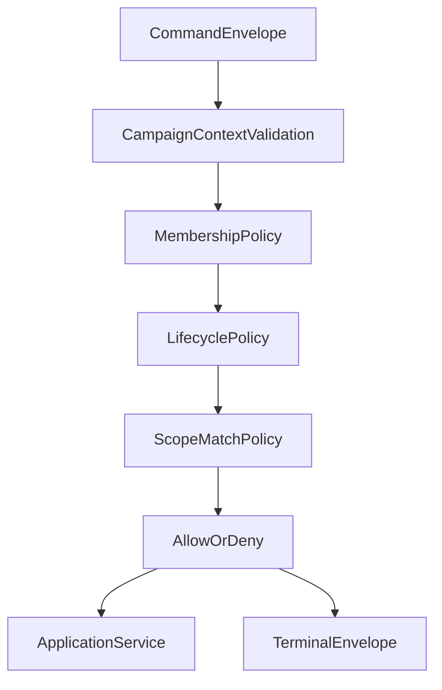

# ISSUE [CONTRACT] [CAM-01]: Campaign Management Context Contract

## Why This Exists

Campaign-level orchestration requires a stable contract for membership, permissions, and context boundaries used by content and character systems.

## Plain-Language Contract Intent

1. Every campaign-bound mutation must explicitly declare which campaign it targets.
2. Membership and role policy are evaluated before business logic executes.
3. Cross-campaign access is always denied, even when entity identifiers are otherwise valid.
4. Testers should be able to verify allow/deny decisions entirely from envelope context and policy outcomes.

## Scope

1. Campaign identity and lifecycle fields.
2. Campaign membership and role context.
3. Contract boundaries between campaign context and DND5E content/character modules.
4. Campaign-level command-gate outcomes and recovery signals.

## Canonical Contract Surface

1. `CampaignRecord`
   - Required: `id`, `name`, `description`, `dm_id`, `lifecycle_state`, `created_at`, `updated_at`
2. `CampaignMemberRecord`
   - Required: `campaign_id`, `user_id`, `role`, `status`
   - Optional: `active_character_id`
3. `CampaignScopeContext`
   - Required command context fields: `campaign_id`, `actor_user_id`, `role`, `membership_status`
4. `CampaignCommandGateResult`
   - Required: `request_id`, `campaign_id`, `status`
   - Required for denied and error: `reason_code`

## Contract Invariants

1. Every character and campaign-scoped content mutation must include campaign context.
2. Role and membership status must be validated before campaign-bound mutation.
3. Campaign lifecycle state gates write permissions for campaign-bound resources.
4. Cross-campaign data mutation is denied.
5. `CampaignMemberRecord.role` must resolve to a canonical policy role.
6. `CampaignMemberRecord.status` must be one of: `active`, `inactive`, `invited`, `removed`.
7. `CampaignScopeContext.campaign_id` must match the target aggregate campaign id.
8. Denied command outcomes must provide stable reason codes.
9. Campaign command gates must produce terminal outcomes (resolved, denied, or error).
10. Inactive campaign lifecycle states must deterministically deny write operations.

## Validation Directives

1. Deny campaign-bound commands missing campaign context.
2. Deny mutation commands from non-member or inactive member identities.
3. Deny writes in campaign states that disallow mutation.
4. Deny cross-campaign ownership violations explicitly.
5. Deny unknown role values in command context.
6. Deny unknown membership status values in command context.
7. Deny any policy evaluation that cannot map to a deterministic allow/deny decision.
8. Deny terminal-denied outcomes that omit reason code.
9. Deny commands where actor identity does not map to campaign membership record.
10. Enforce explicit reason-code mapping for all campaign policy denials.

## Event and Recovery Behavior

### Event Definitions

1. `campaign_membership_denied`
   - Emitted when actor fails membership or role checks.
   - Must include: `campaign_id`, `actor_user_id`, `reason_code`.
2. `campaign_lifecycle_denied`
   - Emitted when campaign lifecycle state blocks requested mutation.
   - Must include: `campaign_id`, `lifecycle_state`, `reason_code`.
3. `campaign_context_invalidated`
   - Emitted when command context is stale or mismatched.
   - Must include: `campaign_id`, `request_id`, `reason_code`.

### Recovery Rules

1. Clients receiving context invalidation must refresh campaign membership/context before retry.
2. Replayed commands with unchanged invalid context must deterministically re-deny with the same reason code family.
3. Recovery flow must retain request correlation and terminal envelope semantics.

## Contract Boundary and Non-Overlap

1. This contract governs campaign context and policy gates only.
2. Character-sheet schema specifics remain in DND5E-05.
3. DND5E content entity schema remains in DND5E-02.
4. Transport envelope contract remains in CORE-04.
5. Layer ownership constraints remain in CORE-05.

## Mermaid Flowchart

## Dependencies

1. CORE-04 Session and Event Envelopes
2. CORE-05 Layer Ownership
3. DND5E-05 Character and Sheet Schema

## Extracted From

1. `ISSUES/archive/vertical_legacy/v05/ISSUE_[VERT]_[V05-08-CLEAN]_native_campaign_management.md`
2. `ISSUES/archive/vertical_legacy/v05/ISSUE_[VERT]_[V05-09]_campaign_content_policy_and_multitenancy.md`

## Canonical Symbols

1. `CampaignResponse` in `backend/src/schemas/campaign.py`
2. `CampaignMemberResponse` in `backend/src/schemas/campaign.py`
3. Legacy campaign aggregate anchor in `backend/src/legacy/campaigns/lib/campaign.py`

## Test Plan

See: `ISSUES/architecture/01_contracts/campaign/test_plan/campaign_management_context.md`
