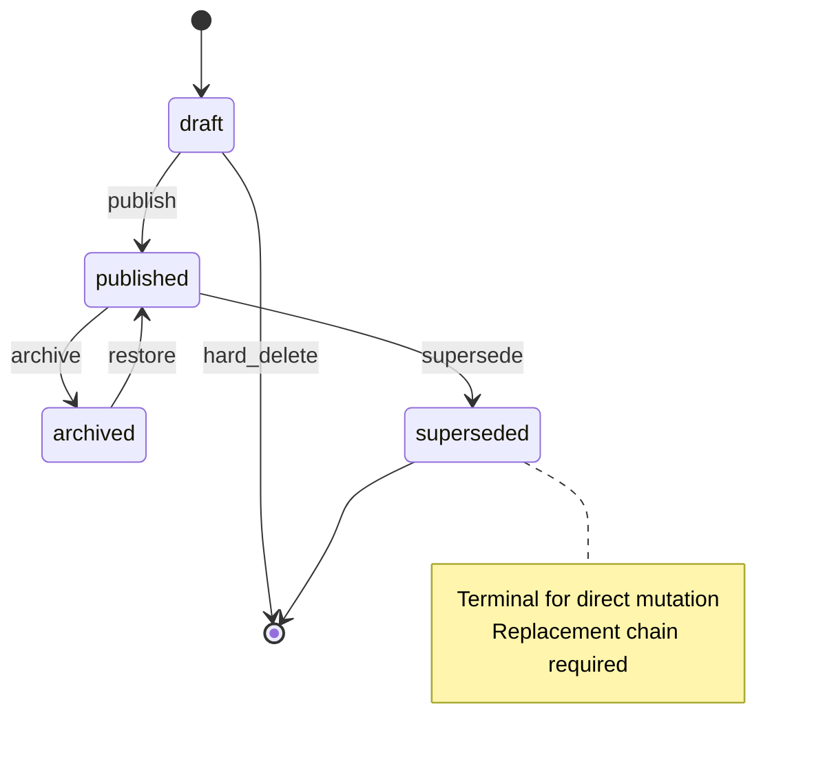

# ISSUE [CONTRACT] [CORE-01]: Pack and Definition Lifecycle

## Why This Exists
Lifecycle rules must be defined once so write-path services, query projections, and test suites all enforce the same transition legality.

## Scope
This contract defines legal state transitions for:
1. `ContentPackRecord.lifecycle_state`
2. `DefinitionRecord.lifecycle_state`

## Canonical States
1. `draft`
2. `published`
3. `archived`
4. `superseded` (definitions only)

## Transition Rules
1. `draft -> published` is legal.
2. `published -> archived` is legal.
3. `archived -> published` is legal only through restore policy.
4. `published -> superseded` is legal for definitions when replacement target is valid.
5. `superseded` is terminal for direct mutation.
6. `draft -> superseded` is illegal.
7. Deletes are legal for `draft` only.

## Policy Surface
The lifecycle policy must provide:
1. `validate_transition(current_state, target_state)`
2. `validate_supersedence(source_definition, replacement_definition)`
3. `validate_delete_permission(state)`

## Mermaid State Machine

## Extracted From
1. `ISSUES/archive/vertical_legacy/v05/V05_compendium_crud_and_definition_catalog_detailed_plan.mmd`
2. `ISSUES/archive/vertical_legacy/v05/ISSUE_[VERT]_[V05-04]_crud_application_orchestration.md`

## Canonical Symbols
1. `LifecycleState` in `backend/src/systems/dnd5e/content/domain/primitives.py`
2. `ContentPackRecord` in `backend/src/systems/dnd5e/content/domain/pack_models.py`
3. `DefinitionRecord` in `backend/src/systems/dnd5e/content/domain/definition_models.py`
