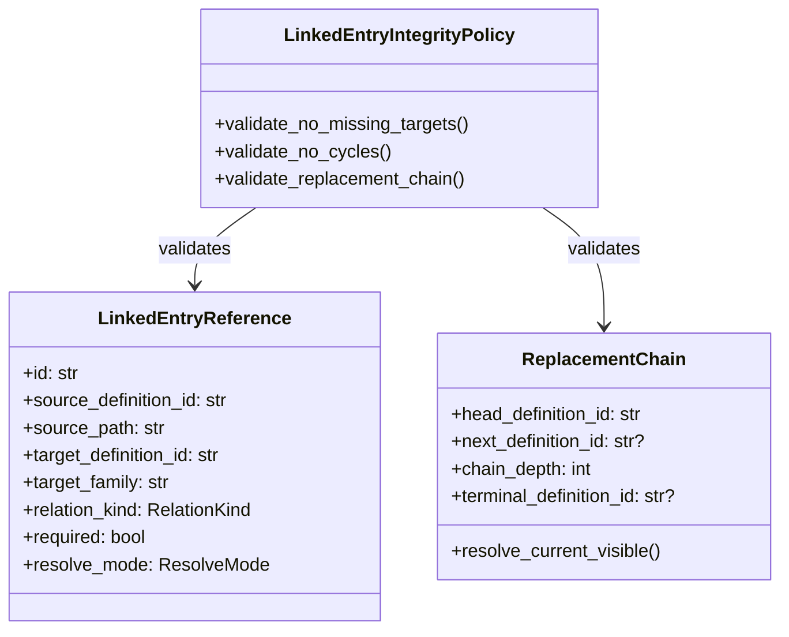

# ISSUE [CONTRACT] [CORE-02]: Referential Integrity and Link Graph

## Why This Exists
Link integrity must be a domain contract, not a storage detail, so all consumers can resolve references deterministically and deny invalid graphs early.

## Link Contract
Each link is represented as `LinkedEntryReference` with:
1. `id`
2. `source_definition_id`
3. `source_path`
4. `target_definition_id`
5. `target_family`
6. `relation_kind`
7. `required`
8. `resolve_mode`

## Required Behaviors
1. Required links must deny if the target does not exist.
2. Cycle creation must deny before persistence.
3. Resolution must support strict and best-effort modes.
4. Replacement chains must resolve to current visible terminal.
5. Delete operations must deny if protected links still depend on target.

## Denial Taxonomy
Use `CompendiumErrorCode` values:
1. `LINKED_TARGET_NOT_FOUND`
2. `CYCLE_DETECTED`
3. `GRAPH_CYCLE_DETECTED`
4. `LINKED_TARGET_IN_USE`
5. `INVALID_REPLACEMENT_TARGET`

## Mermaid Class Diagram

## Extracted From
1. `ISSUES/archive/vertical_legacy/v05/V05_content_management_query_and_projection_detailed_plan.mmd`
2. `ISSUES/archive/vertical_legacy/v05/v05_migration_notes.md`
3. `ISSUES/archive/vertical_legacy/v05/V05_architecture_Q_and_A.md`

## Canonical Symbols
1. `LinkedEntryReference`, `RelationKind`, `ResolveMode`, `ReplacementChain` in `backend/src/systems/dnd5e/content/domain/link_models.py`
2. `CompendiumErrorCode` in `backend/src/systems/dnd5e/content/domain/invariants.py`
3. `LinkedEntryIntegrityPolicy` in `backend/src/systems/dnd5e/content/policies/linked_entry_integrity_policy.py`
