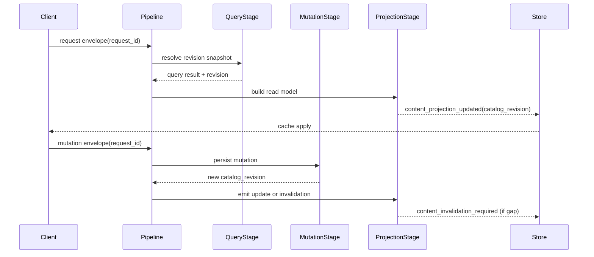

# ISSUE [CONTRACT] [CORE-03]: Query and Projection Consistency

## Why This Exists

Query correctness and projection convergence require explicit revision contracts so clients do not rely on timing heuristics or stale caches.

## Consistency Model

1. Queries execute on a fixed revision snapshot.
2. Mutations create one monotonic catalog revision.
3. Events carry revision metadata.
4. Consumers detect revision gaps and trigger invalidation or targeted refetch.

## Required Contract Fields

1. `request_id`
2. `catalog_revision`
3. `status` (`resolved`, `denied`, `error`)
4. `reason_code` for denied and error outcomes
5. `affected_definition_ids` for projection updates

## Projection Rules

1. Same input + same revision must yield deterministic ordering.
2. If incoming revision is greater than current + 1, consumer must invalidate scope.
3. Recovery policy must define full resync and targeted refetch paths.

## Contract Invariants

1. `catalog_revision` is monotonic and never decreases for accepted mutation outcomes.
2. Query snapshots are revision-pinned for deterministic read behavior.
3. Every terminal result envelope includes one status in `{resolved, denied, error}`.
4. Denied/error outcomes must include `reason_code`.
5. Projection update outcomes must include `affected_definition_ids` when scope is targetable.
6. Consumers must not apply out-of-order revisions without explicit recovery handling.

## Validation Directives

1. Snapshot validation: deny query execution when revision snapshot cannot be resolved.
2. Monotonic revision validation: deny mutation acknowledgement if new revision is not greater than prior accepted revision.
3. Gap validation: if `incoming_revision > current_revision + 1`, emit invalidation and trigger full resync.
4. Outdated event validation: if `incoming_revision < current_revision`, ignore apply and log stale event.
5. Envelope completeness validation: deny terminal envelope publication when required fields are missing.

## Recovery Policy Reference

The detailed recovery decision tree and convergence behavior are defined in:
`ISSUES/architecture/system_info/architecture/CORE_03_recovery_policy.md`.

## Mermaid Sequence Diagram

## Extracted From

1. `ISSUES/archive/vertical_legacy/v05/V05_content_management_query_and_projection_detailed_plan.mmd`
2. `ISSUES/archive/vertical_legacy/v05/V05_content_management_query_and_projection_detailed_plan_explanation.md`

## Canonical Symbols

1. `SearchIndexRepository` contract semantics in `backend/src/systems/dnd5e/content/infrastructure/search_index_repository.py`
2. `ContentMutationEvent` in `backend/src/systems/dnd5e/content/application/services.py`
