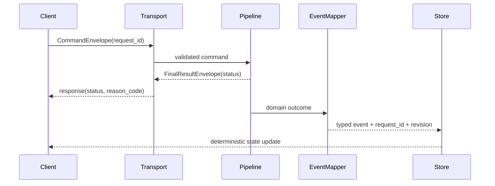

# ISSUE [CONTRACT] [CORE-04]: Session and Event Envelopes

## Why This Exists
Transport adapters must emit stable, machine-readable envelopes so clients can process resolved, denied, and error paths deterministically.

## Command Envelope
Required fields:
1. `request_id`
2. `command_type`
3. `payload`
4. `context` (actor, campaign, scope identifiers)

## Result Envelope
Required fields:
1. `request_id`
2. `status` (`resolved`, `denied`, `error`)
3. `reason_code` (required for denied and error)
4. `catalog_revision` (optional for non-content commands)
5. `payload`

## Event Families
1. `content_projection_updated`
2. `content_invalidation_required`
3. `character_sheet_references_resolved`
4. `character_sheet_references_denied`
5. `command_denied`

## Contract Rules
1. Every command envelope must have a terminal outcome.
2. Denials must be explicit, never silent.
3. `request_id` must be propagated end-to-end.
4. Event payloads must include revision context when they affect projections.

## Mermaid Sequence Diagram

## Extracted From
1. `ISSUES/archive/vertical_legacy/v05/V05_content_management_query_and_projection_detailed_plan.mmd`
2. `ISSUES/archive/vertical_legacy/v05/ISSUE_[VERT]_[V05-05]_rest_ws_contract_convergence_for_content_streams.md`

## Canonical Symbols
1. API request/response models in `backend/src/systems/dnd5e/content/api/router.py`
2. WS event surface in `backend/src/systems/dnd5e/content/api/ws_events.py`
3. Error code enums in `backend/src/systems/dnd5e/content/domain/invariants.py`
