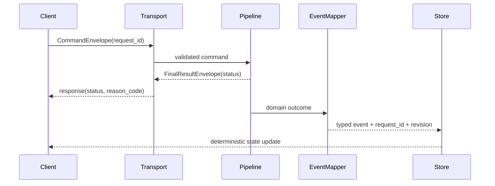

# ISSUE [CONTRACT] [CORE-04]: Session and Event Envelopes

## Why This Exists

Transport adapters must emit stable, machine-readable envelopes so clients can process resolved, denied, and error paths deterministically.

## Command Envelope

Required fields:

1. `request_id`
2. `command_type`
3. `payload`
4. `context` (actor, campaign, scope identifiers)

## Result Envelope

Required fields:

1. `request_id`
2. `status` (`resolved`, `denied`, `error`)
3. `reason_code` (required for denied and error)
4. `catalog_revision` (optional for non-content commands)
5. `payload`

## Event Families

1. `content_projection_updated`
2. `content_invalidation_required`
3. `character_sheet_references_resolved`
4. `character_sheet_references_denied`
5. `command_denied`

## Detailed Event Definitions

1. `content_projection_updated`: emitted when projection apply succeeds; payload must include `catalog_revision` and `affected_definition_ids`.
2. `content_invalidation_required`: emitted when revision gap or projection ambiguity is detected; payload must include invalidation scope and target revision.
3. `character_sheet_references_resolved`: emitted when character-sheet link resolution succeeds; payload must include resolved references and source context.
4. `character_sheet_references_denied`: emitted when link resolution fails policy checks; payload must include denial `reason_code` and failing references.
5. `command_denied`: emitted for terminal command denial paths; payload must include command context and stable denial code.

## Contract Rules

1. Every command envelope must have a terminal outcome.
2. Denials must be explicit, never silent.
3. `request_id` must be propagated end-to-end.
4. Event payloads must include revision context when they affect projections.

## Contract Invariants

1. Every command envelope must contain: `request_id`, `command_type`, `payload`, and `context`.
2. Every result envelope must contain: `request_id`, `status`, and `payload`.
3. Result envelopes with status `denied` or `error` must contain `reason_code`.
4. Projection-affecting events must include revision context.
5. `request_id` must remain unchanged from command ingress through terminal envelope.
6. Event family names must be stable and version-compatible within this contract.

## Validation Directives

1. Envelope shape validation: reject envelopes missing required fields.
2. Status validation: reject terminal outcomes with unsupported status values.
3. Reason code validation: reject denied/error outcomes with missing reason codes.
4. Correlation validation: reject events and results with mismatched or missing `request_id`.
5. Projection context validation: reject projection events without required revision fields.

## Mermaid Sequence Diagram

## Extracted From

1. `ISSUES/archive/vertical_legacy/v05/V05_content_management_query_and_projection_detailed_plan.mmd`
2. `ISSUES/archive/vertical_legacy/v05/ISSUE_[VERT]_[V05-05]_rest_ws_contract_convergence_for_content_streams.md`

## Canonical Symbols

1. API request/response models in `backend/src/systems/dnd5e/content/api/router.py`
2. WS event surface in `backend/src/systems/dnd5e/content/api/ws_events.py`
3. Error code enums in `backend/src/systems/dnd5e/content/domain/invariants.py`
