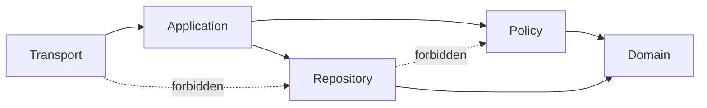

# ISSUE [CONTRACT] [CORE-05]: Layer Ownership and Dependency Direction

## Why This Exists
Horizontal architecture requires strict dependency direction to prevent business rules leaking into transport or persistence layers.

## Layers
1. Transport
2. Application
3. Policy
4. Repository
5. Domain

## Allowed Dependency Direction
1. Transport -> Application
2. Application -> Policy
3. Application -> Repository
4. Policy -> Domain
5. Repository -> Domain

## Forbidden Dependency Direction
1. Transport -> Repository direct writes
2. Repository -> Policy decisions
3. Projection consumer -> Mutation stage direct mutation
4. Domain -> Transport references

## Ownership Rule
Every mutable aggregate has one orchestrating application service owner.

## Mermaid Flowchart

## Extracted From
1. `ISSUES/archive/vertical_legacy/v05/V05_compendium_crud_and_definition_catalog_detailed_plan.mmd`
2. `ISSUES/archive/vertical_legacy/v05/V05_compendium_crud_and_definition_catalog_detailed_plan_explanation.md`

## Canonical Symbols
1. `CompendiumApplicationService` in `backend/src/systems/dnd5e/content/application/services.py`
2. Policies in `backend/src/systems/dnd5e/content/policies/`
3. Repositories and unit of work in `backend/src/systems/dnd5e/content/infrastructure/`
