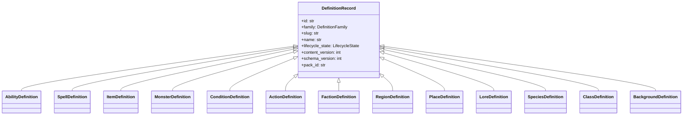

# ISSUE [CONTRACT] [DND5E-02]: Content Schema Contract

## Why This Exists

This contract freezes canonical DND5E definition shapes so compendium write/read paths and combat consumers use identical schema semantics.

## Base Contract

All definitions must extend `DefinitionRecord`:

1. `id`
2. `family`
3. `slug`
4. `name`
5. `lifecycle_state`
6. `content_version`
7. `schema_version`
8. `pack_id`
9. `provenance_source`
10. `provenance_author`
11. `provenance_updated_at`

## Families

1. `class`
2. `species`
3. `background`
4. `ability`
5. `spell`
6. `item`
7. `monster`
8. `lore`
9. `condition`
10. `action`
11. `faction`
12. `region`
13. `place`

## Family-Specific Contract Highlights

1. `AbilityDefinition`: `ability_type`, `action_operation_specs`, `passive_effects`
2. `SpellDefinition`: `level`, `school`, `casting_time`, `action_operation_specs`
3. `ItemDefinition`: `item_type`, `weight`, `cost`, `action_operation_specs`
4. `MonsterDefinition`: `challenge_rating`, `armor_class`, `hit_points_formula`, `action_operation_specs`
5. `ConditionDefinition`: `condition_type`, `has_levels`, `modifier_specs`
6. `ActionDefinition`: `action_type`, `activation_cost`, `action_operation_specs`
7. `FactionDefinition`: `alignment`, `influence_tier`, `base_region_id`
8. `RegionDefinition`: `climate`, `governing_faction_id`, `place_ids`
9. `PlaceDefinition`: `region_id`, `place_type`, `controlling_faction_id`

## Content Pack Contract

`ContentPackRecord` must define:

1. `id`
2. `author_user_id`
3. `title`
4. `lifecycle_state`
5. `is_homebrew`
6. `pack_key`
7. `compatibility_target`
8. `published_version`
9. `created_at`
10. `updated_at`

## Contract Invariants

1. Every definition must include all base contract fields.
2. `family` must match one of the canonical `DefinitionFamily` values.
3. Family-specific required fields must be present for the selected family type.
4. `content_version` and `schema_version` must be positive, monotonic integers.
5. `pack_id` must reference an existing content pack for non-global definitions.
6. `lifecycle_state` must follow the lifecycle contract from CORE-01.
7. Content pack records must include all pack contract fields.

## Validation Directives

1. Base-field validation: deny definitions missing any required base field.
2. Family-shape validation: deny family payloads that miss required family-specific fields.
3. Enum validation: deny unknown family or lifecycle values.
4. Version validation: deny non-positive or regressive version mutations.
5. Pack-reference validation: deny definitions referencing missing packs.
6. Contract error mapping: every schema denial must return explicit reason codes.

## Mermaid Class Diagram

## Extracted From

1. `ISSUES/archive/vertical_legacy/v05/V05_business_and_content_entities_class_diagram.mmd`
2. `ISSUES/archive/vertical_legacy/v05/V05_business_and_content_entities_overview.md`
3. `ISSUES/archive/vertical_legacy/v05/v05_migration_notes.md`

## Canonical Symbols

1. `DefinitionRecord` and family models in `backend/src/systems/dnd5e/content/domain/definition_models.py`
2. `DefinitionFamily` and `LifecycleState` in `backend/src/systems/dnd5e/content/domain/primitives.py`
3. `ContentPackRecord` in `backend/src/systems/dnd5e/content/domain/pack_models.py`
