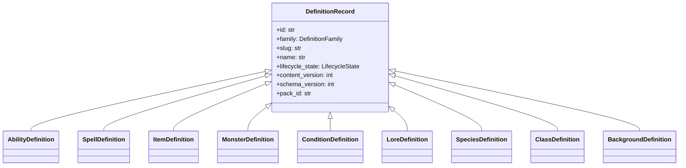

# ISSUE [CONTRACT] [DND5E-02]: Content Schema Contract

## Why This Exists
This contract freezes canonical DND5E definition shapes so compendium write/read paths and combat consumers use identical schema semantics.

## Base Contract
All definitions must extend `DefinitionRecord`:
1. `id`
2. `family`
3. `slug`
4. `name`
5. `lifecycle_state`
6. `content_version`
7. `schema_version`
8. `pack_id`
9. `provenance_source`
10. `provenance_author`
11. `provenance_updated_at`

## Families
1. `class`
2. `species`
3. `background`
4. `ability`
5. `spell`
6. `item`
7. `monster`
8. `lore`
9. `condition`

## Family-Specific Contract Highlights
1. `AbilityDefinition`: `ability_type`, `action_operation_specs`, `passive_effects`
2. `SpellDefinition`: `level`, `school`, `casting_time`, `action_operation_specs`
3. `ItemDefinition`: `item_type`, `weight`, `cost`, `action_operation_specs`
4. `MonsterDefinition`: `challenge_rating`, `armor_class`, `hit_points_formula`, `action_operation_specs`
5. `ConditionDefinition`: `condition_type`, `has_levels`, `modifier_specs`

## Content Pack Contract
`ContentPackRecord` must define:
1. `id`
2. `author_user_id`
3. `title`
4. `lifecycle_state`
5. `is_homebrew`
6. `pack_key`
7. `compatibility_target`
8. `published_version`
9. `created_at`
10. `updated_at`

## Mermaid Class Diagram

## Extracted From
1. `ISSUES/archive/vertical_legacy/v05/V05_business_and_content_entities_class_diagram.mmd`
2. `ISSUES/archive/vertical_legacy/v05/V05_business_and_content_entities_overview.md`
3. `ISSUES/archive/vertical_legacy/v05/v05_migration_notes.md`

## Canonical Symbols
1. `DefinitionRecord` and family models in `backend/src/systems/dnd5e/content/domain/definition_models.py`
2. `DefinitionFamily` and `LifecycleState` in `backend/src/systems/dnd5e/content/domain/primitives.py`
3. `ContentPackRecord` in `backend/src/systems/dnd5e/content/domain/pack_models.py`
