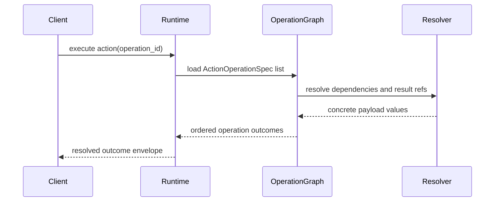

# ISSUE [CONTRACT] [DND5E-03]: Action Mechanics Contract

## Why This Exists

Action execution must be contract-driven and deterministic so combat runtime and content authoring stay aligned across clients and backend.

## Action Operation Contract

`ActionOperationSpec` requires:

1. `operation_id`
2. `activation_cost`
3. `activation_trigger`
4. `resource_consumption`
5. `targeting_spec`
6. `payload` (discriminated by `operation_type`)

## Supported Operation Types

1. `attack_roll`
2. `save`
3. `heal`
4. `effect_application`

## Modifier Contract

Modifier specs must support:

1. Flat modifiers
2. Dice modifiers
3. Rule overrides

## Result Piping Contract

Dynamic values may be:

1. Static values
2. Dice notation
3. `ResultReference` pointers to prior operation outputs

## Determinism Rules

1. Backend remains truth authority for rule execution.
2. `operation_id` must be stable for graph references.
3. Piped references must resolve in dependency order.
4. Invalid references must deny with validation error.

## Contract Invariants

1. Every `ActionOperationSpec` must define all required operation contract fields.
2. `operation_type` must be one of the supported operation types.
3. `operation_id` values must be unique within one action graph.
4. Result piping references must point to prior resolvable operation outputs.
5. Operation dependency graph must be acyclic for deterministic execution.
6. Unsupported modifier shapes must be denied explicitly.

## Validation Directives

1. Shape validation: deny operation specs missing required fields.
2. Operation type validation: deny unknown `operation_type` payload discriminators.
3. Graph validation: deny cyclic operation dependencies before execution.
4. Reference validation: deny unresolved `ResultReference` pointers with explicit reason codes.
5. Ordering validation: deny execution plans that require forward references.
6. Stability validation: deny duplicate `operation_id` values within the same action payload.

## Mermaid Sequence Diagram

## Extracted From

1. `ISSUES/archive/vertical_legacy/v05/V2_action_mechanics_specification.md`
2. `ISSUES/archive/vertical_legacy/v05/V05_architecture_Q_and_A.md`

## Canonical Symbols

1. `ActionOperationSpec`, `OperationType`, payload models in `backend/src/systems/dnd5e/content/domain/primitives.py`
2. `ModifierSpec`, `ResultReference`, `ResultAttribute` in `backend/src/systems/dnd5e/content/domain/primitives.py`
