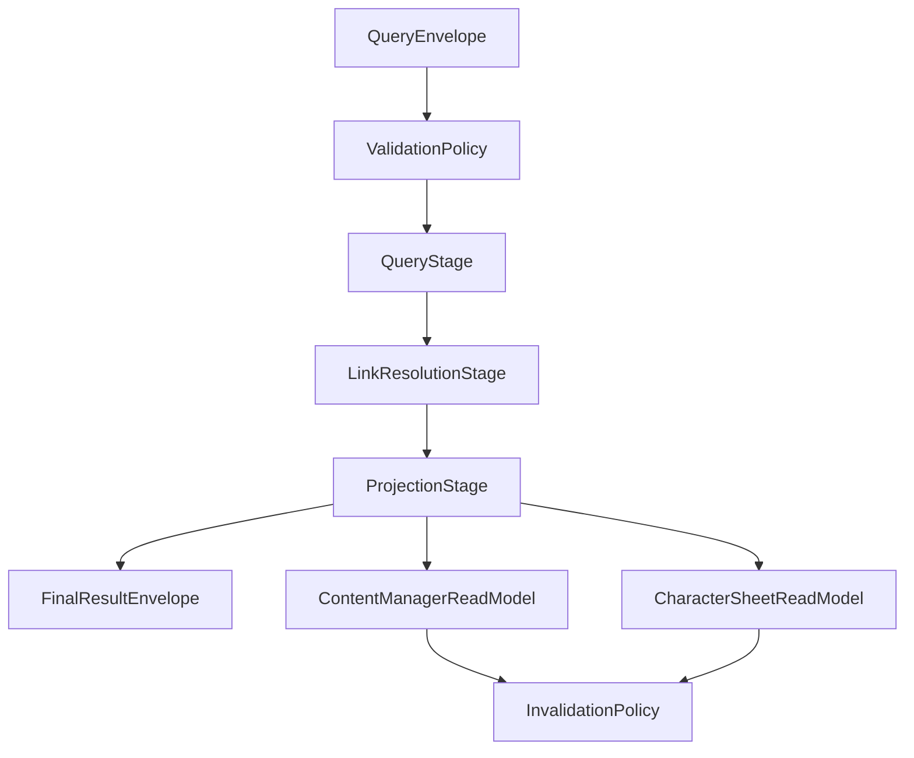

# ISSUE [CONTRACT] [DND5E-04]: Content Query and Read-Model Contract

## Why This Exists
DND5E content browsing and character-sheet lookup need deterministic query contracts with stable projection behavior across list, detail, and linked reference views.

## Query Envelope Families
1. Content list query
2. Content detail query
3. Character sheet lookup query

## Query Guarantees
1. Family and lifecycle filters are explicit.
2. Pagination and sort fields are deterministic.
3. Link expansion is explicit via request flags.
4. Every response includes revision context.

## Projection Consumers
1. Content manager read model
2. Character sheet reference read model

## Projection Rules
1. Read models consume events and revision metadata.
2. Revision gaps trigger invalidation and refetch.
3. Replacement chains resolve current visible definitions.

## Mermaid Flowchart

## Extracted From
1. `ISSUES/archive/vertical_legacy/v05/V05_content_management_query_and_projection_detailed_plan.mmd`
2. `ISSUES/archive/vertical_legacy/v05/V05_content_management_query_and_projection_detailed_plan_explanation.md`

## Canonical Symbols
1. Resolution types in `backend/src/systems/dnd5e/content/application/resolution.py`
2. Search/index semantics in `backend/src/systems/dnd5e/content/infrastructure/search_index_repository.py`
3. API contract endpoints in `backend/src/systems/dnd5e/content/api/router.py`
