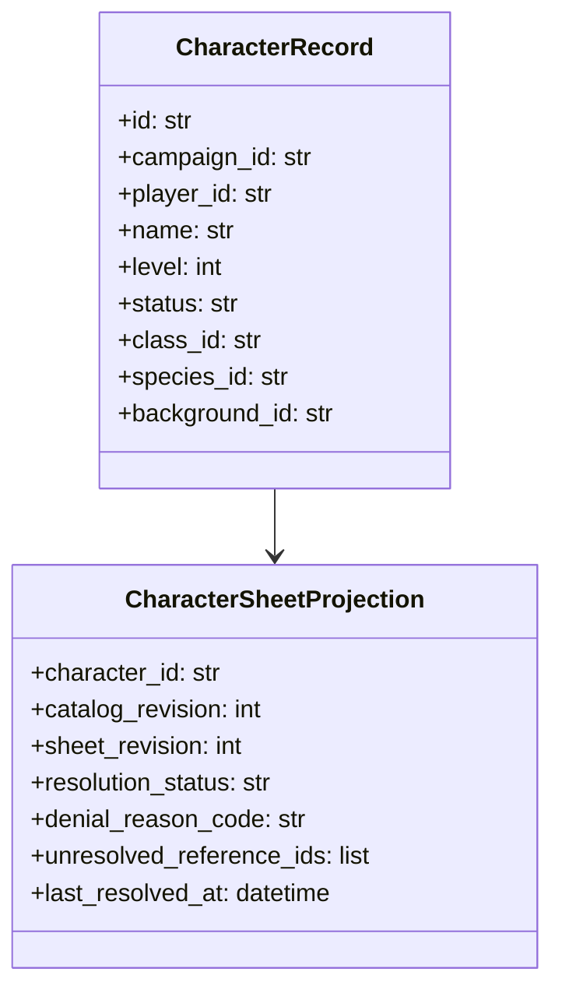

# ISSUE [CONTRACT] [DND5E-05]: Character and Sheet Schema Contract

## Why This Exists

Character entities and their sheet-facing projections need explicit schema contracts so content definitions, runtime state, and UI references remain consistent.

## Plain-Language Contract Intent

1. A character is always owned by exactly one campaign context and one controlling player identity.
2. A character sheet is not raw database output; it is a deterministic projection with explicit revision metadata.
3. If required references (class, species, background, abilities) cannot be resolved, the system must emit explicit denial state instead of partial or silent fallback.
4. Testers should be able to derive pass/fail outcomes from payload fields and reason codes without implementation-specific assumptions.

## Scope

1. Character identity and ownership fields.
2. Character build references (class/species/background/ability and linked definitions).
3. Character-sheet projection shape for deterministic rendering.
4. Character-sheet resolution outcomes (resolved, denied, invalidated).

## Canonical Contract Surface

1. `CharacterRecord`
   - Required: `id`, `campaign_id`, `player_id`, `name`, `level`, `status`
   - Required build refs: `class_id`, `species_id`
   - Optional build refs: `background_id`, `ability_ids`
2. `CharacterSheetProjection`
   - Required: `character_id`, `catalog_revision`, `sheet_revision`, `resolution_status`, `computed_fields`, `last_resolved_at`
   - Required on denied resolution: `denial_reason_code`, `unresolved_reference_ids`
3. `CharacterSheetResolutionEvent`
   - Required: `request_id`, `character_id`, `campaign_id`, `sheet_revision`, `status`
   - Required for `denied` or `error`: `reason_code`

## Contract Invariants

1. Every `CharacterRecord` must include `campaign_id` and `player_id`.
2. `CharacterRecord.level` must be an integer greater than or equal to `1`.
3. `class_id` and `species_id` are mandatory and must resolve through CORE-02 referential integrity checks.
4. `ability_ids` must not contain duplicates.
5. A sheet projection must include both `catalog_revision` and `sheet_revision`.
6. `sheet_revision` must increase monotonically per `character_id`.
7. `resolution_status` must be one of: `resolved`, `denied`, `invalidated`.
8. `resolution_status == denied` requires `denial_reason_code` and at least one unresolved reference id.
9. A projection is invalid for publication if required build references are unresolved.
10. Cross-campaign definition resolution is forbidden.

## Validation Directives

1. Ownership validation: deny create/update when campaign or player ownership fields are missing.
2. Field-shape validation: deny payloads missing required fields for character or projection surfaces.
3. Reference validation: deny unresolved required references with stable reason codes.
4. Duplicate-link validation: deny duplicate `ability_ids`.
5. Revision validation: deny projection writes without revision metadata.
6. Monotonic revision validation: deny projections when incoming `sheet_revision` regresses.
7. Status validation: deny unknown `resolution_status` values.
8. Denial payload validation: deny denied outcomes missing reason code context.
9. Scope validation: deny cross-campaign reference resolution attempts.
10. Contract error mapping: all denials must produce explicit reason codes and terminal envelope outcomes.

## Event and Recovery Behavior

### Event Definitions

1. `character_sheet_projection_updated`
   - Emitted when sheet projection succeeds.
   - Must include: `character_id`, `campaign_id`, `sheet_revision`, `catalog_revision`.
2. `character_sheet_references_denied`
   - Emitted when required references fail validation or resolution.
   - Must include: `character_id`, `campaign_id`, `reason_code`, `unresolved_reference_ids`.
3. `character_sheet_invalidation_required`
   - Emitted when source revision drift invalidates existing projection.
   - Must include: `character_id`, `campaign_id`, `invalidated_at_revision`, `reason_code`.

### Recovery Rules

1. On projection invalidation, clients must treat existing sheet state as stale until re-resolve succeeds.
2. Re-resolve must be idempotent for the same `(character_id, catalog_revision)` input.
3. Recovery retry paths must preserve `request_id` correlation in terminal envelopes.

## Contract Boundary and Non-Overlap

1. This contract defines character data and sheet projection semantics only.
2. Campaign membership and role policy ownership remain in CAM-01.
3. Envelope transport structure remains in CORE-04.
4. Lifecycle legality of referenced content remains in CORE-01.

## Mermaid Class Diagram

## Dependencies

1. CORE-02 Referential Integrity
2. CORE-03 Query and Projection Consistency
3. CORE-04 Session and Event Envelopes
4. DND5E-02 Content Schema

## Extracted From

1. `ISSUES/archive/vertical_legacy/v05/ISSUE_[VERT]_[V05-08]_character_domain_decoupling.md`
2. `ISSUES/archive/vertical_legacy/v05/ISSUE_[VERT]_[V05-09-CLEAN]_native_character_domain.md`
3. `ISSUES/archive/vertical_legacy/v05/test/V05_test_seq_05_character_sheet_viewer_linked_lookup_consistency.mmd`

## Canonical Symbols

1. `CharacterResponse` in `backend/src/schemas/character.py`
2. `CharacterCreationBlueprint` in `backend/src/systems/dnd5e/schemas/creation.py`
3. Character build assembly logic in `backend/src/systems/dnd5e/engine/character_builder.py`

## Test Plan

See: `ISSUES/architecture/01_contracts/dnd5e/test_plan/character_and_sheet_schema.md`
