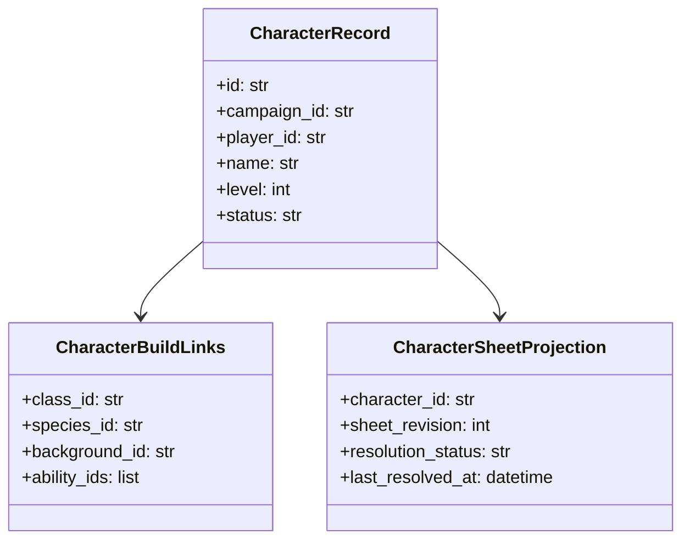

# ISSUE [CONTRACT] [DND5E-05]: Character and Sheet Schema Contract

## Why This Exists

Character entities and their sheet-facing projections need explicit schema contracts so content definitions, runtime state, and UI references remain consistent.

## Scope

1. Character identity and ownership fields.
2. Character build references (class/species/background/ability and linked definitions).
3. Character-sheet projection shape for deterministic rendering.

## Initial Contract Surface

1. `CharacterRecord` core identity fields (`id`, `campaign_id`, `player_id`, `name`, `level`, `status`).
2. Definition-link fields for build elements (`class_id`, `species_id`, `background_id`, `ability_ids`).
3. Sheet projection metadata (`sheet_revision`, `last_resolved_at`, `resolution_status`).

## Contract Invariants (Initial)

1. Character records must reference an owning campaign.
2. Build references must resolve via CORE-02 integrity rules.
3. Sheet projection must include revision context.
4. Unresolved required references must produce explicit denial state.

## Validation Directives (Initial)

1. Deny character create/update when required ownership fields are missing.
2. Deny unresolved required build references.
3. Reject projection publication without revision metadata.
4. Enforce deterministic field presence for sheet render payload.

## Mermaid Class Diagram

## Dependencies

1. CORE-02 Referential Integrity
2. CORE-03 Query and Projection Consistency
3. CORE-04 Session and Event Envelopes
4. DND5E-02 Content Schema

## Test Plan

See: `ISSUES/architecture/01_contracts/dnd5e/test_plan/character_and_sheet_schema.md`
