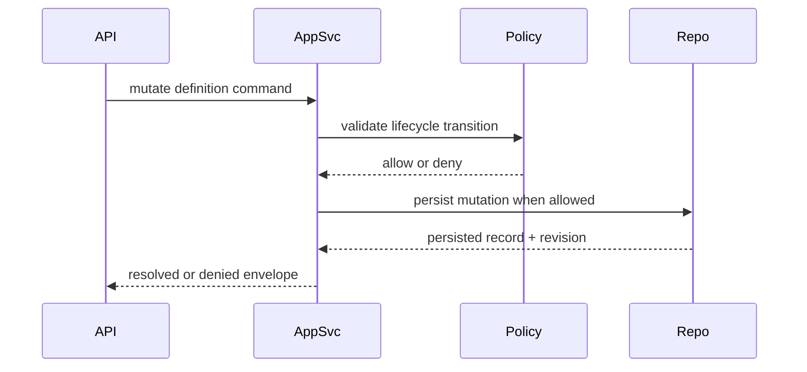

# ISSUE [IMPLEMENT] [CM-01]: Definition Write Path and Lifecycle Enforcement

## Goal

Implement create/update/publish/archive/supersede orchestration for definitions and packs with strict lifecycle enforcement.

## Contract Inputs

1. CORE-01 Pack Lifecycle
2. CORE-05 Layer Ownership
3. DND5E-02 Content Schema

## Scope

1. Application-service entrypoints for definition and pack mutation commands.
2. Lifecycle transition validation through policy layer.
3. Denial mapping for illegal transitions and delete restrictions.

## Out of Scope

1. Query optimization.
2. WS event fan-out implementation details (covered in CM-05).

## Implementation Notes

1. Keep transport layer thin; orchestration lives in application services.
2. Enforce policy before persistence writes.
3. Emit revision-bearing outcomes for downstream projection stages.

## Acceptance Criteria

1. Illegal transitions deny with stable reason codes.
2. Legal transitions persist and return updated lifecycle states.
3. Draft-only delete rule is enforced.
4. Supersedence requires valid replacement target.

## Test Focus

1. Transition legality matrix tests.
2. Supersedence validation tests.
3. Delete permission tests.

## Mermaid Flow

