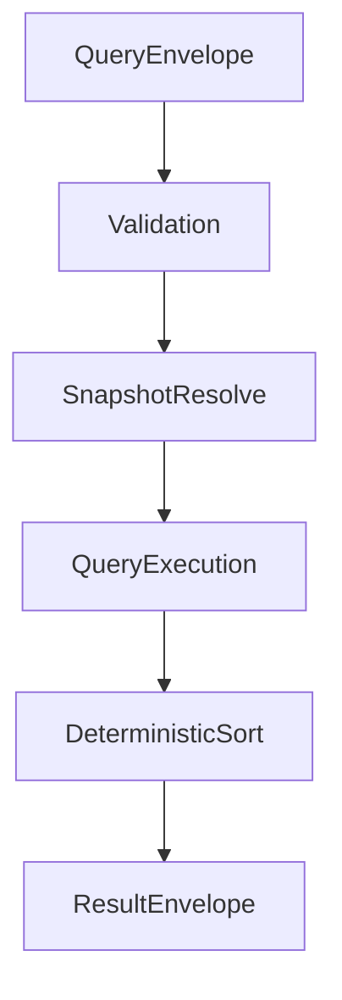

# ISSUE [IMPLEMENT] [CM-02]: Content List and Detail Query Pipeline

## Goal

Implement deterministic list/detail query flow with explicit filters, stable ordering, and revision-aware responses.

## Contract Inputs

1. CORE-03 Query and Projection Consistency
2. DND5E-04 Content Query Projection
3. CORE-04 Session and Event Envelopes

## Scope

1. Query envelope validation and normalization.
2. List/detail query execution over revision-pinned snapshots.
3. Response construction with deterministic sort/pagination behavior.

## Out of Scope

1. Link-graph denial semantics beyond minimal passthrough (CM-03).
2. Full recovery loop behavior (CM-04).

## Acceptance Criteria

1. Same input + same revision yields deterministic output order.
2. Unsupported filter/sort combinations deny explicitly.
3. Every successful response includes revision metadata.
4. Envelope shape is consistent for resolved/denied/error paths.

## Test Focus

1. Deterministic ordering tests.
2. Filter/sort validation denial tests.
3. Revision metadata presence tests.

## Mermaid Flow

