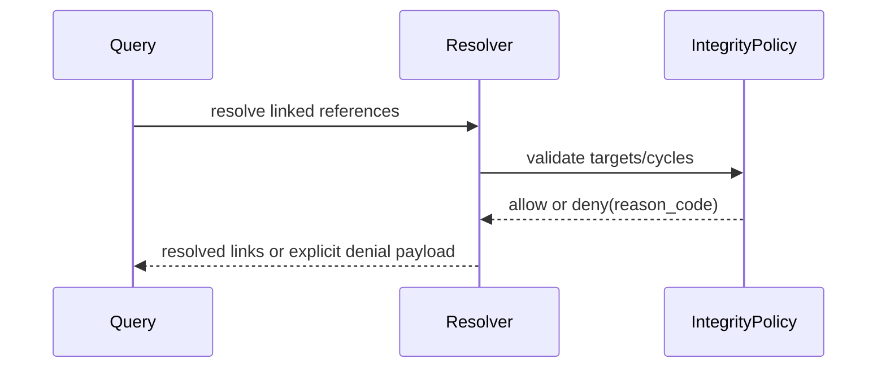

# ISSUE [IMPLEMENT] [CM-03]: Linked Reference Resolution and Denial Paths

## Goal

Implement linked-reference resolution with strict/best-effort behavior and explicit denial taxonomy.

## Contract Inputs

1. CORE-02 Referential Integrity
2. DND5E-04 Content Query Projection
3. CORE-04 Session and Event Envelopes

## Scope

1. Required-link missing target denial behavior.
2. Cycle detection pre-write validation integration.
3. Replacement-chain current-visible resolution in read flow.

## Out of Scope

1. Broad query performance tuning.
2. New schema families.

## Acceptance Criteria

1. Required missing links deny with stable reason codes.
2. Cycles are denied before persistence.
3. Best-effort mode returns partial resolution with explicit unresolved markers.
4. Replacement chains resolve to current visible terminal.

## Test Focus

1. Missing-target denial tests.
2. Cycle detection tests.
3. Replacement-chain resolution tests.

## Mermaid Flow

