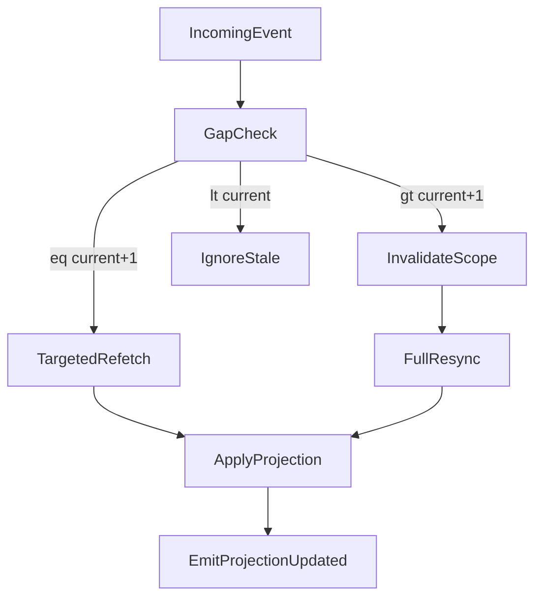

# ISSUE [IMPLEMENT] [CM-04]: Projection Invalidation and Recovery Loop

## Goal

Implement deterministic projection gap handling with explicit invalidation, targeted refetch, and full resync behavior.

## Contract Inputs

1. CORE-03 Query and Projection Consistency
2. CORE-04 Session and Event Envelopes
3. DND5E-04 Content Query Projection
4. `ISSUES/architecture/system_info/architecture/CORE_03_recovery_policy.md`

## Scope

1. Detect revision gaps during projection-consumer apply.
2. Execute targeted refetch path for single-step revision updates.
3. Execute full resync path for multi-step gaps or ambiguous scope.
4. Emit contract-compliant invalidation and update events.

## Out of Scope

1. Query sort/filter business behavior changes (CM-02).
2. Transport adapter fan-out specifics (CM-05).

## Acceptance Criteria

1. `incoming_revision == current_revision + 1` triggers targeted update path.
2. `incoming_revision > current_revision + 1` triggers invalidation + full resync path.
3. `incoming_revision < current_revision` is ignored deterministically with stale-event logging.
4. Recovery failures surface explicit denial/error outcomes with reason codes.

## Test Focus

1. Revision gap detection tests.
2. Targeted refetch and full resync branching tests.
3. Stale event ignore-path tests.
4. Envelope reason-code completeness tests for recovery failures.

## Mermaid Flow

