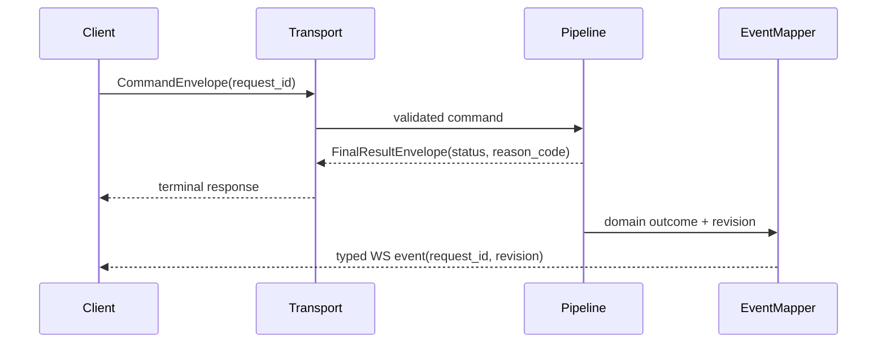

# ISSUE [IMPLEMENT] [CM-05]: Session and WebSocket Envelope Contract Mapping

## Goal

Implement transport-level mapping that guarantees API and WebSocket responses/events conform to CORE-04 envelope contracts.

## Contract Inputs

1. CORE-04 Session and Event Envelopes
2. CORE-03 Query and Projection Consistency
3. CORE-02 Referential Integrity

## Scope

1. Normalize terminal result envelopes for `resolved`, `denied`, and `error` outcomes.
2. Ensure `request_id` correlation propagation end-to-end.
3. Standardize reason-code mapping for denial/error outcomes.
4. Ensure projection-impacting events include revision metadata.

## Out of Scope

1. Domain policy changes for lifecycle/link/query behavior.
2. Client UI rendering logic.

## Acceptance Criteria

1. Every command gets one terminal envelope outcome.
2. Denied/error envelopes include explicit reason codes.
3. `request_id` remains stable across command and event pipeline.
4. Projection events publish required revision fields.

## Test Focus

1. Envelope schema and required field tests.
2. Request correlation continuity tests.
3. Denial/error reason-code mapping tests.
4. Projection-event revision field presence tests.

## Mermaid Sequence

