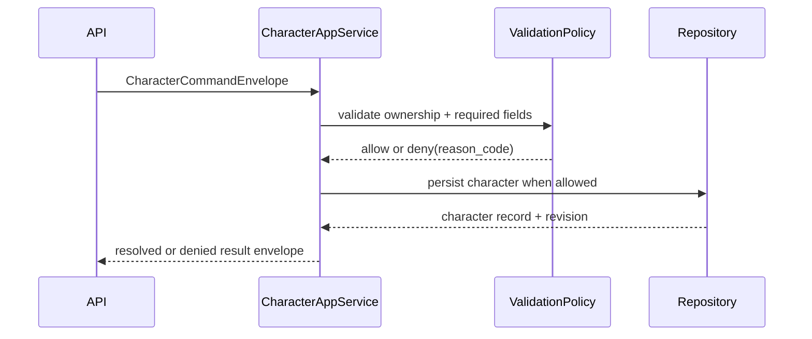

# ISSUE [IMPLEMENT] [CM-07]: Character Record Write and Ownership Validation

## Goal

Implement character create/update write path with campaign ownership validation and deterministic denial behavior.

## Contract Inputs

1. DND5E-05 Character and Sheet Schema
2. CORE-02 Referential Integrity
3. CORE-04 Session and Event Envelopes
4. CORE-05 Layer Ownership

## Scope

1. Character create/update command handling in application service layer.
2. Ownership and required field validation (`campaign_id`, `player_id`, `name`, `level`, `status`).
3. Deterministic denial mapping for missing ownership/context violations.

## Out of Scope

1. Campaign role policy enforcement beyond ownership checks (CAM-01 deferred in Option B).
2. Character-sheet projection rendering payload (covered in CM-08).

## Acceptance Criteria

1. Character create/update denies when required ownership fields are missing.
2. Character create/update resolves when ownership fields are valid.
3. Denied outcomes return explicit reason codes with stable envelope shape.
4. Application-layer orchestration remains compliant with CORE-05 ownership boundaries.

## Test Focus

1. Required ownership field validation tests.
2. Denial reason-code determinism tests.
3. Valid create/update happy-path tests.

## Mermaid Flow

