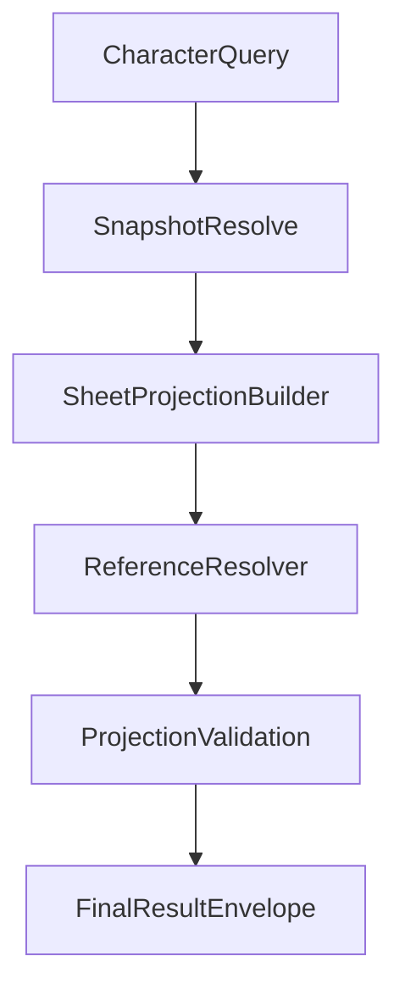

# ISSUE [IMPLEMENT] [CM-08]: Character Sheet Projection and Reference Resolution

## Goal

Implement revision-aware character-sheet projection with deterministic linked-reference resolution and explicit unresolved-reference outcomes.

## Contract Inputs

1. DND5E-05 Character and Sheet Schema
2. CORE-02 Referential Integrity
3. CORE-03 Query and Projection Consistency
4. CORE-04 Session and Event Envelopes
5. DND5E-04 Content Query Projection

## Scope

1. Character-sheet projection builder for character read paths.
2. Linked definition reference resolution for class/species/background/abilities.
3. Explicit unresolved reference signaling with deterministic denial markers.
4. Revision metadata propagation in sheet projection outputs.

## Out of Scope

1. Campaign membership/role policy decisions (CAM-01 deferred in Option B).
2. UI presentation concerns.

## Acceptance Criteria

1. Projection responses include `sheet_revision`, `resolution_status`, and reference resolution metadata.
2. Required unresolved references deny deterministically with stable reason codes.
3. Same character input + same revision yields deterministic sheet payload.
4. Revision gaps trigger invalidation/recovery behavior consistent with CORE-03.

## Test Focus

1. Reference resolution success/denial tests.
2. Deterministic projection output tests.
3. Revision metadata and gap handling tests.

## Mermaid Flow

