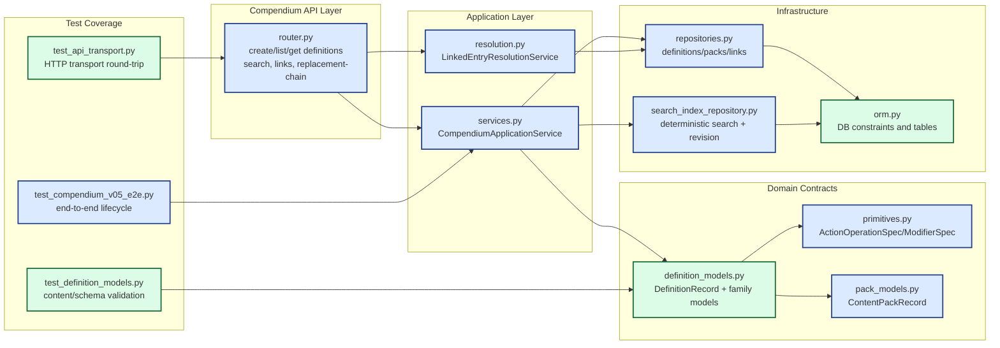

# PR-3 Current State Diagram (Compendium Content Path)

This diagram captures the current backend structure for PR-3 scope:
- DND5E-02 content schema enforcement
- DND5E-04 query/projection behavior
- DND5E-03 integration touch (action payload contract round-trip)

