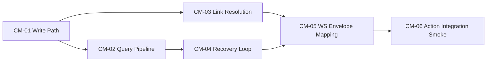

# Sprint 2 Board: Content Management Vertical Delivery

## Sprint Intent

Ship the first production-capable content management slice by implementing Layer 2 behavior on top of frozen Layer 1 contracts.

## Sprint Window

Two-week delivery sprint (execution-focused).

## Contract Baseline (Frozen)

1. CORE-01 Pack Lifecycle
2. CORE-02 Referential Integrity
3. CORE-03 Query and Projection Consistency
4. CORE-04 Session and Event Envelopes
5. CORE-05 Layer Ownership
6. DND5E-02 Content Schema
7. DND5E-03 Action Mechanics (integration touch only)
8. DND5E-04 Content Query Projection

Reference: `ISSUES/architecture/01_contracts/FREEZE_GATE_STATUS.md`

## Pre-Execution Gate (Must Pass)

0. Record one explicit Sprint 2 scope choice in `ISSUES/architecture/02_implementations/SPRINT_02_SCOPE_DECISION.md`.
1. Resolve or explicitly defer blockers listed in `FREEZE_GATE_STATUS.md`:
   - Clarity/testability interpretation blocker
   - Character-sheet domain coverage blocker
   - Campaign-management domain coverage blocker
2. If sprint scope is compendium-only, record explicit out-of-scope decision for DND5E-05 and CAM-01 in sprint kickoff notes.
3. Confirm all in-scope modules are `Frozen` in `ISSUES/architecture/01_contracts/APPROVAL_LOG.md`.
4. Confirm scorecards exist and meet thresholds from `ISSUES/architecture/01_contracts/MODULE_DETAIL_SCORECARD_TEMPLATE.md`.
5. If any module drifts after freeze, re-open review per `ISSUES/architecture/APPROVAL_GATE_PROCEDURE.md` before implementation resumes.

## Sprint Definition of Done

1. Content definition create/update/publish path is functional and contract-compliant.
2. List/detail query path returns deterministic, revision-aware responses.
3. Link resolution and denial behavior is explicit and test-covered.
4. Projection invalidation and recovery behavior is implemented for revision gaps.
5. API and WS envelopes map exactly to CORE-04 contract outcomes.
6. Backend tests for the above paths are green in containerized test workflow.

## Work Board

## In Progress

- [ ] `ISSUE_[IMPLEMENT]_[CM-01]_definition_write_path_and_lifecycle_enforcement.md`
- [ ] `ISSUE_[IMPLEMENT]_[CM-02]_content_list_and_detail_query_pipeline.md`

## Ready

- [ ] `ISSUE_[IMPLEMENT]_[CM-03]_linked_reference_resolution_and_denial_paths.md`
- [ ] `ISSUE_[IMPLEMENT]_[CM-04]_projection_invalidation_and_recovery_loop.md`
- [ ] `ISSUE_[IMPLEMENT]_[CM-05]_session_ws_envelope_contract_mapping.md`

## Option B Character Track (Ready)

- [ ] `ISSUE_[IMPLEMENT]_[CM-07]_character_record_write_and_ownership_validation.md`
- [ ] `ISSUE_[IMPLEMENT]_[CM-08]_character_sheet_projection_and_reference_resolution.md`

## Stretch

- [ ] `ISSUE_[IMPLEMENT]_[CM-06]_action_mechanics_contract_integration_smoke.md`

## Sequencing Rules

1. CM-01 must land before CM-02 enters implementation.
2. CM-02 and CM-03 can run in parallel after CM-01 core interfaces stabilize.
3. CM-04 depends on CM-02 event emission points.
4. CM-05 depends on CM-01..CM-04 envelope sources.
5. CM-06 starts only after CM-01..CM-05 acceptance checks pass.
6. CM-07 depends on Option B scope decision sign-off.
7. CM-08 depends on CM-07 character write-path interfaces and CM-03 reference-resolution behavior.

## Dependency Map

## Verification Commands

1. `docker compose --profile test run --rm backend-test`
2. `python backend/scripts/generate_types.py --check`
3. `python backend/scripts/validate_fixture_json.py`

## Risks

1. Legacy coupling can leak into application services if ownership boundaries are not enforced.
2. Revision metadata omissions can break deterministic query behavior.
3. WS envelope drift can produce client-side state desync.
4. Missing character/campaign contracts can invalidate downstream assumptions for broader feature rollout.

## Daily Update Template

1. Completed ticket IDs.
2. Blocked ticket IDs and dependency reason.
3. Contract compliance concerns discovered.
4. Required contract clarifications (if any).
