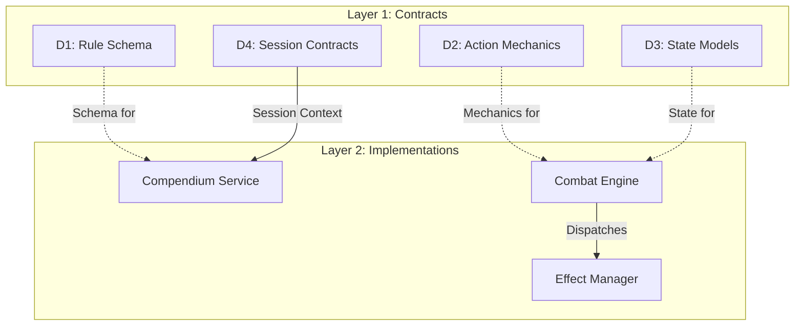

# CMV2 Planning Overview: The "Horizontal-First" Roadmap

> [!IMPORTANT]
> **Instant Context**:
> - [What We Are Doing](file:///c:/Users/simon/Documents/GitHub/cmv2/ISSUES/architecture/WHAT_WE_ARE_DOING.md) — High-level strategy for this phase.
> - [Current Task Context](file:///c:/Users/simon/Documents/GitHub/cmv2/ISSUES/architecture/CURRENT_TASK.md) — Why this task is happening now.
> 
> **Deep Technical Information**:
> Explore the **[System Information Repository](file:///c:/Users/simon/Documents/GitHub/cmv2/ISSUES/architecture/system_info/)** for detailed explanations of legacy systems and new architectural designs.

This map defines the current state of architecture and implementation for the CMV2 engine.

## 1. System Map (Cross-Module Overview)

> [!TIP]
> **View Detailed Version**: For the canonical domain split, see the **[Horizontal Architecture Map](file:///c:/Users/simon/Documents/GitHub/cmv2/ISSUES/architecture/HORIZONTAL_OVERVIEW.mmd)**.

## 2. Diagramming Standards

CMV2 uses **Mermaid** for all architectural documentation. This ensures native rendering in GitHub Web, IDEs, and Notion without extra configuration.

## 3. Shared Principles
- **No Orphan Logic**: Implementation logic (Layer 2) *must* implement a contract from Layer 1.
- **Contract Stability**: Contracts are frozen before implementations begin.
- **Traceability**: Every issue links back to its domain contract.
- **Quality Integrity (PSQ)**: New production code MUST NOT import legacy `bronze` or `unchecked` modules. (Reference: [PSQ System](file:///c:/Users/simon/Documents/GitHub/cmv2/ISSUES/archive/quality/ISSUE_[QUALITY]_[SYS-01]_production_status_quarantine.md)).
- **Horizontal Governance**: No code or models are finalized without a Deep Conceptualization diagram. (Reference: [Horizontal Planning Rule](file:///c:/Users/simon/Documents/GitHub/cmv2/.agents/rules/horizontal-planning.md)).
- **Role of the Agent**: The `documentation_architect` AI skill is responsible for verifying these conceptualization gates.

---

## 3. Active Horizons

### [L1] Current Contract Focus: **D&D 5e Base Rule Schema**
- **Status**: Harvesting from Legacy V05.
- **Goal**: Define the canonical structure for Monsters, Spells, Items, and Lore.
- **Reference**: `ISSUES/architecture/01_contracts/ISSUE_[CONTRACT]_[DND5E-01]_base_rule_schema.md` (Planned).

### [L2] Current Implementation Focus: **Compendium & Character Bridging**
- **Status**: Pivot in Progress.
- **Goal**: Transitioning V05 logic into the new layered pattern.
- **Reference**: `ISSUES/archive/vertical_legacy/v05/` (Source intelligence).

---

## 4. Why This Architecture?
By prioritizing **Contracts**, we ensure that the system remains deterministic and scalable. The "Monster" defined in the Compendium (V05) MUST be the same "Monster" the Combat Engine (V02) interacts with. Layering ensures this consistency across all game-rule definitions.
