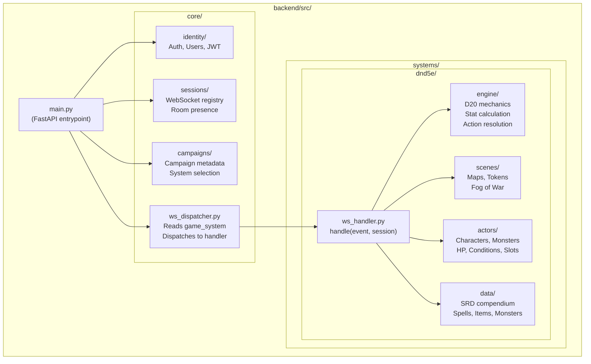
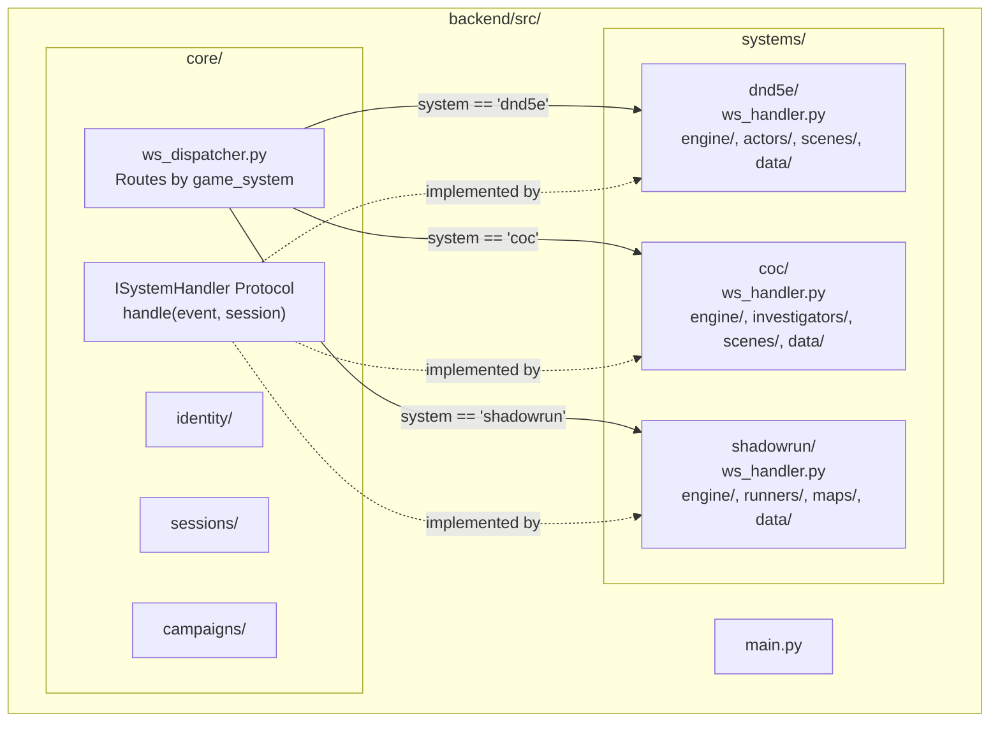
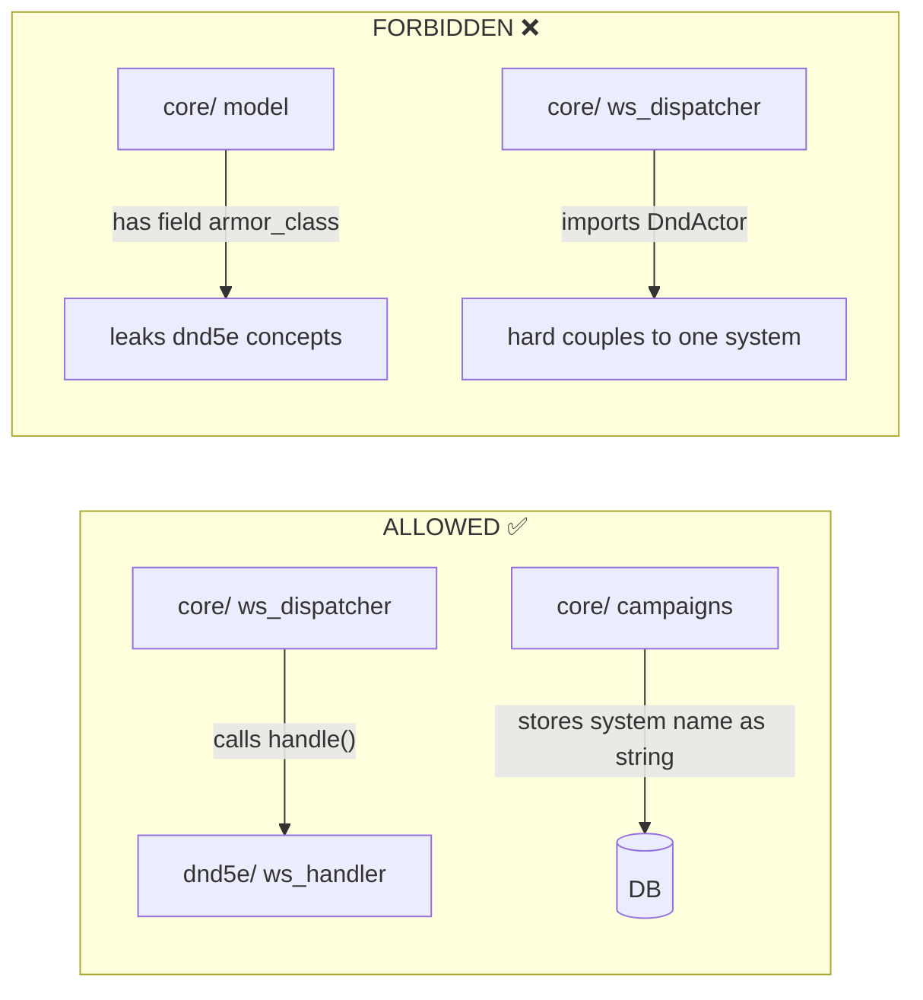
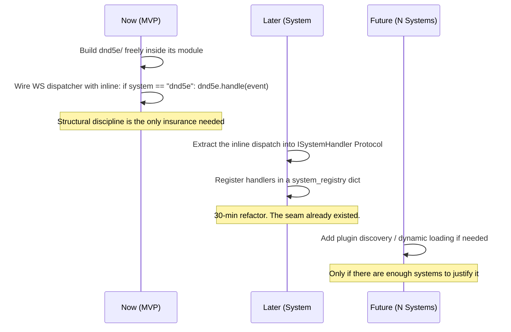

# CMV2: Core Scope & Requirements

This document defines the architectural philosophy, structural boundaries, and MVP scope for the CMV2 backend. It is the canonical reference for development decisions.

---

## 1. Core Philosophy

### The Multi-System Problem

CMV2 aims to support multiple tabletop game systems (D&D 5e, Call of Cthulhu, Shadowrun, etc.). A naive approach would try to abstract all systems into a shared "core VTT" layer. This fails because the systems are **fundamentally incompatible** at the data level:

| Feature     | D&D 5e                          | Call of Cthulhu      | Shadowrun                    |
| ----------- | ------------------------------- | -------------------- | ---------------------------- |
| Maps        | Square/Hex tile grids           | Theater of mind      | Street maps, different scale |
| Entities    | HP, AC, Spell Slots, Conditions | Sanity, Skills, Luck | Essence, Nuyen, Cyberware    |
| Combat      | Initiative, AoO, Reactions      | Simple turns         | Complex initiative passes    |
| Audio/Video | Background ambience             | Horror-focused       | Cyberpunk atmosphere         |

There is no meaningful shared `BaseMap`, `BaseEntity`, or `BaseScene` that wouldn't be an outright lie — a struct so generic it carries no useful type information.

### What _Is_ Universal

The genuine common ground is limited to infrastructure, not game logic:

1. **Identity & Auth** — Users, accounts, JWT. System-agnostic.
2. **Session Management** — WebSocket connection registry, room presence.
3. **Campaign Metadata** — Name, which system is active, who is in the party.
4. **The WebSocket Dispatcher** — Receives an event, reads `game_system`, routes to the correct system handler.

**Everything else is owned by the game system module.**

### The "One Tiny Router" Rule

The only sanctioned connection between `core/` and `systems/` is the WebSocket dispatcher. It calls a single `handle()` function on the active system handler and nothing more. It does not know about D&D actors, maps, spells, or any game-specific concept.

---

## 2. Architecture

### MVP Structure (D&D 5e Only)



### Future Structure (Multi-System)



### The Seam (Critical Boundary Rule)



---

## 3. MVP Scope

### In Scope (Build Now)

The MVP is **D&D 5e only**. The goal is a working system, not a framework.

| Area                 | What to build                                                                   |
| -------------------- | ------------------------------------------------------------------------------- |
| **Folder structure** | `core/` + `systems/dnd5e/` from day one (the seam must exist)                   |
| **Auth**             | JWT login, user model — in `core/identity/`                                     |
| **WebSocket**        | Connection handling, simple inline dispatcher — in `core/`                      |
| **D&D Engine**       | D20 mechanics, stat derivation, action resolution — in `dnd5e/engine/`          |
| **Actors**           | Characters and monsters with typed schemas (AC, HP, slots) — in `dnd5e/actors/` |
| **Scenes**           | Map grid, token placement, fog of war — in `dnd5e/scenes/`                      |
| **Data**             | SRD compendium loader (JSON files) — in `dnd5e/data/`                           |
| **Compendium rule**  | No hardcoded spells/abilities. Engine reads JSON definitions dynamically.       |

### Out of Scope (Deferred)

| Area                          | Why deferred                                                         |
| ----------------------------- | -------------------------------------------------------------------- |
| **`ISystemHandler` Protocol** | Unnecessary until system #2 exists. Retrofit in ~30 min when needed. |
| **Dynamic plugin loading**    | No hot-swap `.zip` mod loader. `dnd5e` is instantiated at boot.      |
| **Authoring tools**           | No custom spell/item creator UI. Ingest predefined SRD JSON.         |
| **Second game system**        | CoC, Shadowrun, etc. come after D&D 5e is fully functional.          |
| **Audio/Video**               | Deferred. Entirely system-specific, no abstraction value right now.  |

---

## 4. The Abstraction Timeline

Do **not** build the formal `ISystemHandler` Protocol now. Follow this sequence instead:



---

## 5. The Data-Driven Engine Rule

The engine must never contain game-specific hardcoded logic. This applies to the D&D 5e engine too.

**Forbidden:**

```python
def cast_fireball(caster, targets, scene):
    damage = roll("8d6")
    ...
```

**Required:**

```python
# "Fireball" is a JSON definition in the compendium
spell_def = data.get_spell("fireball")
# Engine resolves it dynamically
result = engine.resolve_action(caster, targets, spell_def, scene)
```

The engine receives a data-driven `ActionDefinition` (e.g., `"aoe_radius": 20, "damage": "8d6", "damage_type": "fire", "save": "DEX"`) and executes it. This is what makes homebrew and SRD swappable without code changes.

---

## 6. Key Decisions Log

| Decision                       | Rationale                                                                             |
| ------------------------------ | ------------------------------------------------------------------------------------- |
| No shared `BaseEntity`         | Systems are too different. A shared base would be an untyped lie.                     |
| No shared `BaseMap`            | Map types are system-specific. Square grids ≠ theater of mind.                        |
| Seam lives in folder structure | Physical directory boundary enforces the rule without a Protocol.                     |
| Protocol deferred              | Contracts are only useful when there are two things to swap between.                  |
| D&D first, universal later     | A working product beats a perfect framework. Retrofitting is cheap if the seam holds. |
