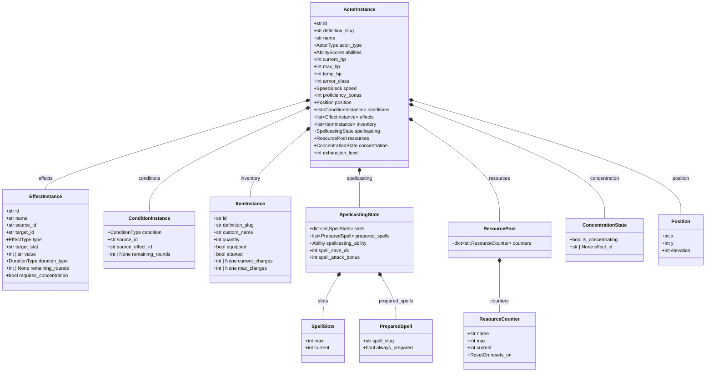
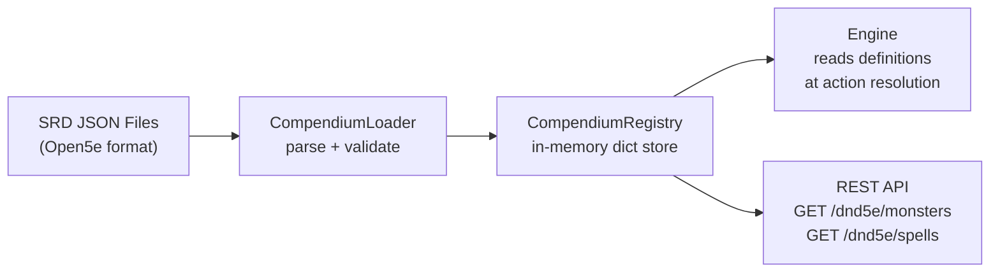
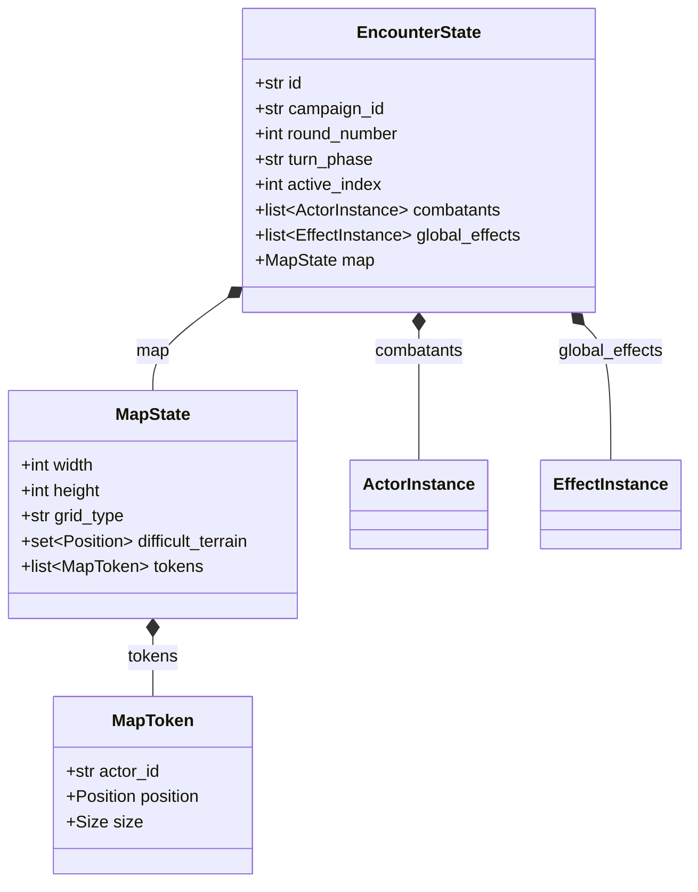
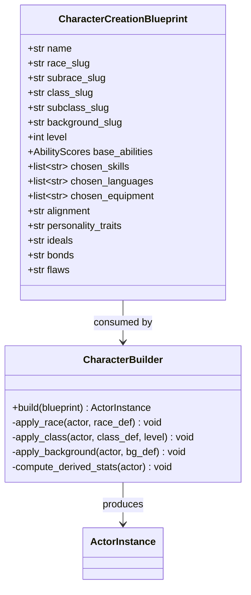
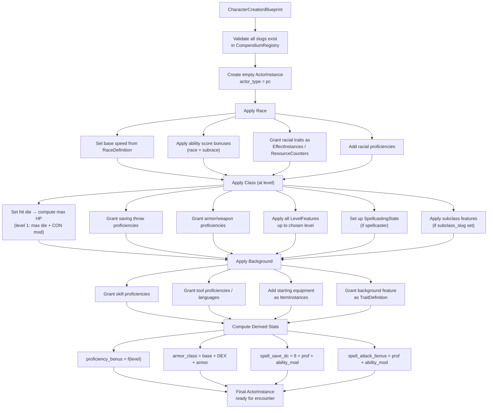

# D&D 5e Data Models Architecture

This document defines every data type needed for the D&D 5e system module. It distinguishes between **Definitions** (compendium templates, read-only) and **Instances** (live game state, mutable). All schemas live inside `src/systems/dnd5e/`.

---

## 1. Design Principles

| Principle                        | Rule                                                                                                                |
| -------------------------------- | ------------------------------------------------------------------------------------------------------------------- |
| **Definition ≠ Instance**        | A spell in the SRD compendium is a `SpellDefinition`. A wizard's prepared Fireball in-session is a `SpellInstance`. |
| **Strict typing**                | No `Dict[str, Any]` for core data. Every action, sense, and speed component gets its own typed model.               |
| **Data-driven**                  | The engine reads `ActionDefinition` records. No `def cast_fireball()` anywhere.                                     |
| **Composition over inheritance** | An `ActorInstance` _has_ a list of `EffectInstance` — it does not inherit from an `Effectable` base.                |

---

## 2. Compendium Definitions (Read-Only Templates)

These are loaded from SRD JSON files at boot. They are never mutated during play.

### Class Diagram



```mermaid
classDiagram
    direction LR

    class MonsterDefinition {
        +str slug
        +str name
        +Size size
        +str type
        +str subtype
        +str alignment
        +int armor_class
        +str armor_desc
        +int hit_points
        +str hit_dice
        +SpeedBlock speed
        +AbilityScores abilities
        +SavingThrows saves
        +dict~str,int~ skills
        +str damage_vulnerabilities
        +str damage_resistances
        +str damage_immunities
        +str condition_immunities
        +str senses
        +str languages
        +float challenge_rating
        +int xp
        +list~ActionDefinition~ actions
        +list~ActionDefinition~ bonus_actions
        +list~ActionDefinition~ reactions
        +list~ActionDefinition~ legendary_actions
        +list~TraitDefinition~ special_abilities
        +str legendary_desc
        +int legendary_action_count
        +list~str~ spell_list
    }

    class SpellDefinition {
        +str slug
        +str name
        +int level
        +MagicSchool school
        +str casting_time
        +str range
        +int target_range_sort
        +Components components
        +str material
        +str duration
        +bool requires_concentration
        +bool can_be_cast_as_ritual
        +str desc
        +str higher_level
        +list~str~ spell_lists
        +AreaOfEffect aoe
    }

    class ItemDefinition {
        +str slug
        +str name
        +ItemCategory category
        +str cost
        +str damage_dice
        +DamageType damage_type
        +str weight
        +list~str~ properties
        +Rarity rarity
        +bool requires_attunement
        +list~EffectDefinition~ effects
    }

    class ActionDefinition {
        +str name
        +str desc
        +ActionType action_type
        +int attack_bonus
        +str damage_dice
        +int damage_bonus
        +DamageType damage_type
        +int reach
        +SaveRequirement save
        +AreaOfEffect aoe
        +RechargeRule recharge
    }

    class TraitDefinition {
        +str name
        +str desc
        +UsageLimit usage
    }

    class EffectDefinition {
        +str name
        +EffectType type
        +str target_stat
        +int | str value
        +str source
    }

    class RaceDefinition {
        +str slug
        +str name
        +str desc
        +SpeedBlock speed
        +Size size
        +list~AbilityScoreBonus~ ability_bonuses
        +list~str~ languages
        +list~TraitDefinition~ racial_traits
        +list~str~ proficiencies
        +list~SubraceDefinition~ subraces
    }

    class SubraceDefinition {
        +str slug
        +str name
        +str desc
        +list~AbilityScoreBonus~ ability_bonuses
        +list~TraitDefinition~ racial_traits
        +list~str~ proficiencies
    }

    class ClassDefinition {
        +str slug
        +str name
        +str desc
        +str hit_die
        +list~Ability~ saving_throw_proficiencies
        +list~str~ armor_proficiencies
        +list~str~ weapon_proficiencies
        +list~str~ tool_proficiencies
        +SkillChoice skill_choices
        +list~str~ starting_equipment
        +list~LevelFeature~ level_features
        +SpellcastingProgression spellcasting
        +list~SubclassDefinition~ subclasses
    }

    class SubclassDefinition {
        +str slug
        +str name
        +str desc
        +str parent_class_slug
        +list~LevelFeature~ level_features
        +list~str~ bonus_spell_list
    }

    class BackgroundDefinition {
        +str slug
        +str name
        +str desc
        +list~str~ skill_proficiencies
        +list~str~ tool_proficiencies
        +list~str~ languages
        +list~str~ starting_equipment
        +TraitDefinition feature
    }

    MonsterDefinition *-- ActionDefinition : actions
    MonsterDefinition *-- TraitDefinition : special_abilities
    ItemDefinition *-- EffectDefinition : effects
    RaceDefinition *-- SubraceDefinition : subraces
    RaceDefinition *-- TraitDefinition : racial_traits
    ClassDefinition *-- SubclassDefinition : subclasses
    ClassDefinition *-- LevelFeature : level_features
    BackgroundDefinition *-- TraitDefinition : feature
```

### Supporting Value Types

```mermaid
classDiagram
    direction TB

    class AbilityScores {
        +int strength
        +int dexterity
        +int constitution
        +int intelligence
        +int wisdom
        +int charisma
    }

    class SavingThrows {
        +int | None strength
        +int | None dexterity
        +int | None constitution
        +int | None intelligence
        +int | None wisdom
        +int | None charisma
    }

    class SpeedBlock {
        +int walk
        +int | None fly
        +int | None swim
        +int | None climb
        +int | None burrow
        +bool hover
    }

    class Components {
        +bool verbal
        +bool somatic
        +bool material
        +str material_desc
    }

    class AreaOfEffect {
        +AoeShape shape
        +int size
    }

    class SaveRequirement {
        +Ability ability
        +int dc
        +str on_fail
        +str on_success
    }

    class RechargeRule {
        +int min_roll
        +int max_roll
    }

    class UsageLimit {
        +int uses
        +ResetOn reset_on
    }

    class AbilityScoreBonus {
        +Ability ability
        +int bonus
    }

    class SkillChoice {
        +list~str~ options
        +int choose
    }

    class LevelFeature {
        +int level
        +str feature_slug
        +list~EffectDefinition~ effects
        +list~ActionDefinition~ granted_actions
        +ResourceCounter granted_resource
    }

    class SpellcastingProgression {
        +Ability ability
        +str type
        +int cantrips_known_at_1
        +dict~int,SpellSlots~ slots_by_level
    }
```



### Key Enums

```python
class Size(str, Enum):
    TINY = "Tiny"
    SMALL = "Small"
    MEDIUM = "Medium"
    LARGE = "Large"
    HUGE = "Huge"
    GARGANTUAN = "Gargantuan"

class DamageType(str, Enum):
    SLASHING = "slashing"
    PIERCING = "piercing"
    BLUDGEONING = "bludgeoning"
    FIRE = "fire"
    COLD = "cold"
    LIGHTNING = "lightning"
    THUNDER = "thunder"
    POISON = "poison"
    ACID = "acid"
    NECROTIC = "necrotic"
    RADIANT = "radiant"
    FORCE = "force"
    PSYCHIC = "psychic"

class Ability(str, Enum):
    STR = "strength"
    DEX = "dexterity"
    CON = "constitution"
    INT = "intelligence"
    WIS = "wisdom"
    CHA = "charisma"

class ConditionType(str, Enum):
    BLINDED = "Blinded"
    CHARMED = "Charmed"
    DEAFENED = "Deafened"
    EXHAUSTION = "Exhaustion"
    FRIGHTENED = "Frightened"
    GRAPPLED = "Grappled"
    INCAPACITATED = "Incapacitated"
    INVISIBLE = "Invisible"
    PARALYZED = "Paralyzed"
    PETRIFIED = "Petrified"
    POISONED = "Poisoned"
    PRONE = "Prone"
    RESTRAINED = "Restrained"
    STUNNED = "Stunned"
    UNCONSCIOUS = "Unconscious"

class AoeShape(str, Enum):
    CONE = "cone"
    SPHERE = "sphere"
    LINE = "line"
    CUBE = "cube"
    CYLINDER = "cylinder"

class MagicSchool(str, Enum):
    ABJURATION = "Abjuration"
    CONJURATION = "Conjuration"
    DIVINATION = "Divination"
    ENCHANTMENT = "Enchantment"
    EVOCATION = "Evocation"
    ILLUSION = "Illusion"
    NECROMANCY = "Necromancy"
    TRANSMUTATION = "Transmutation"

class ActionType(str, Enum):
    MELEE_WEAPON = "melee_weapon"
    RANGED_WEAPON = "ranged_weapon"
    MELEE_SPELL = "melee_spell"
    RANGED_SPELL = "ranged_spell"
    SAVE_EFFECT = "save_effect"    # No attack roll, forces a save (e.g., breath weapons)
    HEALING = "healing"            # Cure Wounds, Healing Word, Lay on Hands, Potions
    UTILITY = "utility"            # Non-damaging, non-healing (Frightful Presence, Dash, Dodge)

class EffectType(str, Enum):
    # --- Stat Modifiers ---
    BONUS = "BONUS"               # +2 AC, +1d6 damage
    SET = "SET"                   # Set STR to 19 (Gauntlets of Ogre Power)
    MULTIPLY = "MULTIPLY"         # Speed × 2 (Haste)
    # --- Roll Modifiers ---
    ADVANTAGE = "ADVANTAGE"       # On attacks, saves, or checks
    DISADVANTAGE = "DISADVANTAGE"
    # --- Damage Interaction ---
    IMMUNITY = "IMMUNITY"         # Immune to fire damage
    RESISTANCE = "RESISTANCE"     # Half fire damage
    VULNERABILITY = "VULNERABILITY" # Double fire damage
    # --- Per-Turn Effects ---
    DAMAGE_PER_TURN = "DAMAGE_PER_TURN"   # e.g., standing in Moonbeam, Witch Bolt
    HEALING_PER_TURN = "HEALING_PER_TURN" # e.g., Regeneration
    # --- Status/Condition Effects ---
    GRANT_CONDITION = "GRANT_CONDITION"    # Applies a ConditionType to the target
    REMOVE_CONDITION = "REMOVE_CONDITION"  # Removes a ConditionType from the target

class ResetOn(str, Enum):
    SHORT_REST = "short_rest"
    LONG_REST = "long_rest"
    DAWN = "dawn"
    ROUND = "round"

class ItemCategory(str, Enum):
    SIMPLE_MELEE = "Simple Melee Weapons"
    SIMPLE_RANGED = "Simple Ranged Weapons"
    MARTIAL_MELEE = "Martial Melee Weapons"
    MARTIAL_RANGED = "Martial Ranged Weapons"
    ARMOR_LIGHT = "Light Armor"
    ARMOR_MEDIUM = "Medium Armor"
    ARMOR_HEAVY = "Heavy Armor"
    SHIELD = "Shield"
    ADVENTURING_GEAR = "Adventuring Gear"
    TOOL = "Tool"
    WONDROUS = "Wondrous Item"
    POTION = "Potion"
    SCROLL = "Scroll"
    RING = "Ring"
    ROD = "Rod"
    STAFF = "Staff"
    WAND = "Wand"

class Rarity(str, Enum):
    COMMON = "Common"
    UNCOMMON = "Uncommon"
    RARE = "Rare"
    VERY_RARE = "Very Rare"
    LEGENDARY = "Legendary"
```

---

## 3. Live Instances (Mutable Game State)

These are created when the DM places a monster on the map, a player equips an item, or a spell is cast. They hold **session-specific mutable state**.

### Class Diagram



### Supporting Types

```python
class ActorType(str, Enum):
    PLAYER_CHARACTER = "pc"
    NPC = "npc"
    MONSTER = "monster"
    SUMMON = "summon"

class DurationType(str, Enum):
    INSTANTANEOUS = "instantaneous"
    ROUNDS = "rounds"
    MINUTES = "minutes"
    HOURS = "hours"
    UNTIL_DISPELLED = "until_dispelled"
    UNTIL_LONG_REST = "until_long_rest"
    PERMANENT = "permanent"
```

---

## 4. SRD Compendium Ingest Pipeline

The compendium loader reads Open5e-format JSON and hydrates it into `*Definition` models.



### Data Source Example: Adult Red Dragon

Key takeaways from the real Open5e data that shaped the schemas:

| SRD Field                               | Model Mapping                   | Notes                                                                     |
| --------------------------------------- | ------------------------------- | ------------------------------------------------------------------------- |
| `actions[].attack_bonus`                | `ActionDefinition.attack_bonus` | Nullable — save-based actions don't have this                             |
| `actions[].damage_dice`                 | `ActionDefinition.damage_dice`  | String expression like `"2d10+2d6"`                                       |
| `speed: {walk: 40, fly: 80, climb: 40}` | `SpeedBlock`                    | Variable keys, must be a structured model                                 |
| `legendary_actions`                     | Same `ActionDefinition` list    | But with `cost` field (Wing Attack costs 2)                               |
| `special_abilities[].desc`              | `TraitDefinition.desc`          | Often contains mechanical rules in prose — parsed later                   |
| `damage_immunities: "fire"`             | `str` field                     | Comma-separated string in SRD, normalized to `list[DamageType]` on ingest |

### Data Source Example: Fireball

| SRD Field                | Model Mapping                           | Notes                                            |
| ------------------------ | --------------------------------------- | ------------------------------------------------ |
| `range: "150 feet"`      | Parsed to `int target_range_sort = 150` | String kept for display, int for engine          |
| `higher_level`           | `SpellDefinition.higher_level`          | Prose description — engine uses a formula parser |
| `requires_concentration` | `bool` — drives `ConcentrationState`    | Links to `EffectInstance.requires_concentration` |
| `components: V, S, M`    | `Components` model                      | Split into three booleans + material description |

---

## 5. Encounter State Container

The encounter is the top-level state object that holds all actors, effects, and map state during combat.



---

## 6. Races, Classes & Character Creation

Player characters are assembled from compendium definitions during character creation. The result is an `ActorInstance` with `actor_type = "pc"`, populated from the chosen race, class, and background.

### Character Creation Blueprint

The `CharacterCreationBlueprint` is a transient object — it exists only during character creation and is consumed to produce an `ActorInstance`.



### Character Assembly Flow



### How Class Features Work

Each class has a list of `LevelFeature` entries. When building a character at level N, the builder applies all features where `level <= N`.

**Example: Fighter (levels 1–5)**

| Level | Feature                   | Implementation                                                                        |
| ----- | ------------------------- | ------------------------------------------------------------------------------------- |
| 1     | Fighting Style            | `EffectDefinition` — e.g., Defense: +1 AC while wearing armor                         |
| 1     | Second Wind               | `ResourceCounter` — 1 use, resets on short rest. `ActionDefinition` of type `HEALING` |
| 2     | Action Surge              | `ResourceCounter` — 1 use, resets on short rest. Grants extra action                  |
| 3     | Martial Archetype         | Subclass selection point — loads `SubclassDefinition` features                        |
| 4     | Ability Score Improvement | +2 to one ability or +1 to two, or a Feat                                             |
| 5     | Extra Attack              | `EffectDefinition` — modifies attack action to allow 2 attacks per action             |

**Example: Wizard (spellcasting)**

| Level | Cantrips Known | Spell Slots (1st/2nd/3rd) | Features                    |
| ----- | -------------- | ------------------------- | --------------------------- |
| 1     | 3              | 2/—/—                     | Arcane Recovery             |
| 2     | 3              | 3/—/—                     | Arcane Tradition (subclass) |
| 3     | 3              | 4/2/—                     | —                           |
| 4     | 4              | 4/3/—                     | ASI                         |
| 5     | 4              | 4/3/2                     | —                           |

### Race Feature Examples

| Race     | Trait                | Implementation                                                                      |
| -------- | -------------------- | ----------------------------------------------------------------------------------- |
| Dwarf    | Darkvision 60 ft.    | `TraitDefinition` — display/informational                                           |
| Dwarf    | Dwarven Resilience   | `EffectDefinition` — `RESISTANCE` to `poison` damage + `ADVANTAGE` on poison saves  |
| Dwarf    | Stonecunning         | `TraitDefinition` — double proficiency on History checks for stonework              |
| Elf      | Fey Ancestry         | `EffectDefinition` — `ADVANTAGE` on saves vs. Charmed + `IMMUNITY` to magical sleep |
| Half-Orc | Relentless Endurance | `ResourceCounter` — 1/long rest. When dropped to 0 HP, drop to 1 instead            |
| Half-Orc | Savage Attacks       | `EffectDefinition` — extra die on melee crit                                        |

---

## 7. Summary: File Map

All data model files inside `src/systems/dnd5e/`:

| File                     | Contains                                                                                                                  |
| ------------------------ | ------------------------------------------------------------------------------------------------------------------------- |
| `schemas/enums.py`       | All enums: `Size`, `DamageType`, `Ability`, `ConditionType`, `ActionType`, `EffectType`, etc.                             |
| `schemas/common.py`      | Value types: `AbilityScores`, `SpeedBlock`, `Components`, `Position`, `AreaOfEffect`, `AbilityScoreBonus`, `LevelFeature` |
| `schemas/definitions.py` | `MonsterDefinition`, `SpellDefinition`, `ItemDefinition`, `ActionDefinition`, `TraitDefinition`                           |
| `schemas/character.py`   | `RaceDefinition`, `SubraceDefinition`, `ClassDefinition`, `SubclassDefinition`, `BackgroundDefinition`                    |
| `schemas/creation.py`    | `CharacterCreationBlueprint`, `CharacterBuilder`                                                                          |
| `schemas/instances.py`   | `ActorInstance`, `EffectInstance`, `ConditionInstance`, `ItemInstance`, `SpellcastingState`                               |
| `schemas/encounter.py`   | `EncounterState`, `MapState`, `MapToken`                                                                                  |
| `data/loader.py`         | `CompendiumLoader` — parses SRD JSON into Definition models                                                               |
| `data/registry.py`       | `CompendiumRegistry` — in-memory lookup by slug                                                                           |
