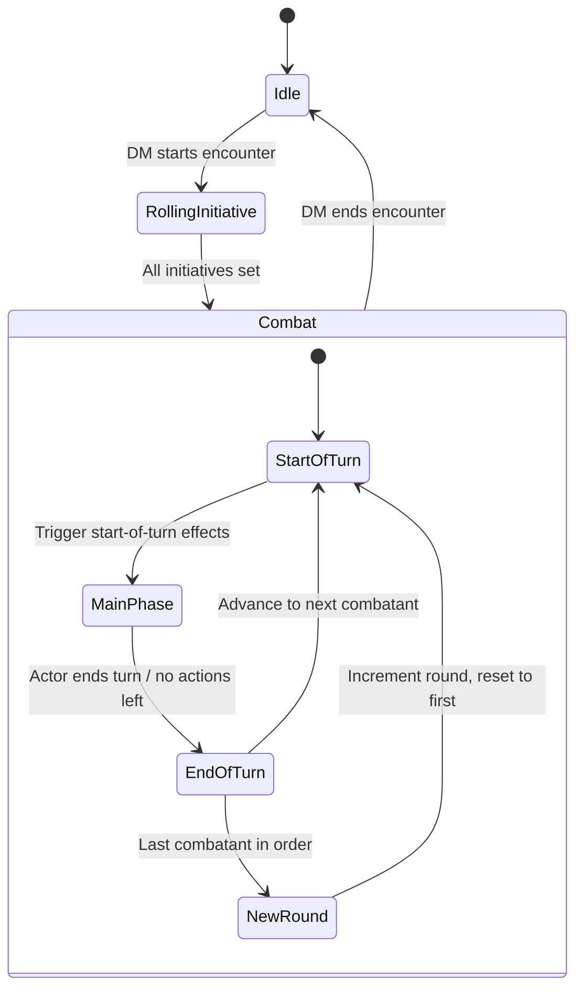
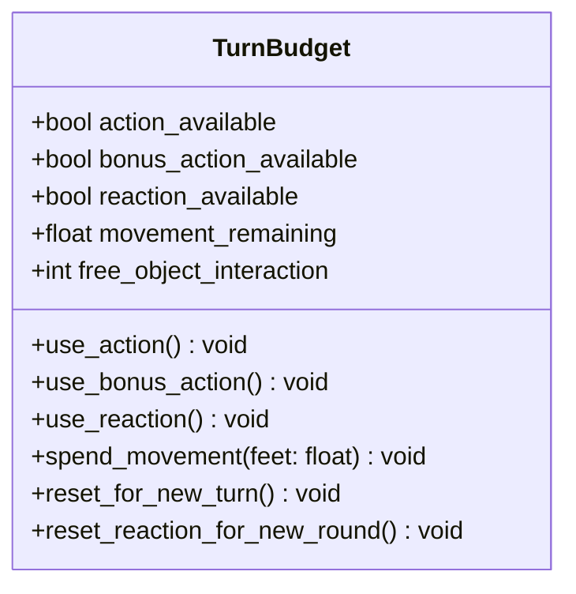
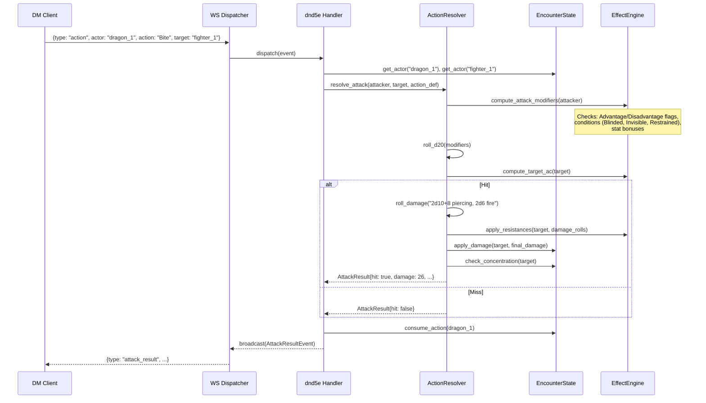
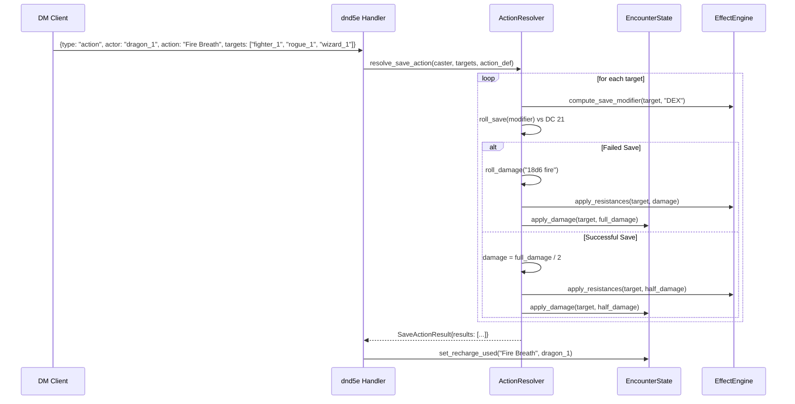
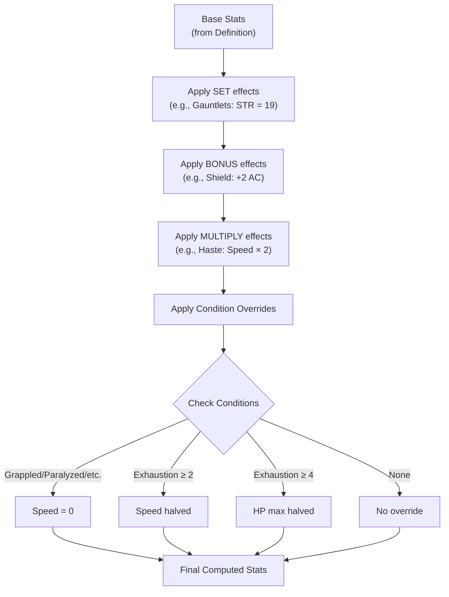
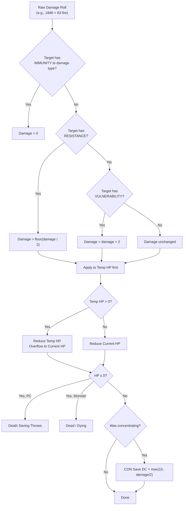

# D&D 5e Combat & Action System Architecture

This document defines the combat lifecycle, action economy, and the data-driven action resolution pipeline for the D&D 5e system module. All logic lives inside `src/systems/dnd5e/engine/`.

---

## 1. Combat Lifecycle

### State Machine

Combat moves through a strict sequence of phases. The DM explicitly starts and ends combat; turn progression is automatic.



### Phase Responsibilities

| Phase                  | What Happens                                                                            |
| ---------------------- | --------------------------------------------------------------------------------------- |
| **Idle**               | No active combat. Actors can still be on the map.                                       |
| **Rolling Initiative** | DM rolls or sets initiative for each actor. Order is computed.                          |
| **Start of Turn**      | Effect durations tick. Conditions re-evaluated. Action economy reset. Recharge rolls.   |
| **Main Phase**         | Active actor takes actions, bonus actions, moves, uses reactions (out-of-turn).         |
| **End of Turn**        | End-of-turn save re-rolls (e.g., Frightened). Per-turn damage (e.g., standing in fire). |
| **New Round**          | Round counter increments. Lair actions (if any).                                        |

---

## 2. Action Economy

Each combatant has the following resource budget per turn:



### Rules

| Resource                    | Refreshes            | Notes                                                                                                                                    |
| --------------------------- | -------------------- | ---------------------------------------------------------------------------------------------------------------------------------------- |
| **Action**                  | Start of turn        | 1 per turn. Can be swapped for Dash, Dodge, Help, Hide, Disengage, Use Object, or any action-costed ability                              |
| **Bonus Action**            | Start of turn        | 1 per turn. Only available if something _grants_ a bonus action (spell, feature, TWF)                                                    |
| **Reaction**                | Start of _your_ turn | 1 per round. Persists between turns. Used for Opportunity Attacks, Shield, Counterspell, etc.                                            |
| **Movement**                | Start of turn        | Speed in feet. Can be split before/after actions. Reduced by difficult terrain (2× cost). Set to 0 by Grappled/Restrained/Paralyzed/etc. |
| **Free Object Interaction** | Start of turn        | 1 per turn. Draw/sheathe weapon, open door, etc.                                                                                         |

### Legendary Actions (Monsters)

Legendary actions are a **separate resource pool**, tracked on the monster's `ActorInstance`. They reset at the **start of the monster's turn**, and can only be used at the **end of another creature's turn**.

```python
class LegendaryActionBudget:
    max_actions: int         # e.g., 3 for Adult Red Dragon
    remaining_actions: int

    def use(self, cost: int) -> bool: ...
    def reset(self) -> None: ...
```

---

## 3. Action Resolution Pipeline

Every action — whether a sword swing, a Fireball, or Frightful Presence — flows through the same generic pipeline. The engine never knows "what" is being done; it only follows the `ActionDefinition` data.

### Sequence: Attack Roll Action (e.g., Bite +14)



### Sequence: Save-Based Action (e.g., Fire Breath DC 21)



---

## 4. The Effect Engine

The Effect Engine sits alongside the action resolver and computes derived stats dynamically. It never stores computed values — it recomputes on demand.

### Stat Computation Flow



### Condition Mechanical Effects Matrix

All 15 SRD conditions and their mechanical impacts:

| Condition         | Speed                 | Attack Rolls          | Saves             | Other                                             |
| ----------------- | --------------------- | --------------------- | ----------------- | ------------------------------------------------- |
| **Blinded**       | —                     | Disadvantage          | —                 | Auto-fail sight checks. Attacks against have ADV  |
| **Charmed**       | —                     | Can't attack charmer  | —                 | Charmer has ADV on social checks                  |
| **Deafened**      | —                     | —                     | —                 | Auto-fail hearing checks                          |
| **Exhaustion 1**  | —                     | —                     | —                 | DADV on ability checks                            |
| **Exhaustion 2**  | Halved                | —                     | —                 | + all lower levels                                |
| **Exhaustion 3**  | Halved                | Disadvantage          | Disadvantage      | + all lower levels                                |
| **Exhaustion 4**  | Halved                | Disadvantage          | Disadvantage      | HP max halved + all lower                         |
| **Exhaustion 5**  | 0                     | Disadvantage          | Disadvantage      | HP max halved + all lower                         |
| **Exhaustion 6**  | —                     | —                     | —                 | **Death**                                         |
| **Frightened**    | Can't approach source | Disadvantage (in LoS) | —                 | Disadvantage ability checks (in LoS)              |
| **Grappled**      | 0                     | —                     | —                 | Ends if grappler incapacitated                    |
| **Incapacitated** | —                     | No actions/reactions  | —                 | —                                                 |
| **Invisible**     | —                     | Advantage             | —                 | Attacks against have DIS                          |
| **Paralyzed**     | 0                     | —                     | Auto-fail STR/DEX | Attacks against ADV. Melee hits are crits         |
| **Petrified**     | 0                     | —                     | Auto-fail STR/DEX | Resistance to all damage. Immune poison           |
| **Poisoned**      | —                     | Disadvantage          | —                 | Disadvantage ability checks                       |
| **Prone**         | Crawl only (half)     | Disadvantage          | —                 | Melee attacks ADV, ranged attacks DIS             |
| **Restrained**    | 0                     | Disadvantage          | Disadvantage DEX  | Attacks against have ADV                          |
| **Stunned**       | 0                     | —                     | Auto-fail STR/DEX | Attacks against have ADV                          |
| **Unconscious**   | 0                     | —                     | Auto-fail STR/DEX | Drop held items, fall prone. Melee hits are crits |

---

## 5. Damage Pipeline

Damage processing is multi-step and must be evaluated in order:



---

## 6. Concentration

Concentration is a critical sub-system that connects damage, saving throws, and effect management.

### Rules

- Only one concentration spell at a time.
- Taking damage triggers a CON save: DC = max(10, floor(damage_taken / 2)).
- Gaining a condition (Incapacitated, Stunned, etc.) automatically breaks concentration.
- Casting a new concentration spell ends the previous one.

### Implementation

```python
class ConcentrationManager:
    def on_damage(self, actor: ActorInstance, damage: int) -> ConcentrationCheckResult:
        """Returns the DC and whether the save passed/failed."""
        ...

    def on_condition_gained(self, actor: ActorInstance, condition: ConditionType) -> bool:
        """Returns True if concentration was broken."""
        BREAKS_CONCENTRATION = {
            ConditionType.INCAPACITATED,
            ConditionType.STUNNED,
            ConditionType.PARALYZED,
            ConditionType.UNCONSCIOUS,
            ConditionType.PETRIFIED,
        }
        ...

    def on_new_concentration_spell(self, actor: ActorInstance, new_effect_id: str) -> str | None:
        """Ends old concentration, starts new. Returns removed effect_id."""
        ...
```

---

## 7. Engine Module File Map

All files inside `src/systems/dnd5e/engine/`:

| File                  | Responsibility                                                                    |
| --------------------- | --------------------------------------------------------------------------------- |
| `action_resolver.py`  | The main pipeline: receives `ActionDefinition` + actors → produces `ActionResult` |
| `dice.py`             | d20 rolls, damage rolls, advantage/disadvantage logic                             |
| `stat_calculator.py`  | Computes derived stats from base + effects + conditions                           |
| `effect_engine.py`    | Manages active effects: apply, remove, tick, query                                |
| `condition_engine.py` | Condition-specific mechanical overrides (the matrix above)                        |
| `concentration.py`    | Concentration save triggers and spell replacement                                 |
| `damage.py`           | Damage pipeline: immunities → resistances → temp HP → current HP                  |
| `initiative.py`       | Initiative rolling, ordering, turn advancement                                    |
| `combat_state.py`     | `EncounterState` management, turn progression state machine                       |
