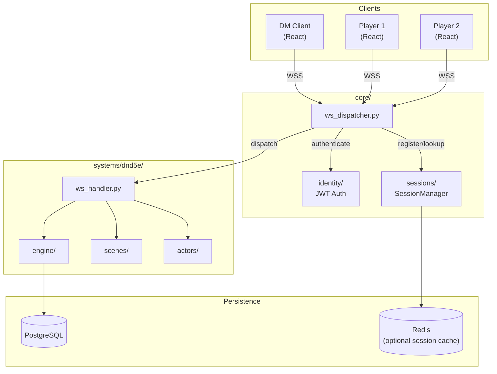
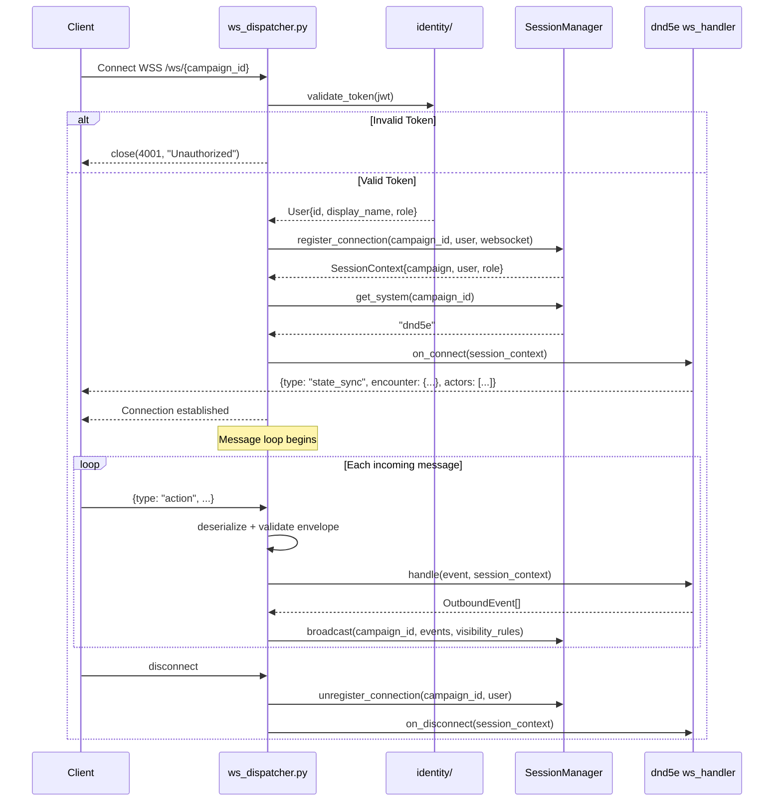
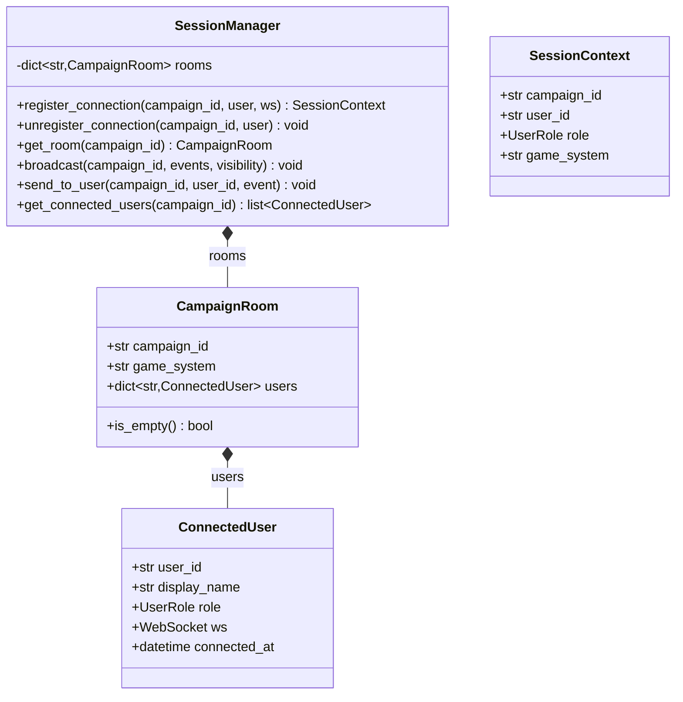
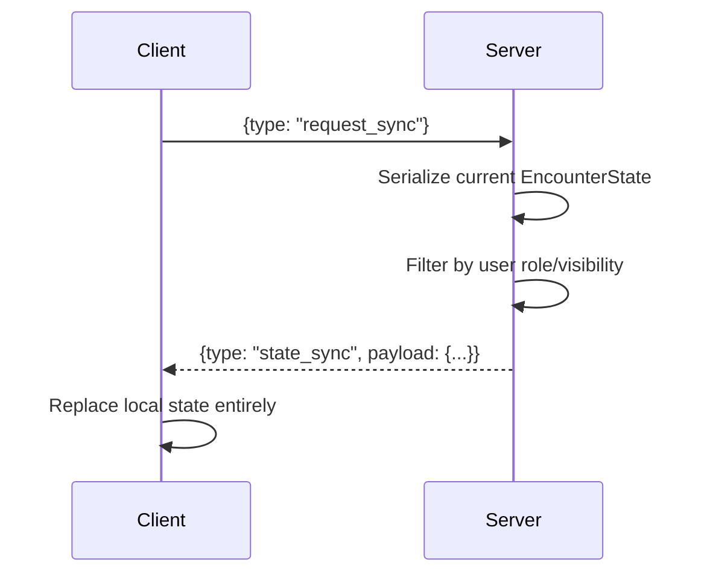
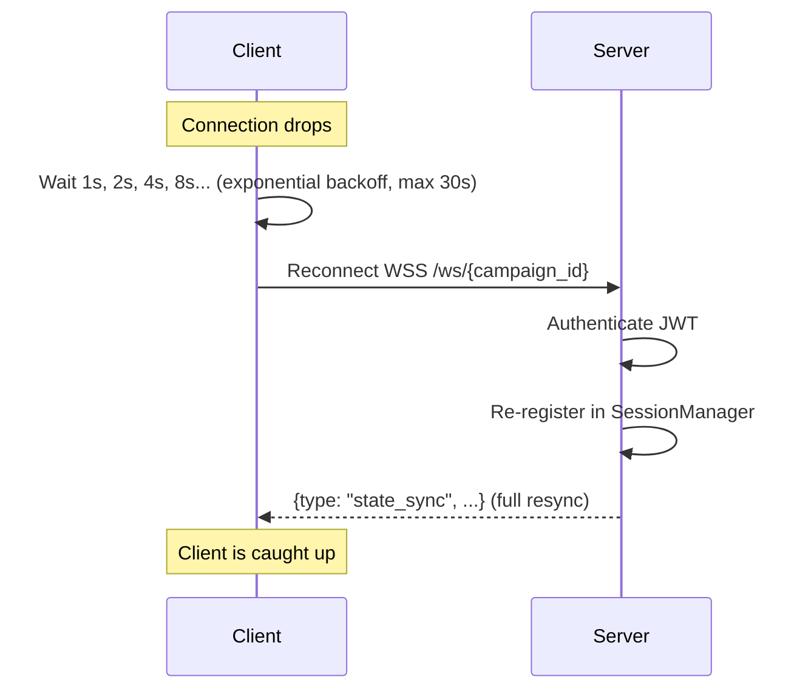

# Session & WebSocket Architecture

This document defines how the CMV2 backend manages user sessions, WebSocket communication, and the real-time bridge between frontend and backend. It covers both the **core** (system-agnostic) layer and the **dnd5e-specific** event handling.

---

## 1. Architecture Overview



---

## 2. Connection Lifecycle



---

## 3. Session Management

### SessionManager Responsibilities

The `SessionManager` lives in `core/sessions/` and is system-agnostic.



### User Roles

```python
class UserRole(str, Enum):
    DM = "dm"          # Full control: all actions, all state visible
    PLAYER = "player"  # Can act on own characters, limited view
    SPECTATOR = "spectator"  # Read-only, sees what DM allows
```

---

## 4. Message Protocol

### Envelope Format

Every WebSocket message follows a typed envelope. This is the contract between frontend and backend.

```python
class WsEnvelope(BaseModel):
    """Inbound message from client."""
    type: str                    # e.g., "action", "move_token", "roll_dice"
    request_id: str | None = None  # Client-generated, echoed in response for correlation
    payload: dict                # Type-specific data, validated by handler

class WsOutbound(BaseModel):
    """Outbound message to client(s)."""
    type: str                    # e.g., "attack_result", "state_update", "error"
    request_id: str | None = None
    payload: dict
    visibility: Visibility = Visibility.ALL
```

### Visibility Rules

Not all events should go to all clients. The DM sees everything; players see only what they're allowed to.

```python
class Visibility(str, Enum):
    ALL = "all"              # Everyone in the room
    DM_ONLY = "dm_only"      # Only the DM
    ACTOR_OWNER = "actor_owner"  # Only the player who owns the actor
    EXCLUDE_ACTOR = "exclude_actor"  # Everyone except the acting player (e.g., hidden rolls)
```

### Event Types — Inbound (Client → Server)

| Type               | Payload                                | Who Can Send    |
| ------------------ | -------------------------------------- | --------------- |
| `action`           | `{actor_id, action_name, target_ids?}` | DM              |
| `move_token`       | `{actor_id, path: [{x, y}...]}`        | DM, Actor Owner |
| `roll_dice`        | `{expression, purpose?}`               | All             |
| `roll_initiative`  | `{actor_id, value?}`                   | DM              |
| `end_turn`         | `{actor_id}`                           | DM              |
| `start_combat`     | `{}`                                   | DM              |
| `end_combat`       | `{}`                                   | DM              |
| `add_actor`        | `{definition_slug, position, name?}`   | DM              |
| `remove_actor`     | `{actor_id}`                           | DM              |
| `apply_condition`  | `{actor_id, condition, source_id?}`    | DM              |
| `remove_condition` | `{actor_id, condition}`                | DM              |
| `apply_damage`     | `{actor_id, amount, damage_type}`      | DM              |
| `apply_healing`    | `{actor_id, amount}`                   | DM              |
| `chat_message`     | `{message}`                            | All             |
| `ping`             | `{}`                                   | All             |

Phase 4 contract note: `update_hp`, `roll_initiative`, `cast_spell`, and `toggle_equip`
are deferred and are not part of the currently supported inbound routing contract.

### Event Types — Outbound (Server → Client)

| Type                   | Payload                                | Visibility                  |
| ---------------------- | -------------------------------------- | --------------------------- |
| `state_sync`           | Full encounter state snapshot          | Per-user (filtered)         |
| `attack_result`        | `{attacker, target, hit, damage, ...}` | All                         |
| `save_result`          | `{actor, save, dc, passed, damage?}`   | All                         |
| `actor_moved`          | `{actor_id, path, movement_remaining}` | All                         |
| `actor_damaged`        | `{actor_id, amount, new_hp, source}`   | All                         |
| `actor_healed`         | `{actor_id, amount, new_hp}`           | All                         |
| `actor_died`           | `{actor_id}`                           | All                         |
| `condition_added`      | `{actor_id, condition, source}`        | All                         |
| `condition_removed`    | `{actor_id, condition}`                | All                         |
| `effect_applied`       | `{effect details}`                     | All                         |
| `effect_expired`       | `{effect_id, name}`                    | All                         |
| `turn_advanced`        | `{active_actor_id, round}`             | All                         |
| `combat_started`       | `{initiative_order}`                   | All                         |
| `combat_ended`         | `{}`                                   | All                         |
| `concentration_broken` | `{actor_id, spell_name}`               | All                         |
| `dice_rolled`          | `{roller_id, expression, result}`      | All (or DM_ONLY for hidden) |
| `error`                | `{message, code}`                      | Sender only                 |
| `pong`                 | `{}`                                   | Sender only                 |

---

## 5. State Synchronization Strategy

### Initial Sync

On connection, the client receives a full `state_sync` event containing the entire encounter state. This is the source of truth — the client replaces its local state entirely.

### Incremental Updates

After initial sync, the server sends **delta events** (e.g., `actor_damaged`, `turn_advanced`). The client applies these incrementally.

### Reconciliation

If the client detects inconsistency (e.g., an actor_id it doesn't know about), it requests a full re-sync:



### Fog of War / Information Hiding

The DM always sees the full state. Player clients receive **filtered snapshots**:

| Data                | DM Sees         | Player Sees                                       |
| ------------------- | --------------- | ------------------------------------------------- |
| Monster HP          | Exact value     | Bloodied/healthy description (or hidden entirely) |
| Monster stats       | Full stat block | Nothing (or what they've identified)              |
| Hidden tokens       | All tokens      | Only tokens in their view                         |
| Other player sheets | All             | Only their own (unless DM shares)                 |
| Initiative values   | All             | Only their own (or all, DM choice)                |

---

## 6. Error Handling & Resilience

### Error Categories

```python
class WsErrorCode(str, Enum):
    INVALID_MESSAGE = "invalid_message"       # Malformed or unknown type
    UNAUTHORIZED = "unauthorized"             # Action not allowed for this role
    INVALID_TARGET = "invalid_target"         # Actor/target doesn't exist
    NOT_YOUR_TURN = "not_your_turn"           # Action out of turn order
    RESOURCE_EXHAUSTED = "resource_exhausted" # No actions/slots/movement left
    INVALID_ACTION = "invalid_action"         # Action can't be performed (range, etc.)
    INTERNAL_ERROR = "internal_error"         # Unexpected server error
```

### Reconnection Protocol



---

## 7. The Dispatch Pattern

The WebSocket dispatcher is the **only** connection between `core/` and `systems/`. It is intentionally minimal.

### MVP Implementation (Inline)

```python
# core/ws_dispatcher.py

async def handle_message(ws: WebSocket, session: SessionContext, raw: str):
    envelope = WsEnvelope.model_validate_json(raw)

    # THE dispatch — this is the entire core/systems boundary
    if session.game_system == "dnd5e":
        from systems.dnd5e.ws_handler import Dnd5eWsHandler
        handler = Dnd5eWsHandler()
        results = await handler.handle(envelope, session)
    else:
        await ws.send_json({"type": "error", "payload": {"message": "Unknown system"}})
        return

    # Broadcast results based on visibility
    room = session_manager.get_room(session.campaign_id)
    for event in results:
        await _broadcast(room, event)
```

### Future Implementation (Registry)

```python
# core/ws_dispatcher.py (when system #2 arrives)

system_registry: dict[str, ISystemHandler] = {
    "dnd5e": Dnd5eWsHandler(),
    "coc": CocWsHandler(),
}

async def handle_message(ws: WebSocket, session: SessionContext, raw: str):
    envelope = WsEnvelope.model_validate_json(raw)
    handler = system_registry.get(session.game_system)
    if not handler:
        await ws.send_json({"type": "error", "payload": {"message": "Unknown system"}})
        return
    results = await handler.handle(envelope, session)
    ...
```

---

## 8. Persistence Strategy

### What is Persisted

| Data              | Storage                  | When                           |
| ----------------- | ------------------------ | ------------------------------ |
| Campaign metadata | PostgreSQL               | On create/update               |
| Encounter state   | PostgreSQL + Redis cache | On every state-changing action |
| User accounts     | PostgreSQL               | On registration                |
| Chat/dice log     | PostgreSQL (append-only) | On every message/roll          |
| SRD compendium    | JSON files → in-memory   | At boot                        |

### Why Redis

Redis is optional but useful for:

- **Session presence** — fast "who's connected" lookups
- **Encounter state cache** — avoid DB read on every WebSocket event
- **Pub/Sub** — if multiple backend instances run behind a load balancer, Redis Pub/Sub ensures broadcasts reach all connected clients

If running a single instance (MVP), Redis can be skipped — all state lives in-process.

---

## 9. File Map

### core/ files

| File                       | Responsibility                                          |
| -------------------------- | ------------------------------------------------------- |
| `core/identity/auth.py`    | JWT validation, token generation                        |
| `core/identity/users.py`   | User CRUD                                               |
| `core/identity/router.py`  | REST API: `/auth/login`, `/auth/me`                     |
| `core/sessions/manager.py` | `SessionManager` — room registry, broadcast             |
| `core/sessions/models.py`  | `CampaignRoom`, `ConnectedUser`, `SessionContext`       |
| `core/campaigns/router.py` | REST API: `/campaigns` CRUD                             |
| `core/campaigns/models.py` | Campaign metadata (name, system, players)               |
| `core/ws_dispatcher.py`    | WebSocket endpoint, auth handshake, dispatch            |
| `core/ws_protocol.py`      | `WsEnvelope`, `WsOutbound`, `Visibility`, `WsErrorCode` |

### systems/dnd5e/ files (WebSocket layer only)

| File                            | Responsibility                                                        |
| ------------------------------- | --------------------------------------------------------------------- |
| `systems/dnd5e/ws_handler.py`   | Receives dispatched events, routes to engine, returns outbound events |
| `systems/dnd5e/event_types.py`  | All inbound/outbound event payload schemas                            |
| `systems/dnd5e/permissions.py`  | Role-based action validation (who can do what)                        |
| `systems/dnd5e/state_filter.py` | Filters `EncounterState` for player visibility (fog of war)           |
