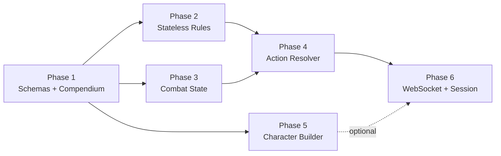

# D&D 5e Implementation Phase Plan

This document defines the build order, test strategy, and acceptance criteria for the D&D 5e system module. Each phase produces a testable deliverable before the next begins.

**Strategy:** TDD for all engine logic. Implementation-first for schemas (data containers). Integration tests for WebSocket layer.

---

## Phase 1 — Foundation: Schemas & Compendium

**Goal:** Typed data models + working SRD compendium loader.

**Approach:** Implementation-first. No engine logic yet.

### Build Order

1. `schemas/enums.py` — all enums
2. `schemas/common.py` — `AbilityScores`, `SpeedBlock`, `Position`, `Components`, `AreaOfEffect`, etc.
3. `schemas/definitions.py` — `MonsterDefinition`, `SpellDefinition`, `ItemDefinition`, `ActionDefinition`, `TraitDefinition`, `EffectDefinition`
4. `schemas/instances.py` — `ActorInstance`, `EffectInstance`, `ConditionInstance`, `ItemInstance`, `SpellcastingState`
5. `schemas/encounter.py` — `EncounterState`, `MapState`, `MapToken`
6. `data/loader.py` — parse Open5e JSON into Definition models
7. `data/registry.py` — in-memory slug→Definition lookup

### Test Cases

```python
# test_schemas.py
def test_monster_definition_from_srd_json():
    """Adult Red Dragon JSON → MonsterDefinition without validation errors."""
    raw = load_json("adult-red-dragon.json")
    monster = MonsterDefinition.model_validate(raw)
    assert monster.name == "Adult Red Dragon"
    assert monster.armor_class == 19
    assert monster.speed.fly == 80
    assert len(monster.actions) == 6  # Multiattack, Bite, Claw, Tail, Frightful, Fire Breath

def test_spell_definition_from_srd_json():
    """Fireball JSON → SpellDefinition."""
    spell = SpellDefinition.model_validate(load_json("fireball.json"))
    assert spell.level == 3
    assert spell.school == MagicSchool.EVOCATION
    assert spell.requires_concentration is False

def test_item_definition_from_srd_json():
    """Longsword JSON → ItemDefinition."""
    item = ItemDefinition.model_validate(load_json("longsword.json"))
    assert item.damage_dice == "1d8"
    assert item.damage_type == DamageType.SLASHING

def test_actor_instance_creation():
    """Create an ActorInstance with inventory, effects, conditions."""
    actor = ActorInstance(
        id="fighter_1", definition_slug="fighter", name="Theron",
        actor_type=ActorType.PLAYER_CHARACTER,
        abilities=AbilityScores(strength=18, dexterity=14, ...),
        current_hp=45, max_hp=45, temp_hp=0, armor_class=18,
        ...
    )
    assert actor.current_hp == 45

# test_compendium.py
def test_registry_loads_all_srd_monsters():
    """Registry loads 300+ monsters from SRD directory without errors."""
    registry = CompendiumRegistry()
    loader = CompendiumLoader(registry)
    loader.load_directory("data/srd/monsters/")
    assert registry.count("monsters") > 300

def test_registry_lookup_by_slug():
    """Lookup returns exact definition by slug."""
    registry = build_test_registry()
    dragon = registry.get_monster("adult-red-dragon")
    assert dragon is not None
    assert dragon.challenge_rating == 17.0

def test_registry_lookup_missing_returns_none():
    assert registry.get_monster("nonexistent-slug") is None
```

### Acceptance Criteria

- [x] All enums and value types compile
- [x] Full SRD monster/spell/item JSON corpus parses without validation errors
- [x] `CompendiumRegistry` provides slug-based lookup for all entity types

---

## Phase 2 — Stateless Rules Engine

**Goal:** Pure functions for D&D 5e math. No state, no encounters, maximum testability.

**Approach:** TDD — write every test before the implementation.

### Build Order

1. `engine/dice.py` — d20 rolls with advantage/disadvantage, damage expression parsing
2. `engine/stat_calculator.py` — derive AC, save DCs, attack bonuses, skill bonuses from `ActorInstance` + effects
3. `engine/condition_engine.py` — mechanical effects of all 15 conditions
4. `engine/damage.py` — immunity → resistance → vulnerability → temp HP → current HP pipeline

### Test Cases

```python
# test_dice.py
def test_roll_d20_returns_1_to_20():
    for _ in range(1000):
        result = DiceService.roll("1d20")
        assert 1 <= result.total <= 20

def test_roll_with_modifier():
    result = DiceService.roll("1d20+5")
    assert 6 <= result.total <= 25

def test_damage_expression_multi_type():
    """'2d10+8' + '2d6' (dragon bite: piercing + fire)."""
    result = DiceService.roll("2d10+8")
    assert 10 <= result.total <= 28

# test_stat_calculator.py
def test_ability_modifier():
    assert calculate_modifier(10) == 0
    assert calculate_modifier(18) == 4
    assert calculate_modifier(7) == -2

def test_proficiency_bonus():
    assert calculate_proficiency_bonus(1) == 2
    assert calculate_proficiency_bonus(5) == 3
    assert calculate_proficiency_bonus(9) == 4
    assert calculate_proficiency_bonus(17) == 6

def test_ac_with_shield_effect():
    """Base AC 15 + Shield (+2 BONUS) = 17."""
    actor = make_actor(armor_class=15)
    actor.effects.append(EffectInstance(type=EffectType.BONUS, target_stat="armor_class", value=2, ...))
    computed = compute_stats(actor)
    assert computed.armor_class == 17

def test_ac_with_set_overrides_base():
    """Barkskin (SET AC 16) on actor with AC 12 → AC 16."""
    actor = make_actor(armor_class=12)
    actor.effects.append(EffectInstance(type=EffectType.SET, target_stat="armor_class", value=16, ...))
    computed = compute_stats(actor)
    assert computed.armor_class == 16

def test_set_does_not_override_higher_base():
    """Barkskin (SET 16) on actor with AC 18 → stays 18 (use higher)."""
    actor = make_actor(armor_class=18)
    actor.effects.append(EffectInstance(type=EffectType.SET, target_stat="armor_class", value=16, ...))
    computed = compute_stats(actor)
    assert computed.armor_class == 18

def test_spell_save_dc():
    """DC = 8 + proficiency + ability_mod."""
    actor = make_actor(level=5, intelligence=18)  # prof=3, INT mod=4
    assert compute_spell_save_dc(actor, Ability.INT) == 15

# test_condition_engine.py
def test_grappled_sets_speed_zero():
    actor = make_actor(speed=SpeedBlock(walk=30))
    actor.conditions.append(ConditionInstance(condition=ConditionType.GRAPPLED, ...))
    computed = apply_conditions(actor)
    assert computed.speed.walk == 0

def test_paralyzed_auto_fails_str_dex_saves():
    result = compute_save_context(paralyzed_actor, Ability.DEX)
    assert result.auto_fail is True

def test_prone_gives_disadvantage_on_attacks():
    result = compute_attack_context(prone_actor)
    assert result.has_disadvantage is True

def test_invisible_gives_advantage_on_attacks():
    result = compute_attack_context(invisible_actor)
    assert result.has_advantage is True

def test_exhaustion_2_halves_speed():
    actor = make_actor(speed=SpeedBlock(walk=30), exhaustion_level=2)
    computed = apply_conditions(actor)
    assert computed.speed.walk == 15

def test_exhaustion_stacks_cumulatively():
    """Level 3: DADV ability checks + DADV attacks + DADV saves + halved speed."""
    actor = make_actor(exhaustion_level=3)
    ctx = compute_attack_context(actor)
    assert ctx.has_disadvantage is True

# test_damage.py
def test_immunity_negates_damage():
    actor = make_actor_with(damage_immunities=["fire"])
    result = apply_damage(actor, amount=63, damage_type=DamageType.FIRE)
    assert result.damage_dealt == 0

def test_resistance_halves_damage():
    actor = make_actor_with(damage_resistances=["fire"])
    result = apply_damage(actor, amount=20, damage_type=DamageType.FIRE)
    assert result.damage_dealt == 10

def test_vulnerability_doubles_damage():
    actor = make_actor_with(damage_vulnerabilities=["fire"])
    result = apply_damage(actor, amount=20, damage_type=DamageType.FIRE)
    assert result.damage_dealt == 40

def test_temp_hp_absorbs_first():
    actor = make_actor(current_hp=30, temp_hp=10)
    result = apply_damage(actor, amount=15, damage_type=DamageType.SLASHING)
    assert actor.temp_hp == 0
    assert actor.current_hp == 25  # 15 - 10 temp = 5 to real HP

def test_damage_below_zero_triggers_death():
    actor = make_actor(current_hp=5, actor_type=ActorType.MONSTER)
    result = apply_damage(actor, amount=20, damage_type=DamageType.SLASHING)
    assert result.is_dead is True
```

### Acceptance Criteria

- [x] All ability modifier and proficiency bonus calculations match PHB tables
- [x] Effect stacking works in correct order: SET → BONUS → MULTIPLY → Conditions
- [x] All 15 conditions produce correct mechanical effects
- [x] Exhaustion levels 1–6 stack cumulatively
- [x] Damage pipeline handles immunity/resistance/vulnerability/temp HP correctly

---

## Phase 3 — Combat State Machine

**Goal:** Turn management, initiative tracking, effect duration ticking.

**Approach:** TDD.

### Build Order

1. `engine/initiative.py` — roll initiative, sort combatants, handle ties
2. `engine/combat_state.py` — `EncounterState`, `TurnBudget`, turn/round advancement
3. `engine/effect_engine.py` — apply/remove/tick effects, duration management
4. `engine/concentration.py` — break on damage, break on condition, break on new spell

### Test Cases

```python
# test_initiative.py
def test_initiative_sorted_descending():
    enc = create_encounter([("dragon", 18), ("fighter", 15), ("wizard", 12)])
    enc.start_combat()
    assert enc.get_active_combatant().name == "dragon"

def test_initiative_tie_higher_dex_goes_first():
    """PHB rule: ties broken by DEX score."""
    enc = create_encounter([("fighter", 15, dex=14), ("rogue", 15, dex=18)])
    enc.start_combat()
    assert enc.get_active_combatant().name == "rogue"

# test_combat_state.py
def test_turn_advancement_cycles():
    enc = create_encounter_with_3()
    enc.start_combat()
    assert enc.round_number == 1
    enc.next_turn()
    enc.next_turn()
    enc.next_turn()  # wraps
    assert enc.round_number == 2
    assert enc.active_index == 0

def test_turn_budget_resets_on_new_turn():
    enc = create_encounter_with_3()
    enc.start_combat()
    budget = enc.get_turn_budget()
    budget.use_action()
    assert budget.action_available is False
    enc.next_turn()
    enc.next_turn()
    enc.next_turn()  # back to first
    new_budget = enc.get_turn_budget()
    assert new_budget.action_available is True

def test_reaction_persists_between_turns():
    """Reaction resets at start of YOUR turn, not others'."""
    enc = create_encounter_with_3()
    enc.start_combat()
    combatant_0 = enc.combatants[0]
    combatant_0.turn_budget.use_reaction()
    enc.next_turn()  # now combatant 1's turn
    assert combatant_0.turn_budget.reaction_available is False
    enc.next_turn()
    enc.next_turn()  # back to combatant 0
    assert combatant_0.turn_budget.reaction_available is True

# test_effect_engine.py
def test_effect_duration_ticks_down():
    effect = EffectInstance(duration_type=DurationType.ROUNDS, remaining_rounds=3, ...)
    enc.add_effect(effect)
    enc.tick_effects(source_id=effect.source_id)
    assert effect.remaining_rounds == 2

def test_effect_removed_at_zero_rounds():
    effect = EffectInstance(remaining_rounds=1, ...)
    enc.add_effect(effect)
    enc.tick_effects(source_id=effect.source_id)
    assert effect not in enc.active_effects

def test_condition_attached_to_effect_removed_together():
    """When Bless expires, the ADVANTAGE condition it granted is also removed."""
    effect = make_effect_with_condition(ConditionType.CHARMED, rounds=1)
    enc.add_effect(effect)
    enc.tick_effects(source_id=effect.source_id)
    assert not actor.has_condition(ConditionType.CHARMED)

# test_concentration.py
def test_concentration_save_dc_is_max_10_or_half_damage():
    assert concentration_dc(damage=8) == 10   # floor(8/2) = 4, max(10,4) = 10
    assert concentration_dc(damage=30) == 15  # floor(30/2) = 15, max(10,15) = 15

def test_concentration_broken_removes_effect():
    actor = make_concentrating_actor(effect_id="bless_1")
    break_concentration(actor, enc)
    assert not enc.has_effect("bless_1")
    assert actor.concentration.is_concentrating is False

def test_incapacitated_breaks_concentration():
    actor = make_concentrating_actor(effect_id="bless_1")
    apply_condition_to(actor, ConditionType.STUNNED)
    assert actor.concentration.is_concentrating is False

def test_new_concentration_spell_ends_previous():
    actor = make_concentrating_actor(effect_id="bless_1")
    start_concentration(actor, "hold_person_1", enc)
    assert not enc.has_effect("bless_1")
    assert actor.concentration.effect_id == "hold_person_1"
```

### Acceptance Criteria

- [ ] Initiative order is correct with tie-breaking by DEX
- [ ] Turn budget correctly resets action/bonus/movement each turn, reaction each round
- [ ] Effect durations tick and auto-expire
- [ ] Concentration breaks on: damage (failed save), incapacitating condition, new concentration spell

---

## Phase 4 — Action Resolver

**Goal:** Full action resolution — attack rolls, save-based actions, healing.

**Approach:** TDD.

### Build Order

1. `engine/action_resolver.py` — main pipeline: `resolve_attack()`, `resolve_save_action()`, `resolve_healing()`
2. Wire into `EncounterState`: consume `TurnBudget`, update HP/effects

### Test Cases

```python
# test_action_resolver.py (deterministic via seeded random)
def test_attack_roll_hit():
    """Roll 18 + bonus 6 = 24 vs AC 15 → hit."""
    result = resolve_attack(attacker, target, action_def, roll_override=18)
    assert result.hit is True

def test_attack_roll_miss():
    """Roll 3 + bonus 6 = 9 vs AC 15 → miss."""
    result = resolve_attack(attacker, target, action_def, roll_override=3)
    assert result.hit is False

def test_natural_20_always_hits():
    """Nat 20 hits regardless of AC."""
    target = make_actor(armor_class=30)
    result = resolve_attack(attacker, target, action_def, roll_override=20)
    assert result.hit is True
    assert result.is_critical is True

def test_natural_1_always_misses():
    target = make_actor(armor_class=5)
    result = resolve_attack(attacker, target, action_def, roll_override=1)
    assert result.hit is False

def test_critical_hit_doubles_damage_dice():
    """Crit: 2d10 becomes 4d10 (PHB rule)."""
    action = make_action(damage_dice="2d10", damage_bonus=8)
    result = resolve_attack(attacker, target, action, roll_override=20)
    # 4d10 range: [4, 40] + 8 = [12, 48]
    assert 12 <= result.total_damage <= 48

def test_advantage_takes_higher_roll():
    result = resolve_attack(attacker, target, action,
                            advantage=True, roll_overrides=[8, 15])
    assert result.roll_used == 15

def test_disadvantage_takes_lower_roll():
    result = resolve_attack(attacker, target, action,
                            disadvantage=True, roll_overrides=[8, 15])
    assert result.roll_used == 8

def test_advantage_and_disadvantage_cancel():
    """If both present, roll normally (single d20)."""
    result = resolve_attack(attacker, target, action,
                            advantage=True, disadvantage=True)
    assert result.roll_count == 1

def test_save_action_full_damage_on_fail():
    """Fire Breath: DC 21 DEX save. Roll 8 → fail → full 63 fire damage."""
    result = resolve_save_action(caster, [target], fire_breath_def, save_overrides=[8])
    assert result.results[0].passed is False
    assert result.results[0].damage == 63

def test_save_action_half_damage_on_success():
    """Fire Breath: roll 22 → pass → half damage (31)."""
    result = resolve_save_action(caster, [target], fire_breath_def, save_overrides=[22])
    assert result.results[0].passed is True
    assert result.results[0].damage == 31  # floor(63/2)

def test_healing_action_restores_hp():
    actor = make_actor(current_hp=20, max_hp=45)
    result = resolve_healing(actor, healing_def, dice_override=12)
    assert actor.current_hp == 32

def test_healing_cannot_exceed_max_hp():
    actor = make_actor(current_hp=40, max_hp=45)
    result = resolve_healing(actor, healing_def, dice_override=20)
    assert actor.current_hp == 45

def test_action_consumes_turn_budget():
    enc = setup_encounter()
    resolve_and_apply(enc, attacker, target, action_def)
    assert enc.get_turn_budget().action_available is False

def test_attack_while_blinded_has_disadvantage():
    attacker.conditions.append(ConditionInstance(condition=ConditionType.BLINDED))
    result = resolve_attack(attacker, target, action_def, roll_overrides=[15, 8])
    assert result.roll_used == 8  # disadvantage → lower roll

def test_attack_against_paralyzed_auto_crits_in_melee():
    target.conditions.append(ConditionInstance(condition=ConditionType.PARALYZED))
    result = resolve_attack(attacker, target, melee_action, roll_override=12)
    assert result.hit is True
    assert result.is_critical is True  # any hit in melee is auto-crit
```

### Acceptance Criteria

- [ ] Attack rolls correctly apply advantage/disadvantage, nat 1/20, and condition modifiers
- [ ] Critical hits double damage dice (not bonus)
- [ ] Save-based actions compute pass/fail per target with correct half-damage
- [ ] Healing restores HP capped at max
- [ ] Action consumption integrates with TurnBudget

---

## Phase 5 — Character Builder

**Goal:** Assemble PCs from race + class + background.

**Approach:** TDD.

### Build Order

1. `schemas/character.py` — `RaceDefinition`, `ClassDefinition`, `SubclassDefinition`, `BackgroundDefinition`
2. `schemas/creation.py` — `CharacterCreationBlueprint`
3. `engine/character_builder.py` — `CharacterBuilder.build()`

### Test Cases

```python
# test_character_builder.py
def test_build_level_1_fighter():
    blueprint = CharacterCreationBlueprint(
        name="Theron", race_slug="human", class_slug="fighter",
        background_slug="soldier", level=1,
        base_abilities=AbilityScores(strength=16, dexterity=14, constitution=14, ...),
        chosen_skills=["athletics", "intimidation"],
    )
    actor = CharacterBuilder(registry).build(blueprint)
    assert actor.name == "Theron"
    assert actor.actor_type == ActorType.PLAYER_CHARACTER
    assert actor.max_hp == 12  # d10 max + CON mod (2)
    assert actor.proficiency_bonus == 2

def test_race_applies_ability_bonuses():
    blueprint = make_blueprint(race_slug="dwarf", base_str=14)
    actor = build(blueprint)
    assert actor.abilities.constitution == blueprint.base_abilities.constitution + 2

def test_class_grants_saving_throw_proficiencies():
    actor = build(make_blueprint(class_slug="wizard"))
    assert Ability.INT in actor.saving_throw_proficiencies
    assert Ability.WIS in actor.saving_throw_proficiencies

def test_spellcaster_gets_spell_slots():
    actor = build(make_blueprint(class_slug="wizard", level=3))
    assert actor.spellcasting.slots[1].max == 4
    assert actor.spellcasting.slots[2].max == 2

def test_level_5_fighter_gets_extra_attack():
    actor = build(make_blueprint(class_slug="fighter", level=5))
    extra_attack = [e for e in actor.effects if e.name == "Extra Attack"]
    assert len(extra_attack) == 1

def test_background_grants_skills():
    actor = build(make_blueprint(background_slug="acolyte"))
    assert "insight" in actor.skill_proficiencies
    assert "religion" in actor.skill_proficiencies

def test_invalid_slug_raises_validation_error():
    blueprint = make_blueprint(race_slug="nonexistent")
    with pytest.raises(CompendiumLookupError):
        build(blueprint)
```

### Acceptance Criteria

- [ ] Builder produces valid `ActorInstance` from blueprint
- [ ] Race bonuses, class features, background proficiencies all apply correctly
- [ ] Spellcasting slots match PHB progression tables
- [ ] Invalid slugs produce clear errors

---

## Phase 6 — WebSocket & Session Layer

**Goal:** Real-time multiplayer. DM can run combat via WebSocket.

**Approach:** Integration tests with FastAPI `TestClient`.

### Build Order

1. `core/ws_protocol.py` — `WsEnvelope`, `WsOutbound`, `Visibility`, `WsErrorCode`
2. `core/sessions/models.py` — `CampaignRoom`, `ConnectedUser`, `SessionContext`
3. `core/sessions/manager.py` — `SessionManager`
4. `core/ws_dispatcher.py` — WebSocket endpoint + dispatch
5. `systems/dnd5e/ws_handler.py` — event routing to engine
6. `systems/dnd5e/event_types.py` — all payload schemas
7. `systems/dnd5e/permissions.py` — role validation
8. `systems/dnd5e/state_filter.py` — fog of war filtering

### Test Cases

```python
# test_session_manager.py
def test_register_and_unregister():
    sm = SessionManager()
    ctx = sm.register_connection("campaign_1", user, mock_ws)
    assert sm.get_connected_users("campaign_1") == [user]
    sm.unregister_connection("campaign_1", user)
    assert sm.get_connected_users("campaign_1") == []

def test_broadcast_sends_to_all_in_room():
    sm = SessionManager()
    sm.register_connection("c1", user_a, ws_a)
    sm.register_connection("c1", user_b, ws_b)
    await sm.broadcast("c1", event, Visibility.ALL)
    ws_a.send_json.assert_called_once()
    ws_b.send_json.assert_called_once()

def test_dm_only_visibility():
    sm.register_connection("c1", dm_user, ws_dm)
    sm.register_connection("c1", player_user, ws_player)
    await sm.broadcast("c1", event, Visibility.DM_ONLY)
    ws_dm.send_json.assert_called_once()
    ws_player.send_json.assert_not_called()

# test_ws_integration.py (FastAPI TestClient)
async def test_connect_with_valid_jwt():
    async with client.websocket_connect(f"/ws/{campaign_id}", headers=auth_headers) as ws:
        msg = await ws.receive_json()
        assert msg["type"] == "state_sync"

async def test_connect_without_jwt_rejected():
    with pytest.raises(WebSocketDisconnect) as exc:
        async with client.websocket_connect(f"/ws/{campaign_id}") as ws:
            pass
    assert exc.value.code == 4001

async def test_action_event_returns_result():
    async with client.websocket_connect(f"/ws/{campaign_id}", headers=dm_headers) as ws:
        await ws.receive_json()  # state_sync
        await ws.send_json({"type": "action", "payload": {
            "actor_id": "dragon_1", "action_name": "Bite", "target_ids": ["fighter_1"]
        }})
        result = await ws.receive_json()
        assert result["type"] == "attack_result"

async def test_player_cannot_send_dm_only_actions():
    async with client.websocket_connect(f"/ws/{campaign_id}", headers=player_headers) as ws:
        await ws.receive_json()
        await ws.send_json({"type": "apply_damage", "payload": {...}})
        error = await ws.receive_json()
        assert error["type"] == "error"
        assert error["payload"]["code"] == "unauthorized"

async def test_state_filter_hides_monster_hp_from_players():
    async with client.websocket_connect(f"/ws/{campaign_id}", headers=player_headers) as ws:
        sync = await ws.receive_json()
        monster = next(a for a in sync["payload"]["combatants"] if a["actor_type"] == "monster")
        assert "current_hp" not in monster  # filtered out for players
```

### Acceptance Criteria

- [ ] WebSocket connects with JWT, rejects without
- [ ] DM can send action events and receive results
- [ ] Players receive broadcasts but cannot send DM-only actions
- [ ] State sync filters sensitive data per role
- [ ] Reconnection produces fresh state_sync

---

## Phase Dependencies



> **Critical path:** Phase 1 → 2 → 3 → 4 → 6. Phase 5 can run in parallel after Phase 1.
