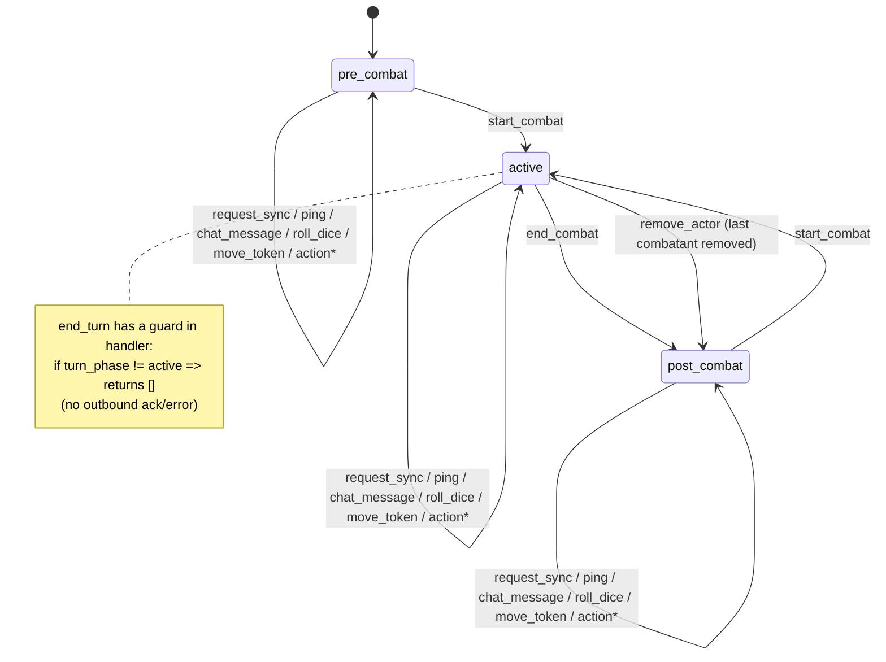
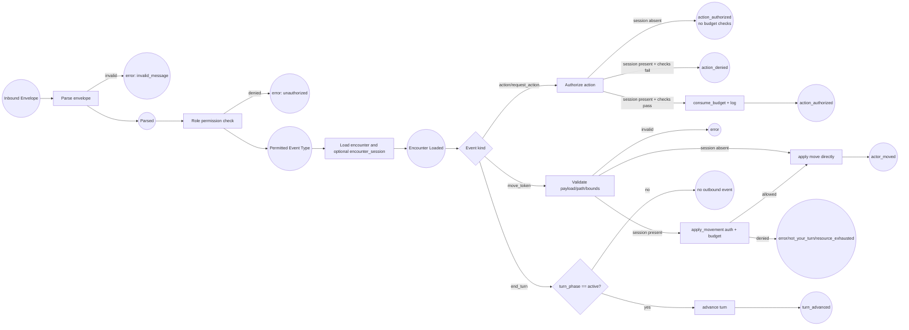

# WebSocket Event System Baseline (As-Built)

This document is the as-built baseline for CMV2 DnD5e real-time combat events.
It is intentionally code-first (derived from handler/store code), not architecture-intent.

Scope:

- Backend endpoint and dispatcher in `core/ws_dispatcher.py`
- DnD5e handler in `systems/dnd5e/ws_handler.py`
- Role checks in `systems/dnd5e/permissions.py`
- Frontend DM/store integration in `frontend/packages/shared/src/stores/useCombatStore.ts`

## 1. Canonical Transport Contract

### 1.1 Endpoint

- Canonical WS endpoint: `/ws/{campaign_id}`
- Query params required for runtime behavior:
  - `token`
  - `role` in `{dm, player, spectator}`

### 1.2 Envelope (Client -> Server)

```json
{
  "type": "event_key",
  "request_id": "optional-correlation-id",
  "payload": {}
}
```

### 1.3 Envelope (Server -> Client)

Server internally uses visibility metadata, but clients receive only:

```json
{
  "type": "event_key",
  "request_id": "echoed-when-available",
  "payload": {}
}
```

Visibility options in backend transport layer:

- `all`
- `dm_only`
- `actor_owner`
- `exclude_actor`

## 2. Role Gate (Event-Level Permission)

Current permission groups in `permissions.py`:

- DM-only inbound keys:
  - `action`
  - `start_combat`
  - `end_combat`
  - `end_turn`
  - `add_actor`
  - `remove_actor`
  - `apply_damage`
  - `apply_healing`
  - `apply_condition`
  - `remove_condition`
  - `update_hp`
  - `cast_spell`
  - `roll_initiative`

- DM-or-owner category:
  - `move_token`
  - `request_action`
  - `toggle_equip`

- All users:
  - `roll_dice`
  - `chat_message`
  - `ping`
  - `request_sync`

Important: this is only role-level gating. Additional turn/ownership/budget checks are done later in CombatService, and only when a DB encounter session is active.

## 3. Exhaustive Event Key Inventory

## 3.1 Inbound Keys (Implemented in runtime routing)

These keys are matched in `Dnd5eWsHandler.handle(...)`:

| Key                | Payload shape                                           | State mutation                                         | Outbound response(s)                               |
| ------------------ | ------------------------------------------------------- | ------------------------------------------------------ | -------------------------------------------------- |
| `ping`             | `{}`                                                    | none                                                   | `pong`                                             |
| `request_sync`     | `{}`                                                    | none                                                   | `state_sync` (filtered by role)                    |
| `roll_dice`        | `{ expression, purpose? }`                              | none                                                   | `dice_rolled`                                      |
| `chat_message`     | `{ message }`                                           | none                                                   | `chat_message`                                     |
| `action`           | `{ actor_id, action_name, action_type, target_ids[] }`  | budget consume only (when persistent session exists)   | `action_authorized` or `action_denied`             |
| `request_action`   | `{ actor_id, action_type, action_name, payload }`       | budget consume only (when persistent session exists)   | `action_authorized` or `action_denied`             |
| `move_token`       | `{ actor_id, path:[{x,y}...] }`                         | actor/token position                                   | `actor_moved` or `error`                           |
| `add_actor`        | `{ definition_slug, name?, position?, owner_user_id? }` | add combatant + token                                  | `actor_added` or `error`                           |
| `remove_actor`     | `{ actor_id }`                                          | remove combatant + token, may adjust phase/index       | `actor_removed` or `error`                         |
| `end_turn`         | `{ actor_id }`                                          | advance active index/round only when phase is `active` | `turn_advanced` or no event                        |
| `start_combat`     | `{}`                                                    | phase/index/round/init order                           | `combat_started` or `error`                        |
| `end_combat`       | `{}`                                                    | set `turn_phase=post_combat`, round/index reset        | `combat_ended`                                     |
| `apply_damage`     | `{ actor_id, amount, damage_type }`                     | hp/temp hp changes, death check                        | `actor_damaged`, optional `actor_died`, or `error` |
| `apply_healing`    | `{ actor_id, amount }`                                  | hp changes                                             | `actor_healed` or `error`                          |
| `apply_condition`  | `{ actor_id, condition, source_id? }`                   | append condition                                       | `condition_added` or `error`                       |
| `remove_condition` | `{ actor_id, condition }`                               | remove condition                                       | `condition_removed` or `error`                     |

## 3.2 Inbound Keys Declared but Not Routed

These keys exist in schema/permission declarations but are not currently matched by handler dispatch:

| Key               | Where declared                         | Runtime result today              |
| ----------------- | -------------------------------------- | --------------------------------- |
| `update_hp`       | payload model + DM-only permission set | falls to unknown event -> `error` |
| `roll_initiative` | payload model + DM-only permission set | falls to unknown event -> `error` |
| `cast_spell`      | DM-only permission set                 | falls to unknown event -> `error` |
| `toggle_equip`    | DM-or-owner permission set             | falls to unknown event -> `error` |

## 3.3 Outbound Keys Actually Emitted

These are emitted by current dnd5e handler/runtime:

- `state_sync`
- `pong`
- `dice_rolled`
- `chat_message`
- `action_authorized`
- `action_denied`
- `actor_moved`
- `actor_added`
- `actor_removed`
- `turn_advanced`
- `combat_started`
- `combat_ended`
- `actor_damaged`
- `actor_died`
- `actor_healed`
- `condition_added`
- `condition_removed`
- `error`

## 3.4 Outbound Keys Defined in Earlier Architecture, Not Emitted by current handler

Mentioned in prior architecture docs but not emitted by current handler path:

- `attack_result`
- `save_result`
- `effect_applied`
- `effect_expired`
- `concentration_broken`

## 3.5 Frontend Internal Bridge Bus Keys (Non-WS)

These are internal host bridge events, not wire-level backend WS events.

| Key              | Producer                                   | Consumer(s)                                       | Purpose                                     |
| ---------------- | ------------------------------------------ | ------------------------------------------------- | ------------------------------------------- |
| `ws:send`        | `ReactHostBridge.actions.dispatch`         | optional listeners                                | emitted before outbound envelope send       |
| `ws:send_result` | `ReactHostBridge.actions.dispatch`         | optional listeners                                | local success telemetry for dispatch        |
| `ws:error`       | `ReactHostBridge.actions.dispatch`         | optional listeners                                | local dispatch transport error              |
| `ws:recv`        | `WsClient.onMessage` via `ReactHostBridge` | `SessionRoute` -> `useCombatStore.ingestEnvelope` | ingress path for backend outbound envelopes |

## 4. Encounter State Machine (Authoritative)

Encounter phase field (`EncounterState.turn_phase`) currently uses:

- `pre_combat`
- `active`
- `post_combat`



`action*` above means action authorization requests; they do not execute concrete attack/spell effects yet.

## 5. Authorization + Budget Pipeline (Petri-style)

This is the runtime transition logic for action-like events (`action`, `request_action`, `move_token`):



## 6. Frontend Store Event Handling Baseline

The DM/shared store currently ingests and applies these outbound keys:

- `state_sync`
- `error`
- `actor_moved`
- `actor_added`
- `actor_removed`
- `actor_damaged`
- `actor_healed`
- `actor_died`
- `action_authorized`
- `action_denied`
- `turn_advanced`

Not currently reduced into local store state by default path (even though backend can emit):

- `combat_started`
- `combat_ended`
- `condition_added`
- `condition_removed`
- `chat_message`
- `dice_rolled`
- `pong`

## 7. Correlation to Current DM Test Findings

### 7.1 "I can move every token, even if it is not that token's turn"

As-built reason:

- Turn and ownership enforcement for movement is only applied when `encounter_session` exists.
- If handler is operating without DB session fallback (in-memory path), `_handle_move_token` skips `CombatService.apply_movement(...)` checks and applies movement directly.

### 7.2 "Next turn calls end turn but backend does not answer"

As-built reason:

- `_handle_end_turn` returns an empty event list when `encounter.turn_phase != "active"`.
- This yields no outbound message (no ack and no error), so frontend appears to hang.

### 7.3 "Characters cannot execute action/bonus/reaction"

As-built reason:

- Current `action` / `request_action` path is an authorization/budget/log pipeline, not an effect-resolution pipeline.
- On success, backend emits `action_authorized`, but does not execute attack/spell/effect outcomes (no `attack_result`, no HP mutation from that command path).
- Therefore action economy may be tracked/consumed, but gameplay effects are not yet produced from action events.

## 8. Baseline Rules for Next Refactor Planning

To keep backend authoritative and frontend simple:

- Every command-like inbound key should return a deterministic response event (`*_ack`, `*_denied`, or `error`) to avoid silent no-op behavior.
- Action commands must separate:
  - authorization phase,
  - resolution phase,
  - publication phase (deltas + logs).
- Movement and action checks must not depend on storage backend mode (in-memory vs DB session).
- Frontend should only render backend truth; optimistic moves should be reconciled aggressively with authoritative outbound events.

---

This file is intended to be the planning baseline for major backend-first event system changes, then frontend contract alignment.
