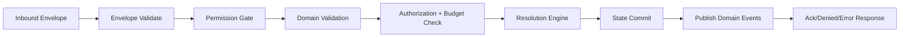

# WS Event Refactor Backend Phase Plan

This plan converts the as-built baseline into an implementation sequence for a backend-first correction of combat events.

Primary input: [docs/architecture/backend/13_ws_event_system_baseline_as_built.md](docs/architecture/backend/13_ws_event_system_baseline_as_built.md)

Planning goals:

- Remove silent/no-response command paths.
- Enforce identical authorization rules regardless of persistence mode.
- Move action flow from authorize-only to authorize + resolve + publish.
- Stabilize the backend event contract before frontend realignment.

## 1. Delivery Principles

- Backend is authoritative: frontend renders backend outcomes only.
- Every command must produce a deterministic terminal response.
- Event contract must be explicit and versioned in types/docs.
- No hidden behavior differences between in-memory and DB-backed encounters.
- Keep rollout incremental with feature flags where needed.

## 2. Target Event Pipeline

## 3. Phases and Milestones

## Phase 0 - Contract Freeze and Instrumentation

Outcome:

- Freeze command/event naming and payload shapes for refactor period.
- Add traceability for every inbound command.

Tasks:

1. Add `request_id` requirements and correlation logging for all command paths.
2. Add explicit command terminal event policy:
   - success -> ack/result event
   - denied -> denied event
   - invalid/internal -> error event
3. Document final command lifecycle states in code comments/docs.

Definition of done:

- No command path exits without producing one terminal outbound event.
- Logs can correlate inbound -> outbound by `request_id` for all commands.

Implementation notes (Phase 0 baseline now applied):

- Command events require `request_id`; missing command correlation ids are rejected as `error` (`invalid_message`).
- Denial outcomes are explicit terminal denied events:
  - `action_denied` for action-family requests
  - `command_denied` for other command families
- Invalid payload/schema and internal failures continue to use `error` events.

## Phase 1 - Turn and Permission Determinism

Outcome:

- Movement and turn changes are enforced consistently across runtime modes.

Phase 1 handoff constraints from implemented Phase 0:

- Command events now require `request_id`; Phase 1 command additions/changes must preserve this gate.
- Denial taxonomy is now explicit:
  - `action_denied` for action-family denial outcomes
  - `command_denied` for non-action command denial outcomes
- Dispatcher observability now emits `WS inbound` and `WS outbound` lines with campaign, event, and `request_id` correlation.
- Verified runtime smoke (container): `start_combat` (`smoke3_req_1`) and `end_turn` (`smoke3_req_2`) produced correlated outbound responses and matching log traces.
- If log verbosity needs reduction after Phase 1, keep correlation fields but move dispatcher trace lines from warning-level back to info-level after central logging config is aligned.

Tasks:

1. Refactor movement auth so turn/ownership/budget checks run in all modes.
2. Remove/end isolation of in-memory bypass behavior for `move_token`.
3. Change `end_turn` behavior from silent `[]` to explicit response:
   - success: `turn_advanced`
   - denied/invalid phase: `action_denied` or `error`
4. Add canonical reason codes for turn gate failures.

Definition of done:

- Reproduced issue "move any token" is no longer possible when not authorized.
- Reproduced issue "end turn no response" always yields explicit outbound response.

## Phase 2 - Action Economy Core

Outcome:

- `action`, `bonus_action`, `reaction`, and movement budgets are coherent and observable.

Tasks:

1. Normalize action type mapping (`action`, `attack`, `cast_spell`, `bonus_action`, `reaction`, etc.).
2. Ensure budget consume/reset behavior is synchronized with round/turn transitions.
3. Publish budget snapshot deltas (or full state sync fallback) after budget-affecting commands.
4. Add strict denied reasons for exhausted resources.

Definition of done:

- Budget state transitions are deterministic and covered by tests.
- Clients receive enough data to render action economy without local guessing.

## Phase 3 - Action Resolution Engine Integration

Outcome:

- Action commands produce gameplay effects, not only authorization outcomes.

Tasks:

1. Introduce resolver dispatch for concrete action families:
   - attack-like
   - save-like
   - heal
   - utility/status
2. Evolve `action_authorized` from terminal success into stage event (optional), with terminal result events.
3. Emit domain results and state deltas (e.g., hp, conditions, death, logs).
4. Ensure atomic sequence: authorize -> resolve -> commit -> publish.

Definition of done:

- Reproduced issue "cannot execute action/bonus/reaction" is resolved for implemented action families.
- At least one full attack flow produces result + HP mutation + log publication.

## Phase 4 - Missing/Declared Event Alignment

Outcome:

- Remove dead contract surface and close declared-vs-routed mismatches.

Tasks:

1. Decide per key: implement now, defer with explicit status, or remove from permission/model declarations.
2. Align for currently declared but unrouted keys:
   - `update_hp`
   - `roll_initiative`
   - `cast_spell`
   - `toggle_equip`
3. Update backend schema docs + frontend type package after final decisions.

Definition of done:

- No event key is simultaneously documented as supported and unrouted.

## Phase 5 - Frontend Contract Handover Prep

Outcome:

- Backend emits stable event stream ready for frontend migration.

Tasks:

1. Produce backend event changelog from baseline -> new contract.
2. Add compatibility mode or transitional aliases only where required.
3. Publish integration checklist for host/shared store updates.

Definition of done:

- Frontend team can implement against a stable, versioned contract.

## 4. Suggested Sequence by Event Family

1. `end_turn`, `start_combat`, `end_combat`
2. `move_token`
3. `action`, `request_action`
4. `apply_damage`, `apply_healing`
5. `apply_condition`, `remove_condition`
6. `chat_message`, `roll_dice`, `ping`, `request_sync`
7. Declared-but-unrouted keys

Reasoning:

- Fixes your top 3 blockers first.
- Establishes turn/state determinism before deep action resolver work.

## 5. Risk Register

- Risk: contract churn causes frontend regressions.
  - Mitigation: freeze payload schemas per phase; publish changelog each milestone.
- Risk: mixed in-memory/DB paths diverge again.
  - Mitigation: consolidate auth/budget checks into single reusable service layer.
- Risk: partial resolver causes inconsistent outcomes.
  - Mitigation: gate by action family and return explicit `unsupported_action` denied reasons.

## 6. Exit Criteria for Backend Refactor

- All command handlers emit deterministic terminal responses.
- No bypass path allows unauthorized movement/action execution.
- At least one complete action family resolves end-to-end with persistent state mutation.
- Event contract doc and type definitions are synchronized.
- Acceptance matrix in [docs/architecture/backend/15_ws_event_refactor_acceptance_matrix.md](docs/architecture/backend/15_ws_event_refactor_acceptance_matrix.md) is green for implemented scope.
