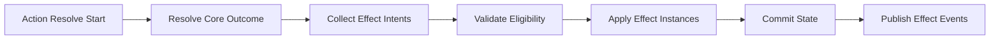

# Effect Engine Data-Driven Adaptation Concept

Date: 2026-03-17
Status: Proposed

Primary references:

- [docs/architecture/backend/08_dnd5e_combat_and_actions.md](docs/architecture/backend/08_dnd5e_combat_and_actions.md)
- [docs/architecture/backend/17_ws_event_command_deck_next_stages.md](docs/architecture/backend/17_ws_event_command_deck_next_stages.md)
- [backend/src/systems/dnd5e/engine/effect_engine.py](backend/src/systems/dnd5e/engine/effect_engine.py)
- [backend/src/systems/dnd5e/engine/action_resolver.py](backend/src/systems/dnd5e/engine/action_resolver.py)

## 1. Why This Exists

The current runtime can store and query effects, but effect application is not consistently driven by shared data definitions and is not fully integrated into action resolution.

This concept defines a backend-authoritative, data-driven effect model where:

- effect definitions are content, not code branches,
- effect instances are deterministic runtime state,
- the resolver executes effects via generic handlers,
- frontend only renders resulting state/events.

## 2. Architecture Constraints

- Backend is truth. Frontend does not infer gameplay outcomes.
- Rules are data-driven. No per-spell/per-ability hardcoded behavior in frontend.
- Effect payload shape must support future effect-processor extensibility.
- Behavior parity is required between preview and execution validation paths.

## 3. Scope and Non-Goals

Included in this concept:

- canonical effect definition schema,
- effect instance runtime schema,
- execution lifecycle hooks,
- integration contract with action resolver,
- persistence and migration strategy.

Not included in this concept:

- AoE and multi-target effect semantics (see dedicated concept file),
- frontend input UX details,
- complete status-icon visual design.

## 4. Target Data Model

## 4.1 EffectDefinition (content-level)

EffectDefinition is canonical gameplay content and should be persisted in DB with JSON import compatibility.

Proposed fields:

- effect_id: string (stable key)
- name: string
- family: string (buff, debuff, condition, utility, damage_over_time, heal_over_time)
- duration:
  - type: instant | rounds | turns | until_removed | concentration
  - value: number | null
  - timing: start_of_turn | end_of_turn | immediate
- stacking:
  - mode: replace | stack | refresh_duration | highest_only
  - max_stacks: number | null
- tags: string[]
- modifiers[]:
  - operation: set | bonus | multiply
  - stat_key: string
  - value: number | string
- grants_conditions[]: string
- periodic[]:
  - trigger: start_of_turn | end_of_turn
  - operation: apply_damage | apply_heal | apply_condition | remove_condition
  - payload: object
- removal_triggers[]:
  - trigger: on_save_success | on_damage_taken | on_turn_end | dispel
- metadata:
  - source_system: dnd5e
  - content_version: string

## 4.2 EffectInstance (runtime-level)

EffectInstance is the applied state on a specific actor/object.

Proposed fields:

- instance_id: string
- effect_id: string
- source_actor_id: string | null
- target_actor_id: string
- applied_at_round: number
- remaining_duration: number | null
- concentration_owner_actor_id: string | null
- stack_count: number
- snapshot_payload: object (resolved values at apply-time)
- provenance:
  - command_request_id: string
  - action_id: string | null

## 5. Execution Lifecycle

Lifecycle stages:

1. Resolve core action outcome.
2. Collect effect intents from ActionDefinition and linked content.
3. Validate target eligibility and immunities.
4. Materialize EffectInstance rows using EffectDefinition.
5. Commit atomically with HP/condition changes.
6. Publish deterministic events (applied/refreshed/expired/denied).

## 6. Resolver Integration Contract

Action resolver should emit a generic structure that the effect engine consumes:

- effect_intents[]:
  - effect_id
  - target_ids[]
  - duration_override (optional)
  - scaling_context (optional)
  - save_context (optional)

Effect engine returns:

- applied[] (instance ids + targets)
- refreshed[]
- denied[] (canonical reason codes)
- emitted_conditions[]

## 7. Persistence Strategy

Hybrid source strategy:

- Runtime authority: DB tables for EffectDefinition and EffectInstance.
- Content import: JSON packs can seed or update EffectDefinition versions.

Migration policy:

1. Introduce schema and read path.
2. Backfill existing inline effect-like entries into definitions.
3. Switch resolver to definition-driven path behind feature flag.
4. Remove legacy ad-hoc execution branches.

## 8. Deterministic Reasons and Events

Canonical denied reasons for effect application:

- effect_not_found
- target_immune
- target_invalid
- concentration_conflict
- stacking_limit_reached
- invalid_duration
- unsupported_effect_operation

Outbound event families:

- effect_applied
- effect_refreshed
- effect_removed
- effect_denied
- effect_tick_resolved

## 9. Testing and Acceptance

Required verification:

1. Resolver parity tests: same inputs always produce same effect outcomes.
2. Persistence mode parity: in-memory fallback and DB-backed mode match behavior.
3. Duration tick tests: start/end turn transitions are deterministic.
4. Concentration tests: concentration replacement/cleanup is deterministic.
5. Request correlation: effect events include command/action provenance.

Definition of done:

- New actions can add effects through data only.
- No gameplay-critical effect behavior depends on frontend inference.
- Effect lifecycle is observable via deterministic outbound events.
