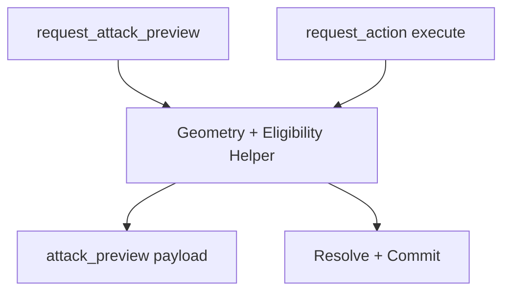

# Effect Engine AoE and Multi-Target Concept

Date: 2026-03-17
Status: Proposed

Primary references:

- [docs/architecture/backend/17_ws_event_command_deck_next_stages.md](docs/architecture/backend/17_ws_event_command_deck_next_stages.md)
- [backend/src/systems/dnd5e/services/combat_service.py](backend/src/systems/dnd5e/services/combat_service.py)
- [backend/src/systems/dnd5e/engine/action_resolver.py](backend/src/systems/dnd5e/engine/action_resolver.py)

## 1. Why This Is Separate

AoE and multi-target behavior affects targeting geometry, eligibility, and per-target resolution semantics. This is intentionally split from the base data-driven effect adaptation so base effect infrastructure can stabilize first.

## 2. Scope

This concept defines:

- authoritative target-set derivation for single-target and template actions,
- per-target effect outcome semantics,
- preview/execute parity requirements,
- deterministic denial taxonomy for AoE and multi-target paths.

Out of scope:

- frontend interaction build-out beyond contract dependencies,
- complete map-rendering performance optimization.

## 3. Target Set Model

The resolver should operate on an explicit TargetSet object:

- source_actor_id: string
- action_id: string
- targeting_mode: single_target | aoe | self
- origin: {x, y}
- template:
  - shape: line | cone | sphere | cube | cylinder | null
  - size: number | null
  - direction: {x, y} | null
- eligible_target_ids: string[]
- resolved_target_ids: string[]
- provenance:
  - preview_request_id: string | null
  - execute_request_id: string

Rules:

- resolved_target_ids must be derived by backend from geometry + world state.
- execute path must never trust frontend-computed target lists.
- optional client target hints may be accepted but must be revalidated.

## 4. Per-Target Resolution Semantics

For each resolved target:

1. Determine eligibility (range, visibility, immunity, alive state).
2. Evaluate save/attack branch if defined.
3. Compute damage/heal branch.
4. Compute effect branch using EffectDefinition handlers.
5. Emit target-local result entry with reason/status.

Result envelope should include:

- target_id
- hit_state: hit | miss | save_success | save_fail | ineligible
- hp_delta: number
- effects_applied[]
- effects_denied[]
- reason_codes[]

## 5. Preview and Execute Parity

Parity requirement:

- preview and execute share the same helper logic for target derivation and eligibility checks.

Drift guardrails:

- if execution receives explicit targets not in derived set, return deterministic denial.
- if world state changed between preview and execute, execute returns updated denied/result outcomes with canonical reasons.

## 6. Effect Semantics in AoE Context

- Effects are applied per target, not per template cell.
- If action specifies on-hit effects, only targets with hit_state that qualifies receive those effects.
- If action specifies always-apply effects (for example terrain aura style), apply to all resolved targets that pass immunity checks.
- Stacking mode and concentration rules from effect core concept still apply unchanged.

## 7. Denial Taxonomy for AoE/Multi-Target

Canonical additional reasons:

- invalid_template_origin
- invalid_template_direction
- template_out_of_range
- no_resolved_targets
- target_not_in_template
- target_no_longer_eligible
- line_of_effect_blocked

## 8. Performance and Safety Constraints

- Enforce max preview and execution target counts.
- Enforce bounded template projection area.
- Keep request correlation ids on preview and execute responses.
- Keep payload shape stable across incremental rollout.

## 9. Acceptance Criteria

1. Single-target and AoE actions use same authoritative validation framework.
2. Multi-target actions return per-target deterministic results.
3. Preview and execute parity tests pass across shape families.
4. Resolver emits deterministic terminal response even when no targets resolve.
5. No frontend local rule fallback is required for target legality.
