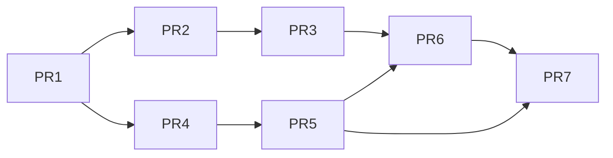

# Effect and Action Data-Driven PR Roadmap

Date: 2026-03-17
Status: Draft for implementation ordering

This roadmap sequences the new concept set into implementation PRs with dependency-aware ordering.

Concept sources:

- [docs/architecture/backend/18_effect_engine_data_driven_adaptation_concept.md](docs/architecture/backend/18_effect_engine_data_driven_adaptation_concept.md)
- [docs/architecture/backend/19_effect_engine_aoe_multi_target_concept.md](docs/architecture/backend/19_effect_engine_aoe_multi_target_concept.md)
- [docs/architecture/backend/20_actions_abilities_data_driven_hybrid_concept.md](docs/architecture/backend/20_actions_abilities_data_driven_hybrid_concept.md)
- [docs/architecture/frontend/16_action_visualization_contract_and_multimode_note.md](docs/architecture/frontend/16_action_visualization_contract_and_multimode_note.md)

## 1. Ordering Principles

- Land contract/schema foundation before resolver behavior.
- Keep AoE/multi-target as a separate stream after base effect pipeline is stable.
- Keep frontend rendering dependent on backend snapshots, never local game rules.
- Preserve deterministic terminal response behavior for all command paths.

## 2. PR Sequence (Detailed)

## PR-1: Canonical Data Contracts and Schema Foundations

Scope:

- Introduce canonical schemas for ActionDefinition, AbilityBinding, EffectDefinition, EffectInstance.
- Add shared denied reason taxonomy additions.
- Add version/changelog section updates for new payload families.

Entry criteria:

- Existing ws-combat-v2 baseline green.

Done criteria:

- Type and backend schema docs align for new entities.
- No runtime behavior change required in this PR.

Risk:

- Contract churn if schemas are unstable.

Rollback:

- Remove additive schemas and references; no state migration yet.

## PR-2: Data Persistence and Hybrid Ingestion Path

Scope:

- Add DB persistence for ActionDefinition/AbilityBinding/EffectDefinition (and minimal EffectInstance storage shape).
- Add JSON content-pack import validation pipeline.
- Add conflict policy hooks (reject/overwrite/fork).

Entry criteria:

- PR-1 merged.

Done criteria:

- Data can be ingested from JSON and represented canonically in DB.
- No resolver execution dependency yet.

Risk:

- Migration complexity and seed/data mismatch.

Rollback:

- Keep old inferred content path active; feature-flag new path.

## PR-3: Executable Action Projection from Canonical Data

Scope:

- Generate executable action snapshots from canonical data model + runtime state.
- Remove frontend-facing dependency on ad-hoc inferred action structures.
- Keep deny reason vocabulary canonical.

Entry criteria:

- PR-2 merged with stable read path.

Done criteria:

- command deck payload is backend-projected from data model.
- Snapshot fields are stable and documented.

Risk:

- Availability regressions if projection rules drift.

Rollback:

- Feature-flag fallback to previous projection implementation.

## PR-4: Effect Engine Core Execution Integration

Scope:

- Connect resolver output effect intents to effect engine handlers.
- Implement effect apply/refresh/remove/tick event emission.
- Implement stacking and concentration handling in core path.

Entry criteria:

- PR-1 and PR-2 merged.

Done criteria:

- Effects apply from data-driven definitions in single-target path.
- Deterministic effect events emitted with request/action provenance.

Risk:

- Atomicity bugs in resolve->commit pipeline.

Rollback:

- Feature-flag effect execution branch; preserve action core outcomes.

## PR-5: AoE and Multi-Target Effect Semantics

Scope:

- Enforce backend-derived TargetSet for multi-target/template actions.
- Apply per-target effect semantics and parity checks.
- Add AoE/multi-target denied reason extensions.

Entry criteria:

- PR-4 merged and stable in single-target path.

Done criteria:

- Preview/execute parity for target derivation and eligibility.
- Per-target deterministic result entries include effect outcomes.

Risk:

- Payload growth and geometry edge-case regressions.

Rollback:

- Keep single-target effect flow active; guard AoE effect path by flag.

## PR-6: Frontend Action Visualization Baseline (Contract-Only Rendering)

Scope:

- Render command surfaces from executable action snapshots.
- Show unavailable/denied reasons directly from backend payloads.
- Implement minimal select->preview->execute mode transitions.

Entry criteria:

- PR-3 merged for snapshot contract stability.
- PR-5 not strictly required for first pass if single-target preview is stable.

Done criteria:

- Frontend renders backend action availability without local rule logic.
- Minimal multi-mode flow is functional and deterministic.

Risk:

- Accidental frontend fallback rules.

Rollback:

- Keep old UI controls behind feature switch for one iteration.

## PR-7: Hardening, Matrix, and Release Readiness

Scope:

- Extend acceptance matrix with effect/action/AoE coverage.
- Add regression tests for deterministic reason codes and request correlation.
- Publish final changelog and migration notes.

Entry criteria:

- PR-1 through PR-6 merged or in merge-ready state.

Done criteria:

- Contract docs, backend handlers, and frontend types are synchronized.
- Determinism and parity checks pass in CI and docker smoke logs.

Risk:

- Late-stage cross-package type drift.

Rollback:

- Hold release branch; keep implementation branch open until matrix green.

## 3. Dependency Graph

## 4. Suggested Merge Strategy

- Keep each PR narrowly scoped with explicit feature flags.
- Require contract diff summary in every PR description.
- Require backend + frontend type check evidence before merge.
- Validate with Docker logs for request_id-correlated command paths.

## 5. Exit Condition for This Roadmap

Roadmap completes when:

1. Actions and effects are authored/modified via data and ingested reliably.
2. Resolver executes effect behavior from canonical definitions.
3. AoE/multi-target effect semantics are deterministic and parity-tested.
4. Frontend action surfaces are contract-driven renderers of backend truth.
