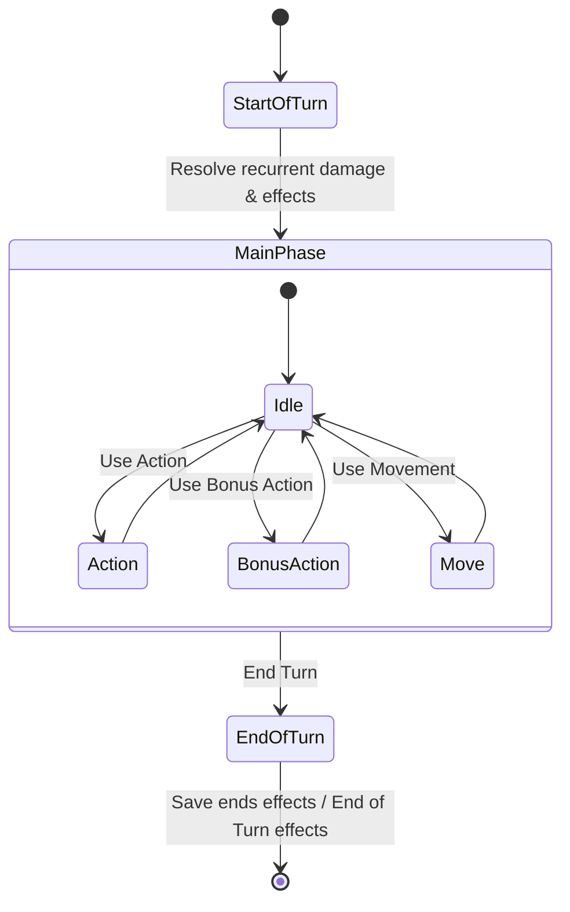

# Combat State Machine (DM-Only MVP)

## 1. Core Philosophy

The DM-Only MVP treats the Combat State Machine as a strict, impartial rules arbitrator. While the DM is the sole operator and input provider for the entire system, the state machine strictly tracks the action economy, turn order, and phases of play to ensure consistency.

## 2. Initiative & Turn Progression

### Combat Roster

The `Encounter` state holds an ordered list of `Combatant` references. This list combines:

- Player Proxies (Controlled by the DM)
- Monsters / NPCs
- Lair Actions (Fixed at Initiative count 20)
- Environmental Hazards / Spells (Operating on specific counts)

### Turn Phases

Every turn is rigidly divided into three phases, which can trigger automatic hooks in the Effect Engine:

1. **`start_of_turn`**: Triggers recurring damage (e.g., Poison), Regeneration, and initial Saving Throws.
2. **`main_phase`**: The combatant is active. They can expend their Action, Bonus Action, and Movement.
3. **`end_of_turn`**: Triggers ending conditions (e.g., "Ends at the end of the target's next turn") and final Saving Throws.

## 3. Action Economy Tracker

The engine ensures that actions are spent correctly per D&D 5e rules.

### Resources Tracked per Combatant

- `action_used` (Boolean): Reset at `start_of_turn`.
- `bonus_action_used` (Boolean): Reset at `start_of_turn`. Strictly limited to one per turn.
- `reaction_used` (Boolean): Reset at the `start_of_turn` of the combatant, independent of the current active turn.
- `attacks_made` (Integer): Tracked during the Attack action to support the "Extra Attack" feature.
- `movement_remaining` (Float): Measured in feet. Decremented as tokens are moved.

## 4. The DM Proxy Interaction

Since players do not have their own clients connected to the combat engine:

- **Player Turns**: The DM selects the Player Token. The DM can manually log the actions taken by the physical players (e.g., clicking "Used Action", decrementing spell slots) or simply execute the attacks via the UI to update target HP.
- **Monster Turns**: The DM selects the Monster Token and utilizes its stat block actions through the interface, which automatically decrements the monster's action economy resources for that turn.

## 5. Ready Actions & Edge Cases

- **Readying an Action**: The DM marks a combatant as having readied an action. This consumes the `action` resource on their turn, and allows a special trigger to consume their `reaction` outside their turn.
- **Surprise**: The engine supports a "Surprised" condition flag during the first round of combat, which disables Actions, Bonus Actions, and Reactions until the surprised combatant's first turn ends.
