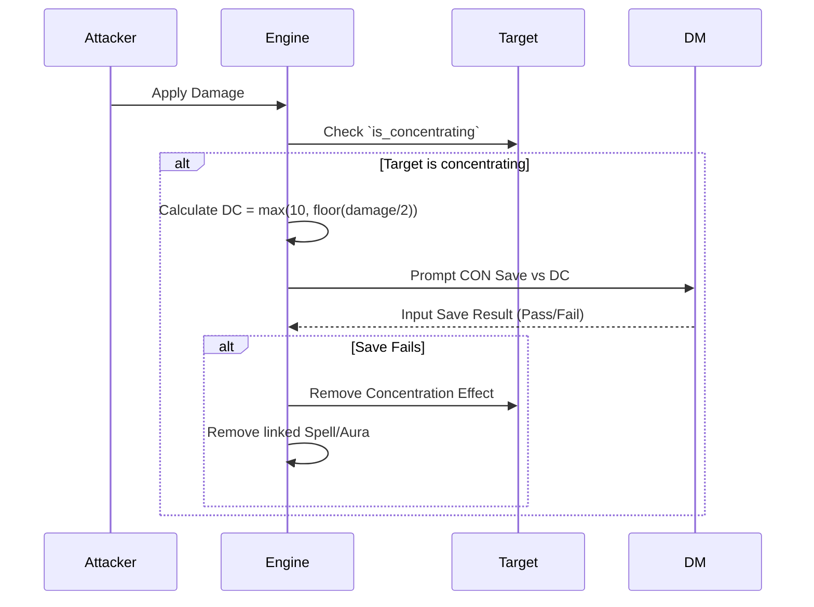

# Effect and Condition Engine (DM-Only MVP)

## 1. Core Philosophy

The Effect Engine must be highly modular and responsive. It tracks temporary and permanent modifications to entities, ranging from standard D&D conditions (like _Restrained_) to complex spell effects (like _Bless_ or _Bane_).

## 2. Standard Conditions

The system natively recognizes the 15 standard D&D 5e conditions:

- Blinded, Charmed, Deafened, Exhaustion (Levels 1-6), Frightened, Grappled, Incapacitated, Invisible, Paralyzed, Petrified, Poisoned, Prone, Restrained, Stunned, Unconscious.

Each standard condition is a preset package of sub-effects (e.g., _Restrained_ automatically sets `Speed = 0` and applies `Advantage` to incoming attacks, and `Disadvantage` to outgoing attacks).

## 3. The Lifecycle of an Effect

Effects are instances attached to a `Combatant`.

1. **Application**: `EffectEngine.apply(target_id, source_id, effect_definition)`
2. **Duration and Expiration**:
   - `duration_rounds`: Decrements at the start/end of the source's turn.
   - `save_ends`: Prompts a saving throw at the end of the target's turn.
   - `manual`: Persists until the DM explicitly removes it.
3. **Continuous Evaluation**: Character statistics (AC, Speed, Attack Bonus) are calculated dynamically on-the-fly by parsing the character's base stats _plus_ all active effect modifiers.
4. **Removal**: When expiration conditions are met, the effect is scrubbed and the character's computed stats revert to normal.

## 4. Concentration Mechanics

A critical component of the engine is automatic **Concentration** tracking.

### The Trigger Pipeline

1. **Damage Event**: When a `Combatant` applies damage to a target via the engine.
2. **Check Status**: The engine checks if `Target.is_concentrating == True`.
3. **Calculate DC**: The engine calculates the Save DC: `MAX(10, FLOOR(Damage_Taken / 2))`.
4. **Resolution Prompt**: The DM evaluates the Constitution Saving Throw (either rolling physical dice for a player or using the engine for a monster).
5. **Failure Consequence**: If the save fails, the `ConcentrationEvent` triggers removal of the associated spell effect from the target and any linked affected entities.

## 5. Auras and Zones

For the MVP, Auras (e.g., Paladin's _Aura of Protection_, _Spirit Guardians_) are handled via explicit linking by the DM. In the future, these can rely on spatial proximity checks, but initially, the DM manually applies "Aura Effect" to tokens within range, and the engine tracks the link to the casting source.
