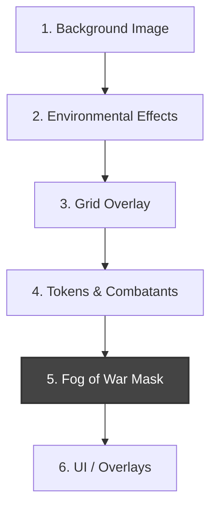

# Spatial and Map Management (DM-Only MVP)

## 1. Core Philosophy

The map system forms the visual backend for the campaign. For the DM-Only MVP, the engine focuses on reliable rendering, distinct creature sizes, and manual Fog of War controls, avoiding complex automation like dynamic Line of Sight (LoS).

## 2. Grid & Creature Sizes

The world is mapped onto a strictly aligned grid where **1 Square = 5 ft**.

### Creature Sizes and Occupancy

- **Tiny**: `0.5 x 0.5` squares. Multiple tiny creatures can occupy the same 5ft square.
- **Small / Medium**: `1 x 1` square. The standard footprint. Snaps directly to grid squares.
- **Large**: `2 x 2` squares. Snaps such that its center is the intersection of four squares.
- **Huge**: `3 x 3` squares. Snaps like a Medium creature, centering on the middle square.
- **Gargantuan**: `4 x 4` (or larger). Snaps similarly based on exact dimensions.

## 3. Movement and Pathing

While moving a token, the DM traces a path. The engine evaluates this path.

### Cost Calculation

- **Base Cost**: 1 square = 5 ft of `movement_remaining`.
- **Difficult Terrain**: Defined zones on the map that double the movement cost (1 square = 10 ft).
- **Diagonals**: The system supports standard 5e rules (every diagonal = 5ft) or optional variant rules (alternating 5ft/10ft).
- **Squeezing**: The DM can toggle a "Squeezing" state on a creature, which mechanically halves their speed and applies appropriate combat penalties.

## 4. Fog of War (FoW)

In the DM-Only MVP, Fog of War relies heavily on the DM's manual control rather than algorithmic raycasting.

- **DM View**: The DM always sees the fully revealed map, with the "hidden" areas depicted via a translucent darkening overlay.
- **Tools**: The DM has access to "Brush", "Polygon", and "Fill" tools to erase the Fog of War as the party explores.
- **Stage View**: The public screen-share view strictly renders the opaque Fog of War mask, ensuring zero spoilers.

## 5. Layers

The map rendering is composed of the following distinct rendering layers (from bottom to top):

1. **Background**: The base image/media for the map.
2. **Environmental Effects**: Difficult terrain masks, traps, and spell zones (e.g., _Web_ or _Wall of Fire_).
3. **Grid**: The physical lines and coordinates.
4. **Tokens**: The combatants, sized correctly.
5. **Fog of War**: The obscuring layer (rendered opaque for players, translucent for DM).
6. **UI/UX Overlays**: Movement path lines, target arrows, and selection rings.

