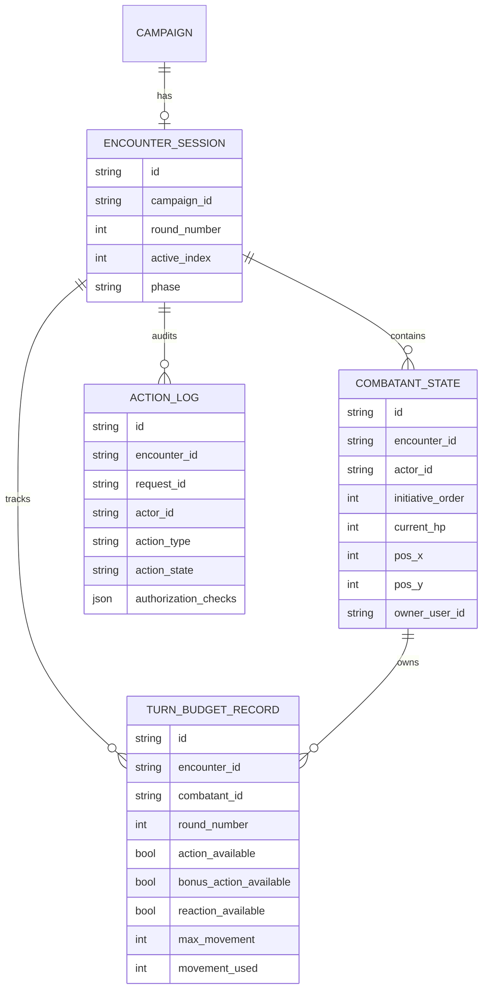
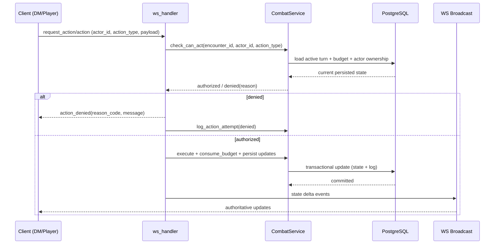

# Backend Feature Concept: Persistent Turn State, Movement Budget, and Action Authorization

## Goal

Make the combat backend authoritative and durable for turn order, movement limits, and action permissions.

This concept addresses three gaps:

- No persistent source of truth for active turn and round.
- No hard backend check for who is allowed to act at a given moment.
- No durable movement budget/max movement tracking per combatant per turn.

## Scope

In scope:

- DnD5e encounter turn-state persistence.
- Action authorization matrix (role + actor ownership + turn + budget + status effects).
- Movement budget tracking (max, used, remaining) and validation.
- WebSocket event and REST read-model updates.
- Migration and test strategy.

Out of scope (follow-up features):

- Full effect engine execution beyond turn-gating hooks.
- Rule-complete spell and reaction exception handling for every edge case.
- Replay UI.

## Current State Findings

Observed backend hotspots:

- `backend/src/systems/dnd5e/engine/combat_state.py`
- `backend/src/systems/dnd5e/schemas/encounter.py`
- `backend/src/systems/dnd5e/ws_handler.py`
- `backend/src/systems/dnd5e/permissions.py`
- `backend/src/systems/dnd5e/engine/action_resolver.py`

Current behavior risks:

- Turn and budget state are volatile (memory-first), so restart loses combat progression.
- Role checks exist, but actor-level and turn-level checks are incomplete.
- Movement spending and max movement are not enforced as durable rules.

## Target Architecture

### Principles

- Backend is truth: frontend submits intent, backend validates and emits authoritative state deltas.
- Data-driven and microservice-ready: combat state persistence and combat rules are separated.
- Recoverable: encounter state must be reconstructible from DB after restart.

### Layers

- Persistence layer: encounter, combatant state, turn budget, action log.
- Combat service layer: lifecycle and authorization logic.
- Transport layer: WebSocket/REST command and query contracts.
- Rule adapters: DnD5e-specific validation hooks (movement, action economy, conditions).

## Proposed Data Model Changes

### New persistent entities

1. `EncounterSession`

- `id`, `campaign_id`, `phase`, `round_number`, `active_index`, timestamps.
- One active encounter session per campaign (or one active plus archived history).

2. `CombatantState`

- Actor instance in encounter, initiative slot, HP, position, owner mapping.
- Ownership fields for player-controlled actors.

3. `TurnBudgetRecord`

- Per encounter + combatant + round budget state:
  - `action_available`
  - `bonus_action_available`
  - `reaction_available`
  - `max_movement`
  - `movement_used`
  - derived `movement_remaining`

4. `ActionLog`

- Immutable record of attempt/result, authorization checks, payload, correlation/request id.

### Notes

- Keep any in-memory maps only as cache/optimization, never as source of truth.
- Add indexes on `(encounter_id, round_number)` and `(encounter_id, combatant_id)`.

## Combat Authorization Matrix

An action is executable only if all checks pass:

1. Role and ownership

- DM: may act for any combatant.
- Player: may request actions only for owned actor(s).
- Spectator: never may act.

2. Combatant validity

- Actor exists in current encounter and is not dead/incapacitated for that action type.

3. Turn legality

- Normal action types require active combatant.
- Reaction types can be out-of-turn if reaction budget and trigger conditions pass.

4. Budget legality

- Required action/bonus/reaction resource available.
- `movement_required <= movement_remaining`.

5. Rules gate

- Terrain/path/passability and system-specific constraints validated.

## API and WebSocket Contract Changes

### WebSocket inbound

- Keep `action` for DM/system callers.
- Add `request_action` for player-originated commands.
- Explicit `actor_id`, `action_type`, and resource or movement intent fields.

### WebSocket outbound (new)

- `action_authorized` (optional, useful for UX and telemetry).
- `action_denied` with machine-readable reason codes.
- Existing state delta events remain authoritative.

### REST query endpoints

- `GET /api/campaigns/{campaign_id}/encounter/state`
- `GET /api/campaigns/{campaign_id}/encounter/action-log`

## Service Refactor Plan

Create `CombatService` in `backend/src/systems/dnd5e/services/combat_service.py` with methods such as:

- `start_combat(...)`
- `advance_turn(...)`
- `check_can_act(...)`
- `consume_budget(...)`
- `apply_movement(...)`
- `log_action_attempt(...)`
- `load_or_create_encounter_state(...)`

`ws_handler.py` should delegate command handling to this service and persist inside transactional boundaries.

## Migration Strategy

Phase 1: schema + models

- Add DB tables and relationships.
- Backfill empty encounter session records for active campaigns where needed.

Phase 2: service and handler integration

- Introduce `CombatService` and route all turn/actions through it.
- Keep compatibility mode for old events for one release window.

Phase 3: contract hardening

- Enforce actor ownership and turn checks by default.
- Emit standardized denial reasons.

Phase 4: cleanup

- Remove legacy memory-only pathways once metrics show stable adoption.

## Testing Strategy

Unit tests:

- authorization matrix checks.
- movement budget spend/reset.
- round/turn advancement behavior.

Integration tests:

- start combat, spend budgets, advance turns, persist and reload.
- restart recovery from DB state.

E2E WS tests:

- invalid actor/turn action denied.
- valid move/action accepted and broadcast.

## Risks and Mitigations

- Race conditions with concurrent commands:
  - Use DB transactions and row-level locking around budget/turn updates.
- Throughput concerns from extra writes:
  - Add targeted indexes and optional async append-only log buffering.
- Frontend compatibility during transition:
  - Dual-protocol support window and explicit contract versioning.

## Mermaid Diagrams

### 1) Persistent Combat State Model

### 2) Action Request Validation Sequence

## Implementation Checklist

- [ ] Add encounter persistence tables and migration.
- [ ] Implement `CombatService` and transaction boundaries.
- [ ] Enforce turn/ownership/budget checks server-side.
- [ ] Persist movement budget and reset semantics per turn.
- [ ] Emit standardized `action_denied` payloads.
- [ ] Add recovery flow on backend startup/WS reconnect.
- [ ] Update frontend combat types after backend model/contract changes.
- [ ] Add unit/integration/e2e coverage for denial and recovery paths.

## Expected Outcome

After this refactor, restart-safe combat sessions, deterministic turn authority, and hard movement/action gating are enforced by backend state rather than frontend assumptions.
