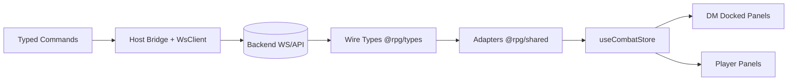
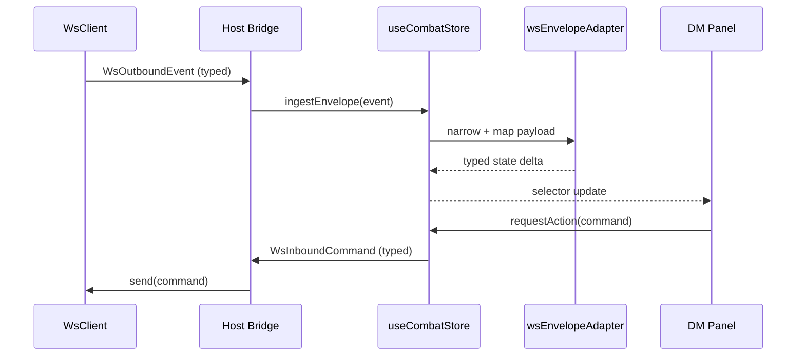

# Frontend Feature Concept: Combat Contract and Type Synchronization for Docked DM Workspace

## Goal

Align frontend encounter and WebSocket type contracts with the backend combat persistence/authorization refactor, while preparing a stable contract foundation for the upcoming DM docked workspace enhancement.

This ensures the frontend remains backend-authoritative, strongly typed, and migration-safe as new DM workspace panels are introduced.

## Problem Statement

Backend combat contracts now include persistent turn budget data and new action authorization events. Current frontend typing and mapping are fragmented and partially implicit (many `any` payloads), which creates a risk of runtime drift and incorrect UI assumptions.

Current risks:

- Store-level state shape does not fully represent backend encounter fields.
- WS payloads are dispatched/ingested as loosely typed envelopes.
- New backend events (`request_action`, `action_authorized`, `action_denied`) are not modeled as first-class frontend contracts.
- Movement/action budget is still represented in ad-hoc UI fields instead of backend-provided authoritative budget state.
- Type ownership is spread across app-level and store-level files with no single source of truth package.

## Scope

In scope:

- Define canonical frontend TypeScript contracts for encounter state and WS envelopes.
- Add typed adapters from backend payloads to UI store view-models.
- Update shared combat store to consume and emit typed contracts.
- Add strict typing to bridge WS dispatch/ingest paths.
- Introduce compatibility policy for phased contract migration.
- Add tests for mapping and envelope handling.

Out of scope:

- Rewriting backend business logic or WS protocol behavior.
- Full UI redesign of DM panels (covered by docked workspace feature).
- Replacing Zustand or bridge architecture.

## Current State Findings

Primary frontend files currently involved:

- `frontend/packages/shared/src/stores/useCombatStore.ts`
- `frontend/packages/bridge/src/WsClient.ts`
- `frontend/packages/bridge/src/index.ts`
- `frontend/apps/host/src/lib/bridge.ts`
- `frontend/packages/dm-view/src/pages/DmDashboard.tsx`
- `frontend/apps/player-view/src/PlayerView.tsx`
- `frontend/apps/player-view/src/types.ts`

Observed type/contract gaps:

- `useCombatStore` defines local backend-like types inline (`BackendEncounter`, `BackendActor`) and still uses generic envelope payloads.
- `WsClient` and bridge interfaces use untyped `any` handlers/payloads.
- Action dispatch from frontend is stringly typed and unconstrained.
- There is no usable centralized type package implementation in `frontend/packages/types` yet.
- Mapping logic includes placeholder defaults (`movement_remaining: 30`, action flags) instead of using backend turn budget source where available.

## Backend Contract Changes to Reflect

The frontend contract layer must account for these backend additions:

1. Encounter state extensions

- `combatants[].owner_user_id`
- `turn_budgets` keyed by `actor_id` containing:
  - `action_available`
  - `bonus_action_available`
  - `reaction_available`
  - `max_movement`
  - `movement_used`
  - `movement_remaining`

2. WS inbound command additions

- `request_action` payload:
  - `actor_id`
  - `action_type`
  - `action_name`
  - `payload`

3. WS outbound event additions

- `action_authorized` payload
- `action_denied` payload with machine-readable reason codes

4. Existing events still used

- `state_sync`, `actor_moved`, `actor_added`, `actor_removed`, `turn_advanced`, `actor_damaged`, `actor_healed`, `actor_died`, `error`

## Proposed Frontend Architecture

### 1) Canonical contract module in shared types package

Create a typed contract boundary in `frontend/packages/types`:

- `src/combat/encounter.ts`
- `src/combat/ws-events.ts`
- `src/combat/commands.ts`
- `src/combat/errors.ts`
- `src/index.ts` exports

Design principles:

- Backend-shape types (wire contracts) are separate from UI-shape types (view models).
- No business logic in type package.
- Use discriminated unions for WS outbound/inbound envelopes.

### 2) Typed adapter layer

Create adapter utilities in `frontend/packages/shared`:

- `src/adapters/encounterAdapter.ts`
- `src/adapters/wsEnvelopeAdapter.ts`

Responsibilities:

- Convert backend encounter to store `GameState` model.
- Merge turn budget from `turn_budgets[actor_id]` into combatant UI projections.
- Handle compatibility fallback when fields are absent during transition window.
- Normalize health descriptor variants.

### 3) Store contract hardening

Refactor `useCombatStore` to:

- Replace inline backend types with imports from `@rpg/types`.
- Replace generic `any` envelope processing with typed envelope narrowing.
- Introduce typed dispatcher methods for:
  - `requestAction(...)`
  - `moveToken(...)`
  - `endTurn(...)`
  - `applyDamage(...)`
- Store and expose action denial feedback from `action_denied` for DM workspace panels.

### 4) Bridge typing upgrade

Update bridge and WS client types:

- `WsClient.onMessage` emits `WsOutboundEnvelope` union instead of `any`.
- `WsClient.sendAction` takes typed command envelope.
- `IActionDispatcher.dispatch` accepts typed command variants.
- Host bridge can retain generic compatibility overload for one release to avoid blocking unrelated callers.

## Data Model Proposal

### Wire types (backend contract aligned)

- `EncounterStateWire`
- `ActorInstanceWire`
- `TurnBudgetWire`
- `WsInboundCommand`
- `WsOutboundEvent`

### UI/store types (frontend projection)

- `CombatantViewModel`
- `GameStateViewModel`
- `ActionFeedbackViewModel`

Mapping policy:

- Wire types are immutable snapshots.
- UI/store types are derived projections only.
- Defaulting only allowed at adapter boundary.

## Contract Compatibility Strategy

Use a dual-contract tolerance window for one release cycle:

- Accept old and new field names where needed in adapter.
- Treat missing `turn_budgets` as unsupported backend and fallback gracefully.
- Keep existing `action` dispatch path for DM/system while introducing `request_action` path for player-originated actions.

After transition window:

- Remove temporary fallback branches.
- Enforce strict required fields in wire types.

## Integration with DM Docked Workspace

This type sync is a prerequisite for the docked DM workspace implementation:

- Panels (`initiative`, `map`, `command-deck`, `action-deck`) should consume shared typed store selectors.
- Action panels should render denial reasons from typed `action_denied` payloads.
- Initiative/map panel state should rely on typed active actor and turn budget projections.
- Layout persistence and panel registry can safely assume stable contracts once this sync lands.

## Migration Plan

Phase 1: contract baseline

- Implement canonical wire and command types in `frontend/packages/types`.
- Export from package root and wire package references.

Phase 2: adapter introduction

- Add encounter and envelope adapters in `shared` package.
- Add fallback compatibility for missing new fields.

Phase 3: store and bridge migration

- Refactor `useCombatStore` to typed ingestion/dispatch.
- Update `WsClient` and bridge interfaces to typed envelopes.
- Preserve backward-compatible overloads where needed.

Phase 4: UI adoption for docked DM workspace

- Update DM and player consumers to use typed selectors and command helpers.
- Connect typed action feedback into command/action decks.

Phase 5: hardening

- Remove legacy fallbacks after rollout validation.
- Enforce no-`any` rule in combat envelope paths.

## Testing Strategy

Unit tests:

- encounter adapter mapping with/without `turn_budgets`
- envelope discriminated union narrowing
- action denial reason parsing and user-facing mapping

Integration tests:

- `useCombatStore` ingest flow for new event set
- bridge dispatch typing for `request_action` and `action`
- state_sync to panel selector projection integrity

E2E tests:

- denied action surfaces correctly in DM workspace
- movement budget updates after move event and sync
- reconnect/state_sync restores turn budget and active turn correctly

Type-level tests:

- compile-time assertions for command/event unions
- no implicit `any` in combat contracts path

## Risks and Mitigations

- Contract drift between backend and frontend:
  - mitigate with canonical type package and adapter tests.

- Migration churn across many packages:
  - mitigate with phased rollout and compatibility overloads.

- Runtime regressions from stricter typing:
  - mitigate with adapter-level tolerant parsing during transition.

## Mermaid Diagrams

### 1) Contract Ownership and Flow

### 2) Typed Envelope Processing Pipeline

## Implementation Checklist

- [ ] Create canonical combat wire + command types in `frontend/packages/types`.
- [ ] Export contract modules via `frontend/packages/types/src/index.ts`.
- [ ] Add `encounterAdapter` and `wsEnvelopeAdapter` in shared package.
- [ ] Refactor `useCombatStore` to consume typed contracts and adapters.
- [ ] Replace `any` envelope handlers in `WsClient` and bridge interfaces.
- [ ] Add typed command helpers for `request_action` and existing DM actions.
- [ ] Add unit/integration/type-level tests for contract mapping and envelope handling.
- [ ] Add transition compatibility rules and cleanup ticket for fallback removal.

## Expected Outcome

Frontend encounter and WS handling become contract-safe and backend-aligned, enabling the DM docked workspace implementation to proceed with stable typed panel data, reliable action authorization feedback, and reduced runtime mismatch risk.
