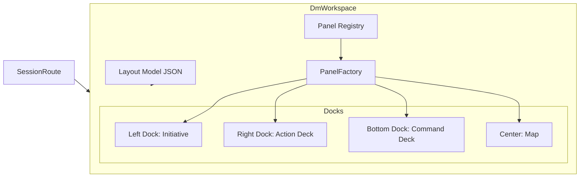
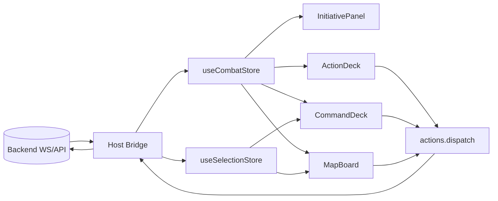

# Frontend Feature Concept: DM Docked Workspace Aligned with Player View

## Goal

Refactor the DM interface into a docked window workspace architecture consistent with the player-view pattern, while preserving backend-authoritative state flow.

## Problem Statement

Current DM layout is composed with fixed/absolute placements and magic sizing, while player view already follows a docked panel model. This mismatch causes:

- Lower extensibility for new DM tools.
- Harder responsiveness and accessibility.
- No persistent layout preferences.
- Inconsistent architecture between DM and player experiences.

## Scope

In scope:

- Introduce docked panel layout container for DM view.
- Move existing DM panels (initiative, map, command deck, action deck) into panel-based composition.
- Add layout persistence per campaign/session.
- Preserve existing stores, event envelopes, and command dispatch flow.

Out of scope:

- Changing core combat business logic in frontend.
- Replacing backend WS protocol.
- Designing all future panels in this phase.

## Current State Findings

Primary files involved:

- `frontend/packages/dm-view/src/pages/DmDashboard.tsx`
- `frontend/packages/dm-view/src/components/MapBoard.tsx`
- `frontend/packages/dm-view/src/components/InitiativePanel.tsx`
- `frontend/packages/dm-view/src/components/CommandDeck.tsx`
- `frontend/packages/dm-view/src/components/ActionDeck.tsx`
- `frontend/apps/player-view/src/PlayerView.tsx`
- `frontend/apps/host/src/routes/SessionRoute.tsx`

Observed mismatch:

- Player view has a model-driven docked shell.
- DM view uses direct positioning and tightly-coupled layout composition.
- This blocks modular panel growth and parity with original architectural plan.

## Proposed Frontend Architecture

### New DM workspace shell

Create `DmWorkspace` as the root DM container with a docked layout model (same conceptual pattern as player view).

Key responsibilities:

- Load default layout model (JSON).
- Restore saved layout for campaign.
- Render panels through a `PanelFactory`.
- Keep panel composition declarative and swappable.

### Panel system

Introduce a panel registry with typed definitions:

- Panel id
- display name
- component
- preferred dock area and default size
- feature flags/visibility

Initial panel set:

- `initiative`
- `map`
- `command-deck`
- `action-deck`

## Docking Model and Panel Layout

Recommended default layout:

- Left dock: Initiative.
- Right dock: Action Deck (+ future tabs).
- Bottom dock: Command Deck.
- Center: Battle Map.

This matches the player-view strategy and keeps map-first focus while making tactical tools docked and resizable.

## State and Data Flow

No ownership shift in state:

- Backend remains source of truth.
- DM actions dispatch through existing bridge/store pipelines.
- WS envelopes still hydrate store and propagate to all panels.

Panel components subscribe to shared stores (combat state, selection state) and render derived views only.

## Responsive and Accessibility Requirements

Responsive behavior:

- Desktop: full 4-region dock layout.
- Tablet: reduced dock widths, right dock collapsible.
- Mobile: map-priority; non-critical docks collapse to tabs/drawer.

Accessibility requirements:

- Keyboard-accessible panel/tab navigation.
- ARIA labeling per panel region.
- Visible focus indicators.
- Contrast-compliant active/selected states.

## Migration Plan

Phase 1: foundation

- Add `DmWorkspace` shell and default layout config.
- Add `PanelFactory` and minimal panel registry.
- Route DM session view to workspace shell.

Phase 2: panel migration

- Migrate `InitiativePanel`, `MapBoard`, `CommandDeck`, `ActionDeck` from fixed/absolute assumptions to dock-aware containers.
- Remove hardcoded dimensions/positions.

Phase 3: persistence and polish

- Save/restore layout per campaign.
- Add reset-to-default action.
- Validate responsive breakpoints and a11y.

Phase 4: extensibility

- Register placeholder future DM panels.
- Document panel extension contract.

## Test Plan

Unit tests:

- panel registry resolution and enablement.
- layout persistence read/write behavior.

Integration tests:

- `DmWorkspace` renders default panel set.
- store updates propagate to the correct panel renders.
- selection flow from initiative to command deck remains intact.

E2E tests:

- panel docking, resizing, collapse/expand.
- DM action dispatch still reaches backend.
- layout persistence across reload.

## Risks and Mitigations

- Dock library integration complexity:
  - mitigate with a week-1 spike and fallback wrapper adapter.
- Regressions in DM controls due to component movement:
  - mitigate with integration snapshots and WS action smoke tests.
- Mobile usability drift:
  - mitigate with explicit breakpoint layouts and early device checks.

## Mermaid Diagrams

### 1) DM Docked Component Architecture

### 2) Data Flow: Backend Truth to Docked Panels

## Implementation Checklist

- [ ] Add `DmWorkspace` shell and route wiring.
- [ ] Add panel registry + panel factory.
- [ ] Move DM panels into docked containers.
- [ ] Remove absolute/fixed positioning from DM page layout.
- [ ] Add layout persistence and reset behavior.
- [ ] Validate responsive and keyboard navigation behavior.
- [ ] Add unit/integration/e2e coverage for panel and action flow.
- [ ] Keep store contracts and backend envelope handling unchanged.

## Expected Outcome

DM gets a modular, docked workspace matching player-view architecture, with cleaner extensibility for future tactical tools and no regression in backend-authoritative gameplay flow.
