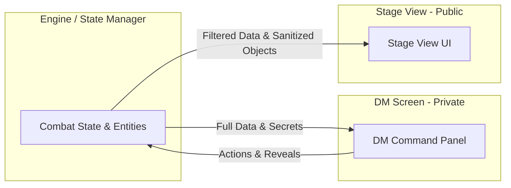

# DM MVP VTT Views & "Stage View" Architecture

## 1. Core Philosophy

To bypass the complexity of multi-client session synchronization and player-facing client development, the MVP relies on a singular host (the DM) running the VTT locally. This host drives two distinct visual interfaces: The DM Command Dashboard, and a public-facing Stage View designed for live Screen Sharing.

## 2. Dual-Screen Strategy

The application is designed to be popped out into two browser windows:

1. **The DM Interface (Primary Window)**: Handled by the DM. Contains all secrets, controls, and stat blocks.
2. **The Stage View (Secondary Window)**: Dragged to a secondary monitor or captured specifically via Discord, Zoom, or OBS stream.

---

## 3. The DM Control Panel (Private)

This is an iteration of the previously detailed `07_dm_view_detailed_plan.md`, heavily adapted for the MVP.

### Layout & Context-Aware Command Deck

- **The Engine Hooks**: When the DM clicks a token, the Command Deck shifts to show that entity's specific D&D action economy.
- **Action Dashboard**:
  - Visual tracking of Action, Bonus Action, Reaction, and Movement dots/bars.
  - Quick-click buttons to execute basic attacks or cast prepared spells, automatically applying results to targeted tokens.
- **DM Secrets**:
  - Complete visibility of exact Monster HP (e.g., 23 / 45).
  - True names of entities (e.g., "Acererak" instead of "Lich").
  - Hidden DM rolls that execute in the background chat log safely away from the Stage View.

---

## 4. The Stage View (Public / Screen-Share)

**Route Path**: `/campaigns/{id}/stage`

### Purpose

The Stage View is the "Player Vision". It receives state updates from the backend but provides zero interactivity. It is purely read-only and highly sanitized to prevent spoilers.

### Core Sanitization Rules

1. **Entities & Names**:
   - Non-player characters only display generic names based on their visual archetype (e.g., "Kobold", "Bandit 1") unless the DM explicitly toggles "Reveal True Name".
2. **Health Concealment**:
   - Exact HP numbers are **never** sent to the Stage View for monsters.
   - Monster health is purely visual using a colored ring indicator:
     - **Green/Blue**: Healthy (100% - 75%)
     - **Yellow**: Wounded (74% - 25%)
     - **Red**: Bloodied/Critical (< 25%)
3. **Rolls & Chat**:
   - The Stage View features a minimal combat log. It only shows public rolls (e.g., "Bandit 1 attacks Arannis: 16 to hit"). Hidden rolls are filtered out at the API level.
4. **Fog of War**:
   - The Fog is completely opaque. Unrevealed rooms are pitch black.
5. **Pan/Zoom Sync**:
   - The Stage View can be set to "Sync with DM" (camera matches DM movements) or left static for the players to view the whole tactical board while the DM zooms around.

### UI Minimalism

The Stage View has no toolbars, no settings menus, and no navigation. It maximizes screen real estate for immersive mapping and a small, clean initiative order tracker docked on the side.
