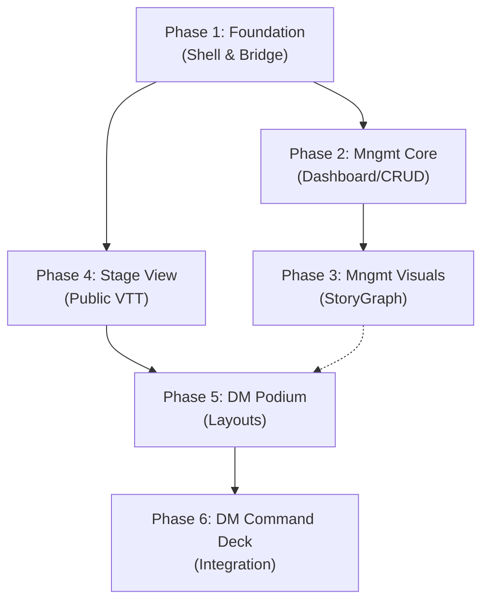

# Frontend Implementation Phase Plan

This document defines the build order, test strategy, and acceptance criteria for the CMV2 Frontend System. It mirrors the backend phased approach, ensuring testable deliverables at each milestone.

**References:**

- Conceptual Architecture: `docs/architecture/frontend/`
- Detailed Specifications: `docs/frontend/reference/`
- Current Snapshot + Next Steps: `docs/architecture/frontend/14_dm_stage_implementation_status_and_next_steps.md`

**Strategy:** Component-Driven Development (CDD). Build UI components in isolation (Storybook or isolated routes) before wiring them to state. Heavily leverage `@civic/design-system` for rapid scaffolding.

---

## Phase 1 — Foundation: Shell, Routing, & Base State

**Goal:** Establish the monorepo workspace for all frontend packages, the `apps/host` shell, and the underlying WebSocket Bridge structure.

**Approach:** Pure scaffolding and structural routing. No heavy VTT rendering yet.

### Build Order

1. **Workspace & Packages**: Initialize `packages/management-view`, `packages/dm-view`, and `packages/bridge`.
2. **`apps/host/src/App.tsx`**: Implement the React Router layout handling `/`, `/campaigns/:id/creator`, `/campaigns/:id/stage`, and `/campaigns/:id/dm`. (Ref: `docs/frontend/reference/01_app_shell_and_routing.md`)
3. **`apps/host/src/components/layout/WorkspaceLayout.tsx`**: Build the persistent top Navbar containing user status and global overlays (Settings, Wiki modal).
4. **`packages/bridge/src/WsClient.ts`**: Implement the raw WebSocket connection logic with exponential backoff and JWT authentication. (Ref: `docs/frontend/reference/07_frontend_bridge.md`)
5. **`packages/bridge/src/store/GameStateStore.ts`**: Scaffold the root `Zustand` store that will eventually hydrate from the server.

### Acceptance Criteria

- [ ] `pnpm dev` successfully starts without errors across all packages.
- [ ] Navigating between `/`, `/campaigns/1/creator`, and `/campaigns/1/dm` successfully loads placeholder components from their respective packages.
- [ ] The `WorkspaceLayout` (navbar) remains persistent across route changes.
- [ ] `WsClient` successfully connects to the local FastAPI backend when provided a valid JWT.

---

## Phase 2 — Management View Core: Dashboard & CRUD

**Goal:** Provide the GM with the tools to manage their campaigns and homebrew content.

**Approach:** Traditional data-fetching (REST) and form-heavy development using the design system.

### Build Order

1. **`packages/management-view/src/components/dashboard/CampaignGrid.tsx`**: List view of campaigns fetching from `GET /api/campaigns`.
2. **`packages/management-view/src/components/content/ContentManager.tsx`**: Tabbed interface for Bestiary, Items, and Spells. (Ref: `docs/frontend/reference/02_management_dashboard.md`)
3. **`packages/management-view/src/components/content/DataTable.tsx`**: Reusable grid component for sorting/filtering content.
4. **`packages/management-view/src/components/content/forms/MonsterForm.tsx`**: Integration of `react-hook-form` and `zod` to edit a `MonsterDefinition`.

### Acceptance Criteria

- [ ] GM can view a list of mock campaigns.
- [ ] The Content Manager renders a table of 100+ Monster Definitions with working pagination.
- [ ] The Monster Form modal successfully mounts and validates required fields before attempting a simulated save.

---

## Phase 3 — Management View: StoryGraph Editor

**Goal:** Transform linear campaign notes into a visual, interactive Node Editor.

**Approach:** Canvas development. Integrate `reactflow` and build custom node styling.

### Build Order

1. **`StoryGraph.tsx`**: Initialize the `ReactFlowInstance` occupying 100% of the container. (Ref: `docs/frontend/reference/03_management_storygraph.md`)
2. **Custom Nodes**: Build `SceneNode.tsx`, `EncounterNode.tsx`, and `NoteNode.tsx` with specific `@civic` styling.
3. **`InspectorPanel.tsx`**: The slide-over right panel that populates data based on the currently selected `reactflow` node.
4. **`EncounterBuilder.tsx`**: The complex interface inside the Inspector (when an Encounter Node is clicked) to assign monsters and calculate XP/Difficulty.

### Acceptance Criteria

- [ ] User can drag-and-drop new nodes onto the infinite canvas and connect them with edges.
- [ ] Clicking a node opens the Inspector Panel specific to that node type.
- [ ] The Encounter Builder correctly sums XP values and assigns a difficulty badge (Easy/Medium/Hard/Deadly) based on a mock party level.

---

## Phase 4 — Stage View: The Public VTT

**Goal:** Create a highly sanitized, screen-sharable VTT view with Fog of War.

**Approach:** WebSocket integration and Canvas rendering limit-testing.

### Build Order

1. **`packages/dm-view/src/stage/StageLayout.tsx`**: The chromeless, minimalist wrapper. (Ref: `docs/frontend/reference/04_stage_view.md`)
2. **`StageCartographer.tsx`**: Implement the map canvas layer. Render background image and token indicators.
3. **State Filter Hooks**: Create selectors bridging the `GameStateStore` to the Stage View that strip out exact HP values, replacing them with Green/Yellow/Red status strings.
4. **`PublicCombatLog.tsx`**: Render incoming chat events, filtering out `Visibility.DM_ONLY` events.

### Acceptance Criteria

- [ ] Stage View renders a map background without any floating toolbars.
- [ ] When the backend broadcasts a monster taking damage, the Stage View updates the health ring color (e.g., Green to Red) without showing numbers.
- [ ] Hidden DM rolls are entirely absent from the `PublicCombatLog` component.

---

## Phase 5 — DM View Podium: Layout & Toolboxes

**Goal:** Build the complex multi-panel scaffolding for the DM's command center.

**Approach:** Drag-and-drop mechanics and dense UI layout management.

### Build Order

1. **`packages/dm-view/src/podium/PodiumLayout.tsx`**: Implement the 3-column docking layout (using flexbox or a layout engine) overlaying the `DMCartographer`. (Ref: `docs/frontend/reference/05_dm_podium_layout.md`)
2. **`LeftToolbox.tsx` (Bestiary/Players)**: Implement the side panel showing searchable monsters. Add Drag-and-Drop capability to monsters in the list.
3. **`DMCartographer.tsx`**: Allow the map canvas to act as a Drop Target. Emits `bridge.actions.spawnToken()` when a monster is explicitly dropped onto a grid coordinate.
4. **`RightCombat.tsx` (Initiative Tracker)**: Build the vertical list of turn order, including condition badges and concentration markers. Add the "Next Turn" button.

### Acceptance Criteria

- [ ] The layout correctly persists a 20% left panel, 60% transparent center, and 20% right panel configuration.
- [ ] The DM can drag a Goblin from the Bestiary and drop it onto the map canvas, firing a console log of the exact coordinates and monster ID.
- [ ] The Initiative Tracker accurately renders the turn order based on mock `GameStateStore` data.

---

## Phase 6 — DM View: Command Deck & Integration

**Goal:** Consolidate DM controls into a context-aware action bar, finalizing the VTT interaction loop.

**Approach:** Complex local state (`useSelectionStore`) driving dynamic component mounting.

### Build Order

1. **`packages/dm-view/src/store/useSelectionStore.ts`**: Create the hook tracking exactly one `activeEntityId`. (Ref: `docs/frontend/reference/06_dm_command_deck.md`)
2. **`CommandDeckContainer.tsx`**: The sticky bottom bar.
3. **Context Decks**: Build `GlobalDeck.tsx` (Audio/Fog), and `MonsterDeck.tsx` (HP inputs, specific Attacks).
4. **Bridge Hookup**: Wire the "Bite" attack button on the `MonsterDeck` to `bridge.actions.attack()`.
5. **Full System Integration**: Test the complete flow from Frontend click → Backend Pipeline → WebSocket Broadcast → Frontend `GameStateStore` hydration → UI Re-render.

### Acceptance Criteria

- [ ] Clicking a Monster token on the map changes the Command Deck from `GlobalDeck` to `MonsterDeck`.
- [ ] Modifying HP via the `MonsterDeck` quickly input triggers an API call, and the map updates via the WebSocket return trip.
- [ ] Executing an Attack via the Command Deck displays the correct resolution (Hit/Miss/Damage) in both the DM's Master Log and the Stage View's Public Log (if a public attack).

---

## Phase Dependencies

> **Critical Path:** Phase 1 → Phase 4 → Phase 5 → Phase 6. The Management views (2 & 3) can be built in parallel or slightly offset from the VTT views once Phase 1 is complete.
