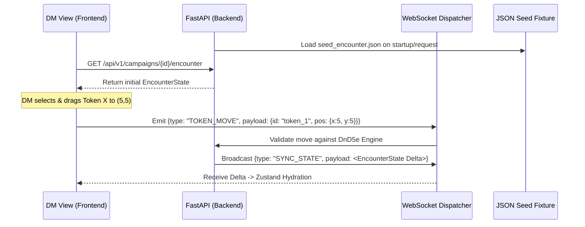

# Concept: DM View & Full Campaign Seed Strategy

## 1. Executive Summary & Motivation
The CMV2 VTT requires robust testing of real-time state synchronization (moving tokens, changing maps, updating initiative) across multiple clients. Building the player-facing Stage View first creates a dependency deadlock: the Stage View is read-only and needs a state driver to be tested. Building an AI or algorithmic dummy player to drive this state is an overly complex detour.

**The Solution:** We will bypass the deadlock by seeding the game engine with a static, pre-configured JSON encounter. We will then build the **DM View** as our primary, authoritative visual testing harness. Once the DM View can manipulate the seeded state (e.g., drag and drop a token) and the backend broadcasts those changes, validating the read-only Stage View becomes trivial.

---

## 2. Architecture & Data Flow Overview

The architecture relies on the authoritative server model. The frontend (DM View) holds a replica of the backend's `EncounterState`.



---

## 3. Core Data Structures (The Seed Schema)

To build the `mock_encounter.json` seed, the data must strictly adhere to the DnD5e backend Pydantic schemas defined in `src/systems/dnd5e/schemas/encounter.py`.

### 3.1 EncounterState Concept
The root object that the DM view will hydrate into its Zustand store.

```typescript
// Frontend representation of backend EncounterState
interface Position { x: number; y: number; }

interface MapToken {
  actor_id: string; // References an ActorInstance
  position: Position;
  size: "TINY" | "SMALL" | "MEDIUM" | "LARGE" | "HUGE" | "GARGANTUAN";
}

interface MapState {
  width: number;      // e.g., 40 squares
  height: number;     // e.g., 40 squares
  grid_type: string;  // e.g., "square"
  difficult_terrain: Position[];
  tokens: MapToken[];
}

interface EncounterState {
  id: string;
  campaign_id: string;
  round_number: number;
  turn_phase: "pre_combat" | "active" | "post_combat";
  active_index: number;
  combatants: ActorInstance[]; // Contains stats, hp, conditions
  map: MapState;
}
```

### 3.2 The JSON Seed File (`seed_encounter.json`)
We will create a specific fixture file containing exactly one valid `EncounterState` JSON object. This allows us to instantly load a 40x40 grid, 2 player actors, and 2 monsters without needing to go through the complex campaign creation wizards.

---

## 4. Phased Implementation Plan

### Phase 1: Engine Seeding (Backend)
1. **Fixture Creation:** Create `backend/data/fixtures/seed_encounter.json` containing the payload conforming to `EncounterState`.
2. **Dev Endpoint:** Create an endpoint `POST /api/dev/load-seed` that reads the JSON file and forces the `core.sessions.manager` to inject this state into the active memory for a specific dummy campaign ID (e.g., `seed-campaign-001`).

### Phase 2: DM View Foundation (Frontend)
The DM View must fetch and render the base state.

1. **State Management:** Implement `useEncounterStore` (Zustand) in `@cmv2/shared` that holds the `EncounterState`.
2. **Canvas/Stage Engine:** 
   - Read `map.width` and `map.height` from the store to draw the base grid layer.
   - Use `Z-Index` layers: Background Map -> Grid Overlay -> Token Layer -> UI/Ruler Layer.
3. **Token Rendering:** Map over `map.tokens` and render the sprites at the precise `(x, y)` grid coordinates multiplied by the global cell size (e.g., 50px). 

### Phase 3: Interactive State Manipulation (The DM Tools)
The specific interaction logic for our primary test case: moving a token.

1. **Interaction Layer:** Implement drag-and-drop on the rendered Token components using `@dnd-kit/core` or raw pointer events.
2. **Local Optimistic Update:** When dropped, snap the token to the nearest grid coordinates locally to prevent visual lag.
3. **Dispatch:** Send a WebSocket event to the backend:
    ```json
    {
      "type": "TOKEN_MOVE",
      "payload": {
        "encounter_id": "seed-campaign-001",
        "actor_id": "pc_01",
        "new_position": {"x": 12, "y": 14}
      }
    }
    ```
4. **Backend Validation:** `ws_handler.py` routes the event to the 5e engine. The engine verifies the move, updates the canonical `MapState`, and broadcasts a `STATE_UPDATED` event to all clients in the room.
5. **Reconciliation:** The DM View receives `STATE_UPDATED` and deeply merges the new `EncounterState` into the Zustand store, confirming the optimistic update.

### Phase 4: The Validation Harness (Dual-View Sync)
To prove the architecture works:
1. Initialize the Stage View player application.
2. Have it connect to the WebSocket dispatcher for `seed-campaign-001`.
3. The Stage View purely listens to the `Zustand` store and renders exactly what the DM View renders, but with interaction disabled.
4. **The Test:** The developer physically drags a token in the DM View browser window, and watches the Stage View browser window smoothly update the token's position via the WebSocket broadcast, entirely bypassing HTTP polling or visual AI bots.

---

## 5. Next Steps for Execution
1. Approve this concept document.
2. We begin executing **Phase 1: Engine Seeding**, specifically wiring up the `seed_encounter.json` into the FastAPI backend.
