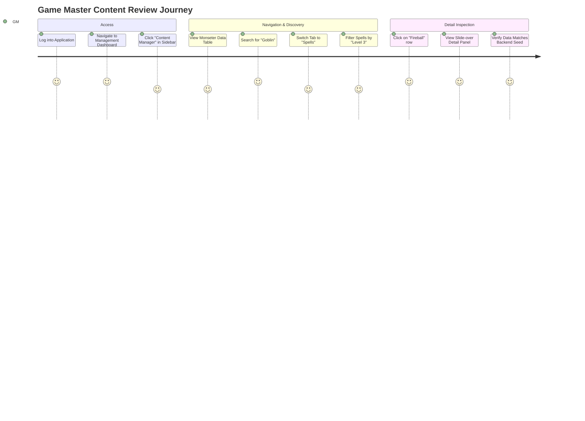
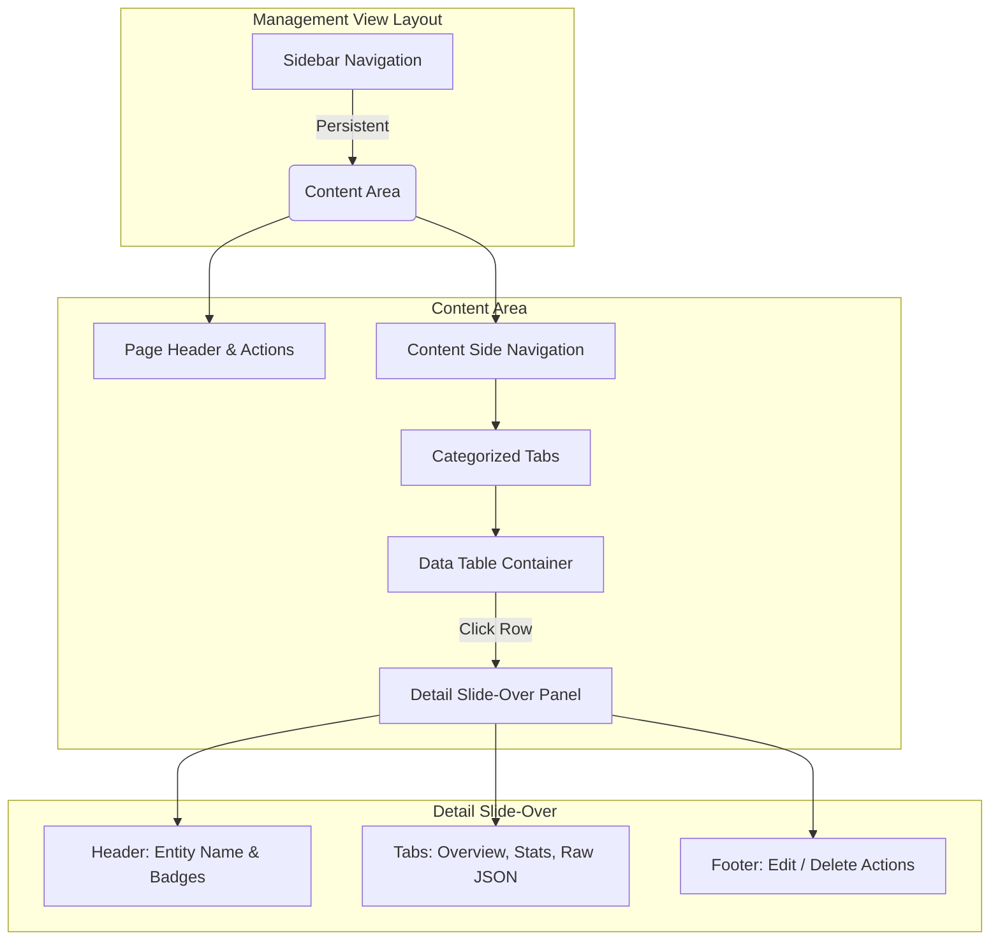
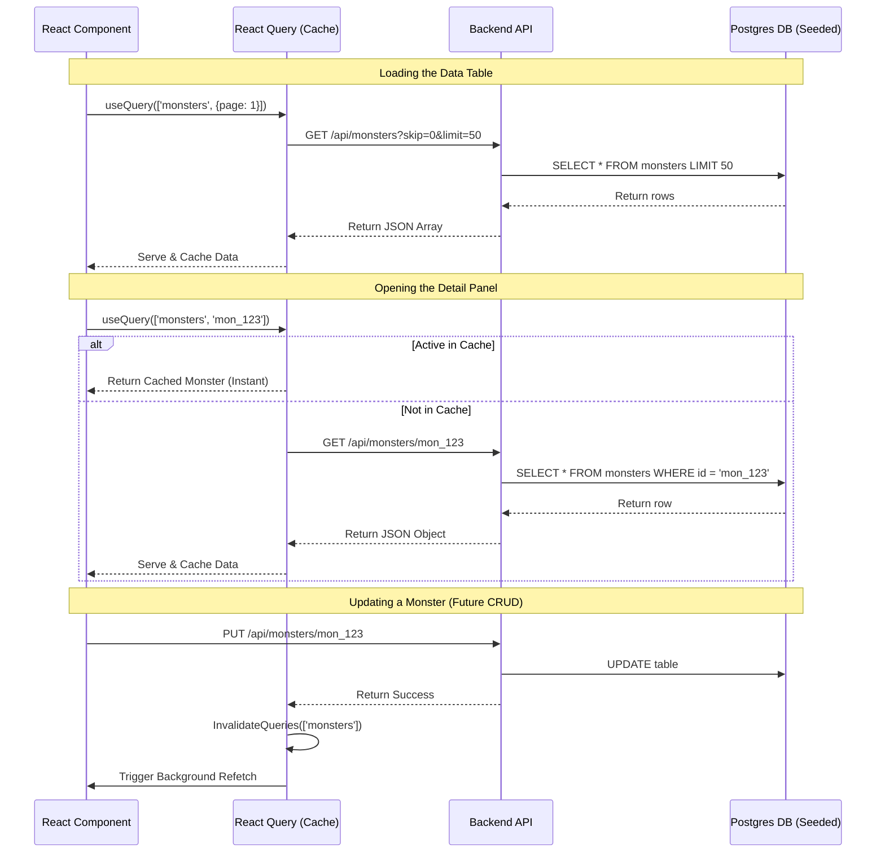

# Concept: Content Manager & Data Visualization Pipeline

## 1. Executive Summary & Goals

Following the successful implementation of the dynamic JSON data seeding pipeline in the backend, the next major objective is to build the frontend interfaces to actually visualize, manage, and interact with this data. The **Content Manager** (part of the `packages/management-view`) will serve as the Game Master's primary hub for viewing the database state, reviewing homebrew materials, and preparing for campaigns.

**Core Goals:**
1. **Comprehensive Entity Coverage**: Visualize and manage every backend model, from campaigns to individual encounter states.
2. **Mock Data Validation**: Serve as the first true frontend test harness for the data we just seeded.
3. **Scalable Data Presentation**: Establish robust, reusable data tables capable of sorting, filtering, and paginating hundreds of entries.
4. **CRUD Foundation**: Lay the groundwork for Create, Read, Update, and Delete operations for the entire ecosystem.

---

## 2. Information Architecture & Routing

The Content Manager will exist under a protected route within the main application shell, likely accessed via a persistent sidebar or top navigation bar when a GM is in the management context.

### 2.1 Route Structure
```typescript
// Proposed react-router-dom route tree in apps/host
<Route path="/management" element={<ManagementLayout />}>
  <Route index element={<DashboardPage />} /> // Overview of Campaigns
  <Route path="content" element={<ContentManagerLayout />}>
    <Route index element={<Navigate to="campaigns" replace />} />
    <Route path="campaigns" element={<CampaignsDataPage />} />
    <Route path="characters" element={<CharactersDataPage />} />
    <Route path="monsters" element={<MonstersDataPage />} />
    <Route path="spells" element={<SpellsDataPage />} />
    <Route path="items" element={<ItemsDataPage />} />
    <Route path="definitions" element={<DefinitionsLayout />}>
       <Route path="species" element={<SpeciesDataPage />} />
       <Route path="classes" element={<ClassesDataPage />} />
       <Route path="feats" element={<FeatsDataPage />} />
       <Route path="backgrounds" element={<BackgroundsDataPage />} />
    </Route>
    <Route path="encounters" element={<EncountersDataPage />} />
  </Route>
</Route>
```

### 2.2 User Journey Flowchart



---

## 3. Component Architecture & UI Layout

The Content Manager is designed to handle high information density gracefully. We will utilize a "Master-Detail" interaction pattern to keep the user in context without constant page navigations.

### 3.1 The Master-Detail Pattern
Instead of navigating to a new `/spells/fireball` page when clicking a spell, the table (Master) remains active while a slide-over panel (Detail) animates in from the right side of the screen.



### 3.2 Key Components & Prop Interfaces

1. **`ContentManagerLayout`**: The wrapper that renders the page title ("Content Manager"), the global search bar, and the horizontal `Tabs` component to switch between entity types (Monsters, Spells, Items, etc.).
   
2. **`GenericDataTable<T>`**: A highly generic, highly typed table component wrapping `@tanstack/react-table`. 
   ```typescript
   interface GenericDataTableProps<T> {
     data: T[];
     columns: ColumnDef<T>[];
     fetchNextPage: () => void; // for infinite scroll or pagination
     isLoading: boolean;
     onRowClick: (item: T) => void;
     emptyStateMessage?: ReactNode;
   }
   ```
   - Supports sortable column headers.
   - Supports global fuzzy filtering.
   - Supports pagination.
   - Distinct row rendering based on the type (e.g., Spells show level/school columns, Monsters show CR/Type columns).

3. **`EntityDetailPanel`**: A slide-over component (`Dialog` or `Sheet` from the design system) that receives the selected entity ID, fetches its full details, and renders them.
   ```typescript
   interface EntityDetailPanelProps {
     entityId: string | null;
     entityType: 'monster' | 'spell' | 'item' | 'definition';
     isOpen: boolean;
     onClose: () => void;
   }
   ```

4. **`RawJsonViewer`**: A specific sub-component within the Detail Panel that renders the raw JSON payload from the backend with syntax highlighting. Essential for our immediate goal of verifying the mock data pipeline!
   ```typescript
   interface RawJsonViewerProps {
     data: Record<string, any>;
     isExpanded?: boolean;
   }
   ```

---

### 3.3 Encounter Visualization (Dev Mode)
Unlike static reference data, Encounters represent live, in-memory system states. The Content Manager will include a "Live States" view specifically to:
1. **Visualize In-Memory Encounters**: Display encounters loaded via the `@api/dev/load-seeds` endpoint.
2. **State Synchronization Check**: Compare the local frontend `GameStateStore` with the raw JSON provided by the dev router to ensure WebSocket synchronization is accurate.
3. **Turn Order Preview**: Render the initiative list as a simple table before it reaches the full VTT DM View.

---

## 4. Data Fetching Strategy (React Query)

To ensure snappy performance and robust caching, we will use **TanStack React Query**.

### 4.1 API Client Generation
Given our FastAPI backend, we should use a generated typed client (e.g., via `openapi-ts` or Orval) to ensure the frontend TypeScript interfaces perfectly match the backend Pydantic schemas (like `SpellResponse`, `MonsterResponse`).

### 4.2 Query Architecture & Cache Invalidation



### 4.3 Custom Hooks Blueprint
We will abstract the queries into custom hooks to keep components clean.

```typescript
// packages/management-view/src/hooks/useMonsters.ts
import { useQuery } from '@tanstack/react-query';
import { apiClient } from '@cmv2/bridge';

export const useMonstersList = (params: PaginationParams) => {
  return useQuery({
    queryKey: ['monsters', 'list', params],
    queryFn: () => apiClient.monsters.list(params),
    keepPreviousData: true, // Smooth pagination without flashing loading spinners
    staleTime: 1000 * 60 * 5, // Cache for 5 minutes
  });
};

export const useMonsterDetail = (id: string | null) => {
  return useQuery({
    queryKey: ['monsters', 'detail', id],
    queryFn: () => apiClient.monsters.get(id!),
    enabled: !!id, // Only fetch if an ID is selected
    staleTime: 1000 * 60 * 5,
  });
};
```

---

## 5. Mock Data Verification Workflow

Because our primary short-term goal is visualizing the backend's JSON seeding, the Content Manager will feature specific developer/GM tools integrated into the UI.

1. **Seed Status Indicator**: A small badge in the `ContentManagerLayout` header that pings `/api/health` or a dedicated endpoint to verify if the mock data was successfully loaded (`LOAD_MOCK_DATA=true`).
2. **Raw JSON Payload Verification**: Every Detail Panel will have a "Raw JSON" tab. This tab will utilize the `RawJsonViewer` component to dump the exact response from the API. The GM or Developer can visually compare this tree to the raw fixture files (e.g., `backend/data/fixtures/monsters/goblin.json`) to confirm nothing was stripped or incorrectly parsed by the FastAPI serialization layer.

---

## 6. Aesthetic & UX Considerations (The "WOW" Factor)

As mandated by the core design principles, the Content Manager cannot be a generic, boring admin panel. It must feel premium, state-of-the-art, and highly dynamic.

### 6.1 Animations & Transitions
1. **Micro-Animations**: 
   - Row hovers in the data table should subtly elevate the row and transition a background color using smooth bezier curves (`transition-all duration-300 ease-in-out`).
   - The slide-over Detail Panel must slide in (`translateX: 0` from `translateX: 100%`) while a slight backdrop blur (`backdrop-blur-sm`) is applied to the main table behind it, focusing the user's attention.
2. **Layout Shifts**: 
   - Avoid jarring layout jumps when loading data. Use skeleton loaders (shimmer effects) within the `GenericDataTable` instead of blocking spinners.

### 6.2 Typography & Badging
1. **Fonts**: Utilize the project's selected Google Fonts (e.g., Inter for UI, maybe a serif for fantasy flavor in headers) consistently via the design system tokens.
2. **Pill-Shaped Badges**: 
   - Use pill-shaped badges for entity types (e.g., a fiery orange badge filled with `bg-orange-500/20 text-orange-400` for "Evocation", a dark purple badge for "Necromancy").
   - Challenge Ratings (CR) for monsters should be color-coded (Green for CR 0-4, Yellow for 5-10, Red for deadly).
3. **Card-Based UI**: Even within lists, wrap interactive sections in subtly bordered, slightly rounded cards with glassmorphism effects where appropriate (e.g., the detail panel's inner sections).

### 6.3 Empty States
If the `LOAD_MOCK_DATA` was false and the database is empty, the table should not just show "No data." It should render a beautifully illustrated or icon-driven empty state prompting the GM to "Create your first Monster" or "Run the Seed Script," accompanied by a subtle breathing animation on the primary Call-To-Action button.

---

## 8. Entity Dictionary & Mapping

To ensure "all content" is manageable, we map every backend model to a frontend view:

| Category | Entity | Backend Endpoint | Key Detail Views |
| :--- | :--- | :--- | :--- |
| **Core** | Campaigns | `/api/campaigns` | World Notes, Playable Characters |
| **Core** | Characters | `/api/characters` | Stats, Inventory, Spells |
| **Reference** | Monsters | `/api/monsters` | Statblock, Actions, Loot |
| **Reference** | Spells | `/api/spells` | Description, Scaling, Effects |
| **Reference** | Items | `/api/items` | Properties, Effects, Rarity |
| **Lore** | Species | `/api/definitions/species` | Traits, Speed, Language |
| **Lore** | Classes | `/api/definitions/classes` | Hit Die, Proficiencies, Progression |
| **Lore** | Feats | `/api/definitions/feats` | Prerequisites, Effects |
| **Lore** | Backgrounds | `/api/definitions/backgrounds`| Skills, Equipment, Features |
| **Live** | Encounters | `/api/dev/load-seeds`* | Initiative, Map Pos, Active Effects |

> [!NOTE]
> Encounters are currently managed via the Dev API but will transition to a production `/api/encounters` for persistent state management.

---

## 9. Implementation Checklist & Phase Integration

This concept seamlessly integrates into **Phase 2 — Management View Core: Dashboard & CRUD** of our existing `11_implementation_phase_plan.md`.

### Immediate Next Steps (If conceptually approved)
1. Initialize the routing structure in `apps/host` pointing to the `management-view` package.
2. Build the `GenericDataTable` wrapper utilizing `@civic/design-system` tokens and set up the column definitions for Monsters.
3. Implement the React Query hooks targeting our existing FastAPI backend endpoints (which are now properly seeded).
4. Build the Monsters tab and verify the "Goblin" mock data is fetched and rendered correctly.
5. Implement the Slide-over detail panel with the `RawJsonViewer` to allow immediate visual parity checks with the `fixtures/monsters/goblin.json` file.
6. Verify global aesthetics (glassmorphism, typography, micro-hover animations) meet the premium standard.
