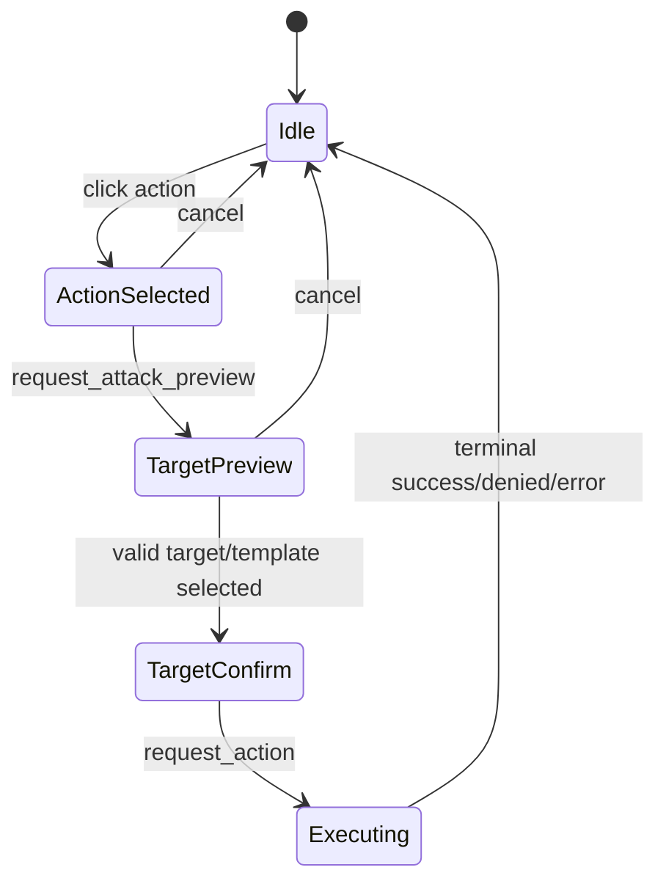

# Action Visualization Contract and Multi-Mode Input Note

Date: 2026-03-17
Status: Proposed (Short Note)

Primary references:

- [docs/architecture/backend/17_ws_event_command_deck_next_stages.md](docs/architecture/backend/17_ws_event_command_deck_next_stages.md)
- [frontend/packages/types/src/combat/ws-events.ts](frontend/packages/types/src/combat/ws-events.ts)
- [frontend/packages/shared/src/stores/useCombatStore.ts](frontend/packages/shared/src/stores/useCombatStore.ts)

## 1. Purpose

Define a minimal contract-first frontend direction for rendering character/monster actions from backend snapshots.

This note intentionally does not design the full interaction system. That deeper interaction design is a later step.

## 2. Required Backend Inputs

Minimum payload dependencies:

- executable_actions_snapshot
- action_denied and command_denied reason payloads
- attack_preview for single-target and template actions

Rendering rule:

- frontend displays backend-provided availability and reasons only,
- frontend does not compute legality.

## 3. UI Mapping (Minimal)

Map snapshot fields to UI:

- label -> action button text
- family -> icon/category grouping
- action_type_cost -> badge/chip
- is_available -> enabled/disabled state
- unavailable_reason -> tooltip/subtext
- targeting_mode + range -> targeting hint text

## 4. Compact Multi-Mode State Sketch

Mode notes:

- single-target actions enter TargetPreview with target highlights,
- template actions enter TargetPreview with origin/template overlays,
- denied outcomes return to Idle with visible reason.

## 5. Deferred to Later Document

The following will be designed later in a dedicated interaction document:

- full pointer/drag/multi-select UX,
- keyboard/controller accessibility model,
- advanced DM power-user workflows,
- visual polish and animation language.

## 6. Acceptance for This Step

1. Frontend can render backend-provided executable actions without local rules.
2. Frontend can show deterministic unavailable and denied reasons.
3. Minimal state transitions for select -> preview -> execute are documented.
4. Full interaction complexity is explicitly deferred, not silently implied.
