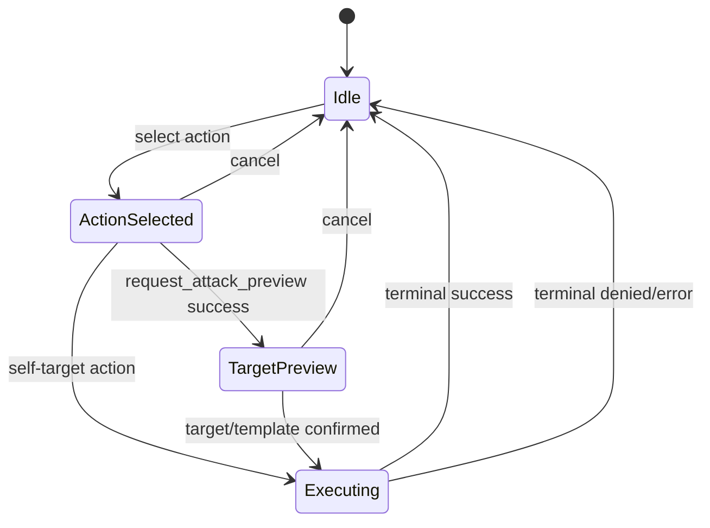

# DM Proxy Dock Panel Concept (Single-PR)

Date: 2026-03-17
Status: Proposed

Primary references:

- [docs/architecture/frontend/16_action_visualization_contract_and_multimode_note.md](docs/architecture/frontend/16_action_visualization_contract_and_multimode_note.md)
- [docs/architecture/backend/21_effect_action_data_driven_pr_roadmap.md](docs/architecture/backend/21_effect_action_data_driven_pr_roadmap.md)
- [frontend/packages/player-view/src/pages/PlayerView.tsx](frontend/packages/player-view/src/pages/PlayerView.tsx)
- [frontend/packages/dm-view/src/workspace/DmWorkspace.tsx](frontend/packages/dm-view/src/workspace/DmWorkspace.tsx)
- [frontend/packages/dm-view/src/components/CommandDeck.tsx](frontend/packages/dm-view/src/components/CommandDeck.tsx)
- [frontend/packages/shared/src/stores/useCombatStore.ts](frontend/packages/shared/src/stores/useCombatStore.ts)
- [frontend/packages/shared/src/selectors/combatSelectors.ts](frontend/packages/shared/src/selectors/combatSelectors.ts)

## 1. Intent

Add a DM docked panel that can proxy action execution for both player-owned actors and monsters/NPCs while preserving backend-authoritative rules.

This is a single PR focused on frontend orchestration and rendering, not a backend rules rewrite.

## 2. Problem Statement

Current DM controls are split between:

- a legacy `Command Deck` with ad-hoc controls,
- an `Action Command Lab` oriented at testing/preset dispatch.

Gaps:

- DM cannot efficiently run the same contract-driven action flow as the player surface.
- There is no dedicated operational UI for "select actor -> preview -> execute" inside the DM workspace.
- Player/monster proxy behavior is possible through `acting_as_user_id`, but the UX path is indirect.

## 3. Architecture Constraints (Non-Negotiable)

- Backend is truth: frontend does not compute legality.
- Action availability and reasons are rendered from backend snapshot payloads.
- Preview and execute use backend-derived targeting semantics.
- Deterministic denied and terminal outcomes are shown from backend reason codes/messages.
- Existing advanced DM testing tools remain available; this panel does not remove them.

## 4. Scope (Single PR)

In scope:

1. New DM proxy action dock panel in the DM workspace (bottom dock target).
2. Reusable contract action-surface component extracted to shared package.
3. Actor-context handling for selected combatant (map/initiative-selected actor).
4. Proxy identity policy wiring for DM vs player impersonation.
5. Deterministic unavailable and denied reason rendering.
6. Minimal select -> preview -> execute state transitions.
7. Feature flag guard for staged rollout (recommended).

Out of scope:

- Full command deck redesign beyond proxy execution needs.
- Backend schema changes.
- Seed user authoring and account management UX.
- Accessibility deep pass and controller/keybinding workflow.

## 5. Proposed UX

### 5.1 Dock Placement

- Primary target: DM workspace bottom dock tab.
- The panel can replace current `Command Deck` behavior or exist as an adjacent tab during transition.

### 5.2 Core Flow

1. DM selects a combatant on map/initiative.
2. Panel requests executable actions for selected actor.
3. Panel renders snapshot actions with backend availability and reason text.
4. DM chooses action.
5. If action needs target/template, panel enters preview mode and requests backend preview.
6. DM confirms target/template origin.
7. Panel dispatches request action.
8. Terminal success/denied/error updates panel status and resets mode to idle.

### 5.3 Proxy Identity Behavior

Default strategy:

- For player-owned actor: send commands with `acting_as_user_id = owner_user_id`.
- For unowned/monster actor: send as DM (no `acting_as_user_id`).

Operational controls:

- Respect global "Play as" selection already present in DM workspace.
- Add a clear display badge showing effective dispatch identity:
  - `DM`
  - `player:<user_id>`

## 6. Contract Dependencies

Required existing payloads (already in ws-combat-v2 path):

- `executable_actions_snapshot`
- `attack_preview`
- `action_denied`
- `command_denied`
- terminal outcomes correlated by `request_id`

No new backend payload required for baseline.

## 7. State Model (Minimal)

Recommended UI mode state:

- `idle`
- `action_selected`
- `target_preview`
- `executing`

State transitions:

## 8. Component Strategy

Do not duplicate the full player page.

Preferred approach:

1. Extract a reusable contract action surface from player implementation into shared package.
2. Use this shared surface in:
   - player page,
   - new DM proxy dock panel.

Rationale:

- single behavior source for snapshot mapping and mode transitions,
- reduced drift risk between player and DM behavior,
- easier future command deck rework.

## 9. File-Level Implementation Plan

## Phase A: Shared Extraction

- Add shared component(s) under `frontend/packages/shared/src/components/combat/`:
  - `ContractActionSurface.tsx` (name can vary)
  - optional local view model helpers.
- Move contract-driven action rendering and minimal mode transitions into shared component.
- Keep selectors/store usage in shared package.

## Phase B: DM Integration

- Add new DM panel component (for example `DmProxyActionDock.tsx`) under `frontend/packages/dm-view/src/components/`.
- Wire it to selected combatant context from workspace panel registry.
- Replace or augment `command-deck` entry in panel registry and default layout.

## Phase C: Player Integration

- Update player page to use shared contract action surface.
- Keep player-specific wrappers (owned actor selection and map presentation) in player package.

## Phase D: Guard and Rollout

- Add a feature flag in host config for DM proxy dock enablement.
- Keep legacy DM command controls available behind fallback for one iteration.

## 10. Single-PR Acceptance Criteria

1. DM can execute available actions for selected player-owned actor via proxy identity.
2. DM can execute available actions for selected monster/unowned actor as DM.
3. Unavailable actions display backend `unavailable_reason` directly.
4. Denied outcomes display backend reason code/message deterministically.
5. Preview and execute paths are backend-driven for single-target and template actions.
6. No local legality computation is added in DM panel.
7. Legacy controls are either removed intentionally or safely feature-gated.

## 11. Test Matrix (Minimum)

Functional scenarios:

1. Player-owned actor selected, action available -> execute success.
2. Player-owned actor selected, invalid target -> deterministic denied reason visible.
3. Monster actor selected, available action -> execute success without impersonation.
4. AoE action -> preview cell selection -> execute with backend projection.
5. Turn changes -> snapshot refresh behavior remains correct.

Observability checks:

- request/terminal flow preserves `request_id` correlation in command log.
- DM panel mode returns to idle after terminal event.

## 12. Risks and Mitigations

Risk: Player/DM behavior drift.
Mitigation: Shared component extraction first.

Risk: Proxy identity confusion.
Mitigation: Always render explicit effective identity badge and actor ownership indicator.

Risk: Regressions from command deck replacement.
Mitigation: Feature-flag rollout and temporary fallback tab.

Risk: Coupling to unstable contracts during bigger backend sync work.
Mitigation: Keep this PR constrained to current ws-combat-v2 payloads.

## 13. Rollback Strategy

- Disable DM proxy dock feature flag.
- Restore legacy command deck as default bottom panel.
- Keep shared extraction code isolated so rollback can be UX-only if needed.

## 14. Merge Checklist (One PR)

1. Shared component used by both player and DM surfaces.
2. DM dock panel wired in registry/layout.
3. Feature flag behavior verified.
4. TypeScript builds green for affected frontend packages.
5. Docker frontend logs show no runtime errors for new panel path.
6. Manual smoke matrix above completed.

## 15. Exit Condition

This concept is complete when DM has a docked, contract-driven proxy action panel that supports selected actor action execution with deterministic backend reason feedback and no local gameplay rule logic.
