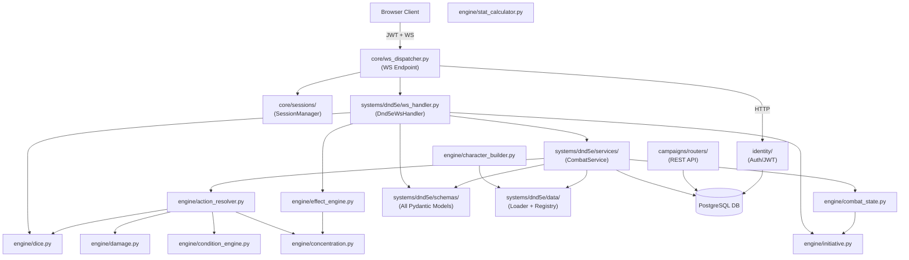
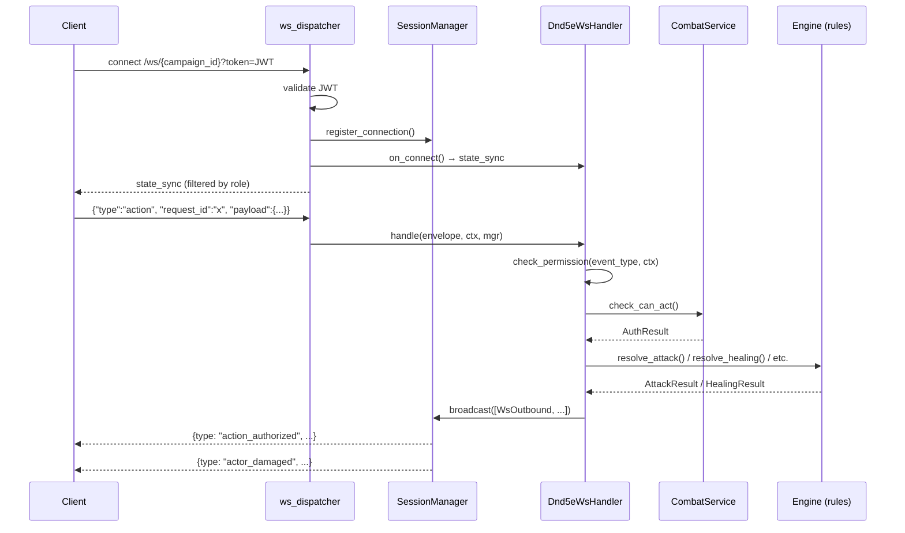

# Backend Architecture — Overview

> **As-Is Documentation** — Reflects the actual codebase state as of March 2026.

## System Summary

The CMV2 backend is a Python/FastAPI application serving a D&D 5e Virtual Tabletop engine over WebSockets with a supporting REST API. All game logic is strictly typed via `Pydantic` v2 models. The system is divided into two conceptual layers:

| Layer | Purpose |
|---|---|
| **Core Transport** | System-agnostic WebSocket connection management, JWT auth, session management, outbound broadcasting |
| **D&D 5e Engine** | All game rules, schemas, state machines, resolvers, and compendium data — specific to the `dnd5e` game system |

---

## High-Level Module Map

---

## Module Index

| # | File | Area | Purpose |
|---|---|---|---|
| [01](./01_core_transport.md) | `core/ws_protocol.py`, `core/ws_dispatcher.py`, `core/sessions/` | Core Transport | WS connection handling, JWT auth, session registry, broadcast |
| [02](./02_schemas.md) | `systems/dnd5e/schemas/` | D&D 5e Schemas | All Pydantic models: enums, definitions, instances, encounter |
| [03](./03_data_compendium.md) | `systems/dnd5e/data/` | Data/Compendium | Loader (JSON → pydantic), Registry (in-memory lookup) |
| [04](./04_stateless_rules_engine.md) | `engine/dice.py`, `stat_calculator.py`, `damage.py`, `condition_engine.py` | Rules Engine | Pure-function math: dice, stat derivation, damage pipeline, conditions |
| [05](./05_combat_state_machine.md) | `engine/initiative.py`, `combat_state.py`, `effect_engine.py`, `concentration.py` | Combat State | Initiative, turn budget, effect ticking, concentration management |
| [06](./06_action_resolver.md) | `engine/action_resolver.py` | Action Resolver | Orchestrates attacks, saves, and healing pipelines end-to-end |
| [07](./07_character_builder.md) | `engine/character_builder.py` | Character Builder | Blueprint → combat-ready ActorInstance |
| [08](./08_websocket_handler.md) | `systems/dnd5e/ws_handler.py`, `permissions.py`, `state_filter.py`, `event_types.py` | WS Handler | D&D event dispatch, Fog of War filtering, permission enforcement |
| [09](./09_campaign_api.md) | `campaigns/routers/`, `systems/dnd5e/services/`, `encounter_router.py` | Campaign REST API | Campaign/character CRUD, session persistence, encounter management |
| [10](./10_identity_and_auth.md) | `identity/`, `config.py`, `database.py` | Identity & Auth | JWT auth, user model, DB sessions |

---

## Data Flow: WebSocket Request Lifecycle

