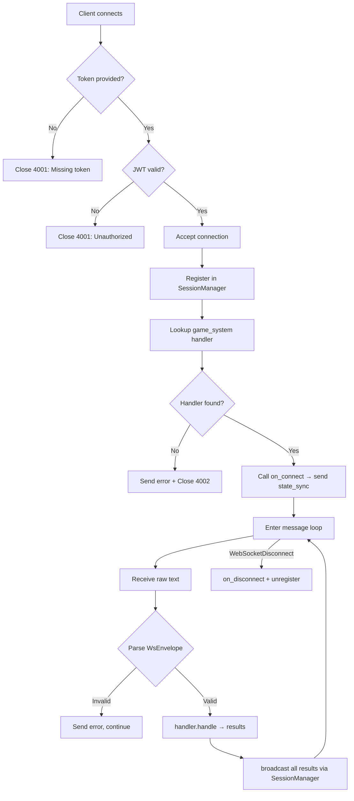
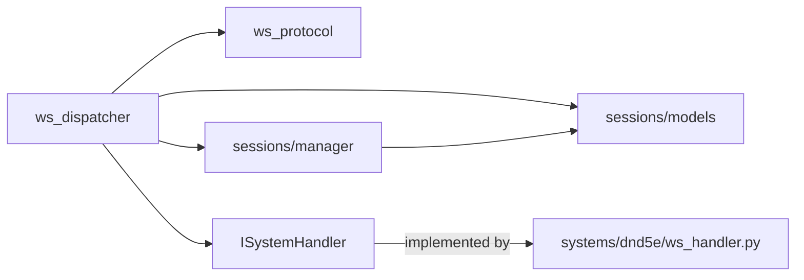

# Module 01 — Core Transport

> **As-Is Documentation** | Files: `src/core/ws_protocol.py`, `src/core/ws_dispatcher.py`, `src/core/sessions/`

## Overview

The core transport layer provides the system-agnostic WebSocket infrastructure. It is intentionally game-system-unaware — it handles JWT verification, connection lifecycle, broadcasting, and message parsing. Game-specific logic is delegated to registered `ISystemHandler` implementations.

---

## Key Models

### `WsEnvelope` — Inbound
Every message from a client MUST conform to this structure:

```python
class WsEnvelope(BaseModel):
    type: str           # Event name e.g. "action", "roll_dice"
    request_id: Optional[str] = None  # Required for command events
    payload: dict[str, Any] = {}
```

> [!IMPORTANT]
> `request_id` is **required** for all command-type events (actions, start_combat, etc.). Its absence causes an immediate `error` response.

### `WsOutbound` — Outbound
All server responses use this envelope:

```python
class WsOutbound(BaseModel):
    type: str
    request_id: Optional[str] = None
    payload: dict[str, Any] = {}
    visibility: Visibility = Visibility.ALL
    target_user_id: Optional[str] = None
```

### `Visibility` — Broadcast Scope
Controls which connected clients receive a given outbound event:

| Value | Meaning |
|---|---|
| `ALL` | Broadcast to all users in the campaign |
| `DM_ONLY` | Send only to the DM |
| `ACTOR_OWNER` | Send only to the `target_user_id`'s session |
| `EXCLUDE_ACTOR` | Send to everyone EXCEPT `target_user_id` |

### `WsErrorCode`

| Code | Meaning |
|---|---|
| `invalid_message` | Malformed payload or missing field |
| `unauthorized` | Role access violation |
| `invalid_target` | Referenced actor not found |
| `not_your_turn` | Attempted action outside your turn |
| `resource_exhausted` | Budget depleted (action/bonus action etc.) |
| `invalid_action` | Action not valid for the actor |
| `internal_error` | Uncaught server exception |

---

## System Handler Interface

All game systems implement `ISystemHandler`:

```python
class ISystemHandler:
    async def on_connect(ctx, mgr) -> list[WsOutbound]: ...
    async def on_disconnect(ctx, mgr) -> None: ...
    async def handle(envelope, ctx, mgr) -> list[WsOutbound]: ...
```

System handlers are registered at startup:
```python
register_system_handler("dnd5e", Dnd5eWsHandler())
```

---

## WebSocket Endpoint

**Route:** `GET /ws/{campaign_id}?token=<JWT>&role=<player|dm>`



### Dev Token Bypass
For development only, a token value of `"dev-token"` is accepted without signature validation:
```python
if token == "dev-token":
    return {"sub": "simon", "display_name": "Simon (Dev)"}
```

> [!WARNING]
> This bypass must be removed before production deployment.

---

## Session Models

### `SessionContext`
Created per-connection and passed to all handler methods:

```python
class SessionContext:
    campaign_id: str
    user_id: str
    display_name: str
    role: UserRole      # DM | PLAYER
    game_system: str    # e.g. "dnd5e"
```

### `ConnectedUser`
Cached in the `SessionManager` with a reference to the raw `WebSocket`:

```python
class ConnectedUser:
    user_id: str
    display_name: str
    role: UserRole
    ws: WebSocket
```

### `SessionManager`
Singleton instance shared across the application. Provides:
- `register_connection(campaign_id, user)` → returns `SessionContext`
- `unregister_connection(campaign_id, user_id)`
- `send_to_user(campaign_id, user_id, event)`
- `broadcast(campaign_id, event)` — applies `Visibility` rules and iterates connected users

---

## Dependencies


