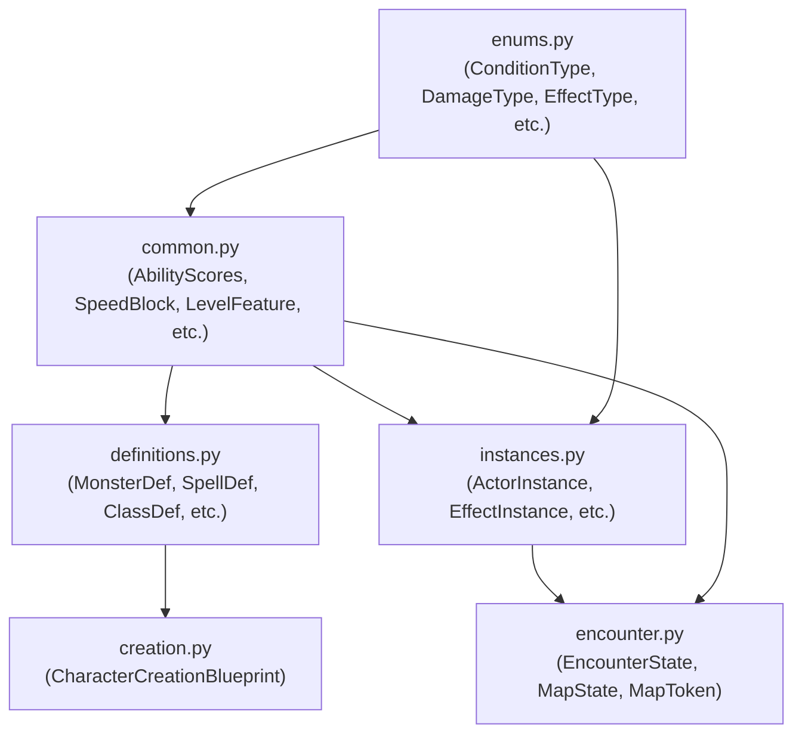
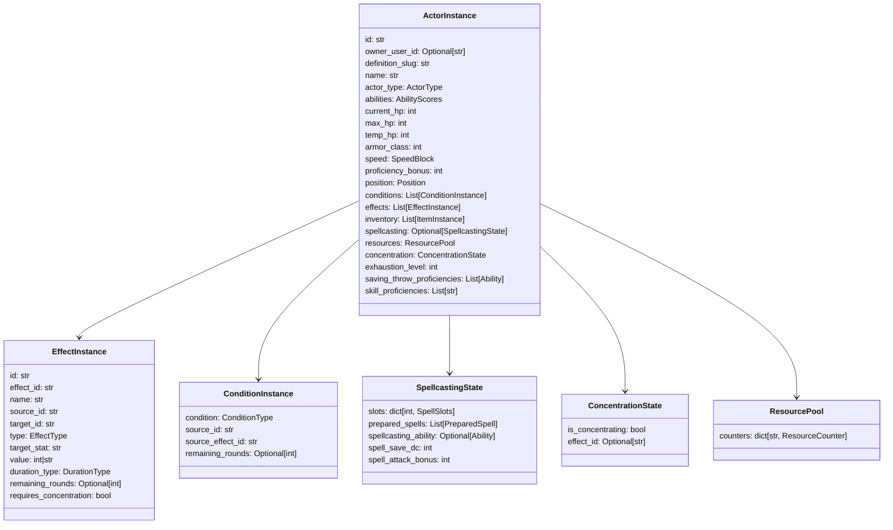
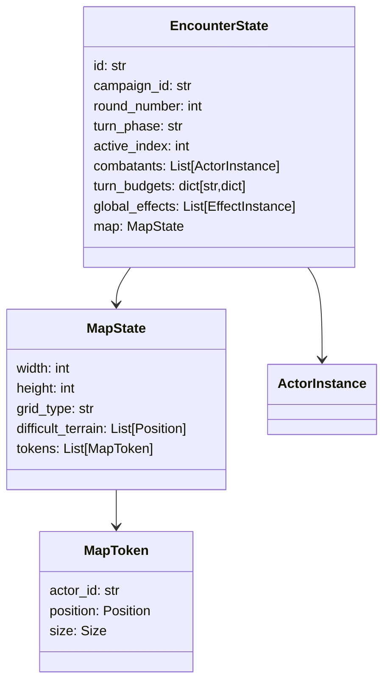

# Module 02 — D&D 5e Schemas

> **As-Is Documentation** | Files: `systems/dnd5e/schemas/enums.py`, `common.py`, `instances.py`, `encounter.py`, `definitions.py`, `creation.py`

## Overview

All game data is strictly typed using Pydantic v2. Schemas are separated by mutability:

| Category | Description |
|---|---|
| **Enums** | All string enumerations. Prevents typos and enables IDE autocompletion |
| **Common** | Reusable sub-models shared between Definitions and Instances |
| **Definitions** | Immutable, read-only game data (monsters, spells, items, races, classes) — loaded once at startup |
| **Instances** | Mutable runtime state — created when something enters the encounter |
| **Encounter** | The top-level state container for an active combat session |
| **Creation** | Input schemas for the Character Builder |

---

## Schema Dependency Graph



---

## Enums (`enums.py`)

### Damage & Condition Types

| Enum | Values |
|---|---|
| `DamageType` | `slashing`, `piercing`, `bludgeoning`, `fire`, `cold`, `lightning`, `thunder`, `poison`, `acid`, `necrotic`, `radiant`, `force`, `psychic` |
| `ConditionType` | All 15 PHB conditions: `Blinded`, `Charmed`, `Deafened`, `Exhaustion`, `Frightened`, `Grappled`, `Incapacitated`, `Invisible`, `Paralyzed`, `Petrified`, `Poisoned`, `Prone`, `Restrained`, `Stunned`, `Unconscious` |

### Actor & Action Types

| Enum | Values |
|---|---|
| `ActorType` | `pc`, `npc`, `monster`, `summon` |
| `ActionType` | `melee_weapon`, `ranged_weapon`, `melee_spell`, `ranged_spell`, `save_effect`, `healing`, `utility` |

### Effect Types (stacking model)

| Enum Value | Behavior |
|---|---|
| `BONUS` | Additive |
| `SET` | Takes max of base vs value |
| `MULTIPLY` | Multiplicative (applied last) |
| `ADVANTAGE` | Roll two dice, take higher |
| `DISADVANTAGE` | Roll two dice, take lower |
| `IMMUNITY` | Negate damage of type |
| `RESISTANCE` | Halve damage of type |
| `VULNERABILITY` | Double damage of type |
| `DAMAGE_PER_TURN` | Applies on start of turn |
| `HEALING_PER_TURN` | Applies on start of turn |
| `GRANT_CONDITION` | Adds a `ConditionType` |
| `REMOVE_CONDITION` | Removes a `ConditionType` |

### Duration & Reset Types

| Enum | Values |
|---|---|
| `DurationType` | `instantaneous`, `rounds`, `minutes`, `hours`, `until_dispelled`, `until_long_rest`, `permanent` |
| `ResetOn` | `short_rest`, `long_rest`, `dawn`, `round` |

---

## Common Types (`common.py`)

### Stat Blocks

```python
class AbilityScores(BaseModel):
    strength: int = 10
    dexterity: int = 10
    constitution: int = 10
    intelligence: int = 10
    wisdom: int = 10
    charisma: int = 10

class SpeedBlock(BaseModel):
    walk: int = 30
    fly: Optional[int] = None
    swim: Optional[int] = None
    climb: Optional[int] = None
    burrow: Optional[int] = None
    hover: bool = False

class SavingThrows(BaseModel):
    strength_save: Optional[int] = None
    # ... (all 6 abilities)
```

### Action & Effect Sub-Types

```python
class AreaOfEffect(BaseModel):
    shape: AoeShape    # cone, sphere, line, cube, cylinder
    size: int          # feet

class SaveRequirement(BaseModel):
    ability: Ability
    dc: int
    on_fail: str = "full_damage"
    on_success: str = "half_damage"

class EffectDefinition(BaseModel):  # lightweight version for embedding
    name: str
    type: EffectType
    target_stat: str = ""
    value: int | str = 0
    source: Optional[str] = None
```

### Character Building Types

```python
class SpellSlots(BaseModel):
    max: int
    current: int

class SpellcastingProgression(BaseModel):
    ability: Ability
    type: str = "full"  # full, half, third, pact
    cantrips_known_at_1: int = 0
    slots_by_level: dict[int, SpellSlots]

class LevelFeature(BaseModel):
    level: int
    feature_slug: str
    effects: List[EffectDefinition]
    granted_actions: list
    granted_resource: Optional[ResourceCounter] = None

class ResourceCounter(BaseModel):
    name: str
    max: int
    current: int
    resets_on: ResetOn
```

---

## Instance Types (`instances.py`)

These are the **mutable** runtime objects. The `ActorInstance` is the central game object.



---

## Encounter State (`encounter.py`)



**`turn_phase` lifecycle values:**
- `pre_combat` — No combat initiated yet
- `active` — Combat running, `active_index` points to acting combatant
- `post_combat` — Combat ended, encounter archivable
